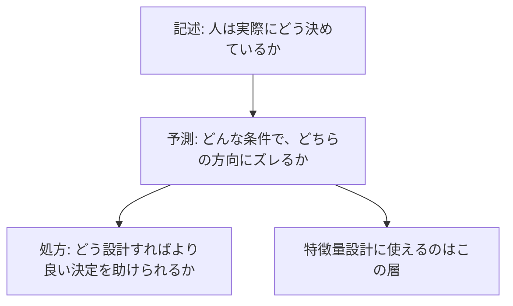
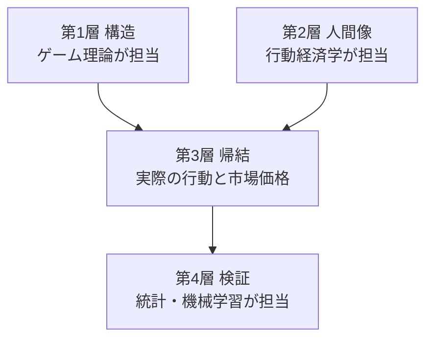
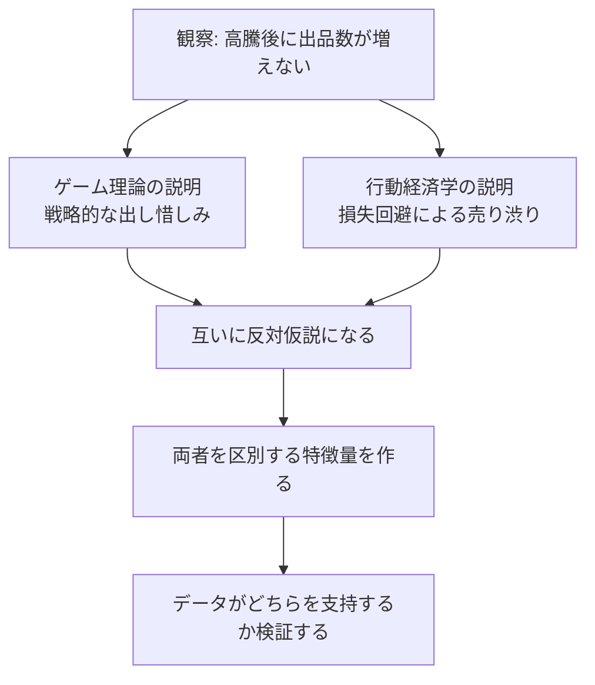
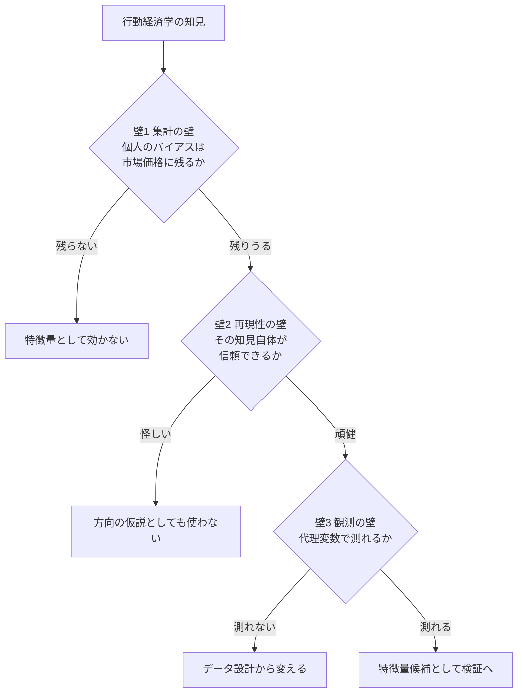
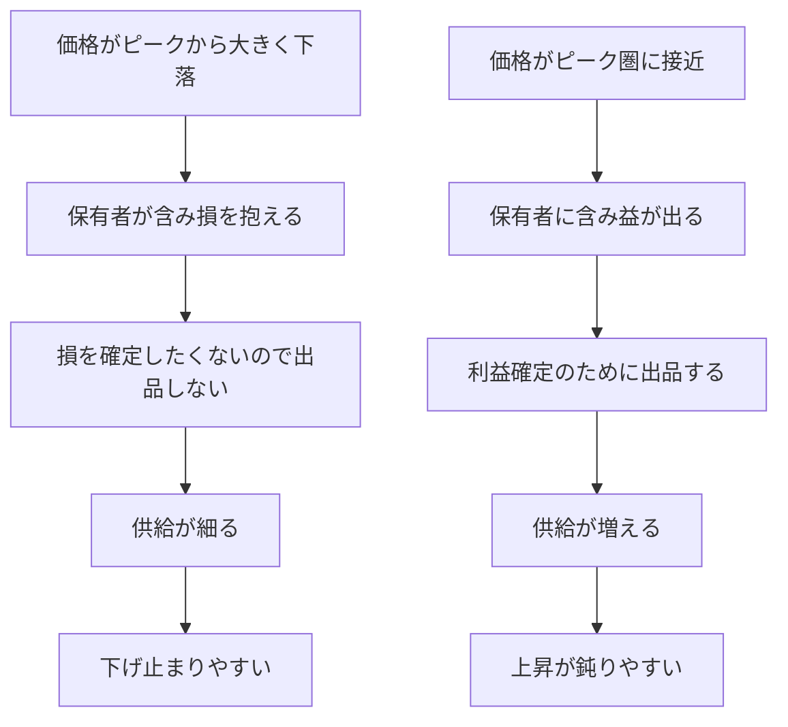
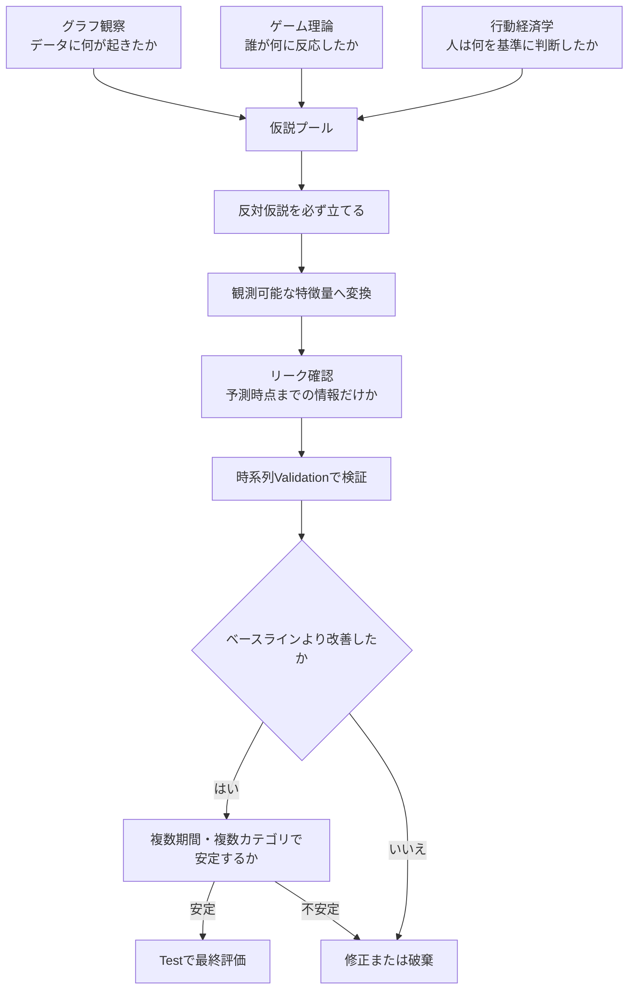

# 行動経済学は特徴量設計に使えるか

作成日: 2026-08-02 JST

関連文書: [ゲーム理論を活用したコレクター製品の価格予測モデル設計](./game_theory_for_collector_price_prediction.md)

---

## 1. このドキュメントの目的

このドキュメントは、次の3つの疑問に答えるために作成しました。

```text
疑問1: 行動経済学とはどのような学問で、何を知ることを目的としているのか
疑問2: 行動経済学とゲーム理論は相反するのか、補完するのか
疑問3: 行動経済学は、特徴量抽出などの判断軸として使えるのか
```

前回の議論では、ゲーム理論を「価格を予言する道具」ではなく「仮説を生み、特徴量候補を発見する思考法」として位置づけました。

今回は、そこに行動経済学を加えると何が増えるのかを整理します。

---

## 2. 先に結論

3つの疑問に対する結論を、先にまとめます。

| 疑問 | 結論 |
|---|---|
| 行動経済学とは何か | 「人間は非合理だ」と言う学問ではなく、**人間の判断のズレが、ランダムではなく系統的で、条件を指定すれば方向を予測できる**ことを示す学問 |
| ゲーム理論との関係 | **相反しない。層が違う。** ゲーム理論は「盤面のルール」を書く道具、行動経済学は「その盤に座る人間」を描く道具。両者を統合した「行動ゲーム理論」という分野が既に存在する |
| 特徴量の判断軸に使えるか | **使える。しかもゲーム理論より落とし込みやすい。** ただし、価格に残るとは限らない（集計の壁）、効果量を信じてはいけない（再現性の壁）、直接測れない（観測の壁）の3つを踏まえる必要がある |

最も重要な一文は、次のものです。

> ランダムなズレは特徴量にならない。しかし、**系統的なズレは特徴量になる**。
> 行動経済学の価値は「人間が間違える」ことではなく、「**同じ方向に、同じ条件で間違える**」と主張している点にある。

---

## 3. 疑問1：行動経済学とはどのような学問か

### 3.1 一言でいうと

行動経済学（Behavioral Economics）は、次のように説明できます。

```text
経済学 × 心理学

「人はこう決めるはずだ」という理論上の予測と、
「人が実際にどう決めているか」という観察結果のズレを研究し、
そのズレに規則性を見つける学問
```

シカゴ大学の解説では、この学問を次のように表現しています。

> 人が「すべきこと」と、実際に「していること」の差を調べる学問

### 3.2 なぜ生まれたのか：標準的な経済学の人間像

行動経済学を理解するには、まず「何に対する反論なのか」を知る必要があります。

伝統的な経済学は、計算を可能にするために、極端に単純化した人間像を置きました。これを **ホモ・エコノミクス（合理的経済人）** と呼びます。

```text
ホモ・エコノミクス
├─ すべての選択肢と結果を計算できる
├─ 好みは安定していて、表現方法で変わらない
├─ 自制心が完全で、将来を一貫した基準で評価する
└─ 自分の利益だけを考える
```

行動経済学は、この4点すべてに「実際は違う」という観察を突きつけました。

| 標準理論の前提 | 実際に観察されること | 対応する概念 |
|---|---|---|
| すべてを計算して最適な選択をする | 計算資源が有限。「十分よい」で止める | 限定合理性、満足化 |
| 最終的な資産の絶対水準で評価する | 「基準点からいくら動いたか」で評価する | 参照点依存 |
| 利得と損失を対称に扱う | 損失のほうが強く効く | 損失回避 |
| 確率を正しく扱う | 小さい確率を過大、大きい確率を過小に評価する | 確率加重 |
| 表現が変わっても選択は変わらない | 同じ内容でも見せ方で選択が変わる | フレーミング効果 |
| 将来を一貫した割引率で評価する | 目先を過大に評価する | 現在バイアス、双曲割引 |
| 自分の利益だけを考える | 公平さや相手の取り分を気にする | 社会的選好 |
| 取り返せない過去の費用は無視する | 過去の支出を引きずる | サンクコスト効果 |

Richard Thaler は、これらのズレを3つの「限界」としてまとめています。

| 3つの限界 | 意味 | 例 |
|---|---|---|
| 限定合理性 | 計算能力・情報処理能力に限りがある | 全出品を見比べず、上位数件だけ見て買う |
| 限定意志力 | 自制心に限りがある | 「今日は買わない」と決めていたのに買う |
| 限定利己性 | 自分の利益だけでは動かない | 「足元を見た価格」に腹を立てて買わない |

### 3.3 この学問が答えようとしている3つの問い

行動経済学は、次の3つの水準の問いを持っています。**予測モデルに関係するのは主に2番目**です。



| 水準 | 問い | 成果物の例 |
|---|---|---|
| 記述（descriptive） | 人は実際にどう判断しているのか | ヒューリスティクスの分類、意思決定プロセスの記述 |
| 予測（predictive） | どんな条件で、どちらの方向にズレるか | プロスペクト理論、現在バイアスのモデル |
| 処方（prescriptive） | どう設計すれば良い決定を助けられるか | ナッジ、デフォルト設定の設計 |

書店に並んでいる一般向けの本の多くは「記述」と「処方」を中心に書かれています。

しかし、価格予測モデルに使えるのは **「予測」の層** です。つまり、次の形で書ける知見だけが使えます。

```text
条件Xが成り立つとき、人は平均してY方向にズレる
```

### 3.4 歴史：どのように学問として成立したか


節目となる出来事を、年表で整理します。

| 年 | 出来事 | 内容 |
|---:|---|---|
| 1955 | Herbert Simon「限定合理性」 | 人の計算能力は有限であり、最適化ではなく「満足化」をすると主張 |
| 1974 | Tversky & Kahneman「ヒューリスティクスとバイアス」 | 利用可能性・代表性・アンカリングという3つの近道を提示（Science誌） |
| 1978 | Simon ノーベル経済学賞 | 「経済組織における意思決定過程の先駆的研究」に対して |
| 1979 | Kahneman & Tversky「プロスペクト理論」 | 参照点・損失回避・確率加重を数式化（Econometrica誌） |
| 1980年代 | Thaler の一連の研究 | メンタルアカウンティング、保有効果、サンクコスト効果を経済学に導入 |
| 1994 | Nash・Harsanyi・Selten ノーベル経済学賞 | 非協力ゲームの均衡分析に対して（**このSeltenが後で重要になります**） |
| 1999 | Fehr & Schmidt「不平等回避」 | 「相手との差」を利得関数に組み込むモデル |
| 2002 | Kahneman・Vernon Smith ノーベル経済学賞 | 心理学の知見を経済学に統合したことと、実験を経済分析の道具として確立したことに対して |
| 2003 | Camerer『Behavioral Game Theory』 | ゲーム理論と行動経済学を統合した教科書 |
| 2008 | Thaler & Sunstein『Nudge』 | 政策・制度設計への応用が一般に広がる |
| 2017 | Thaler ノーベル経済学賞 | 限定合理性・社会的選好・自制心の欠如を経済分析に組み込んだことに対して |
| 2010年代〜 | 再現性の検証 | 有名な知見の一部が再現しないことが判明（詳細は §5.3.2） |

ここで注目すべきは、**ノーベル賞が3回（1978・2002・2017）出ている**ことです。

一時的な流行ではなく、経済学の主流に組み込まれた分野だと言えます。

### 3.5 中核理論：プロスペクト理論

行動経済学で最も重要な理論が、プロスペクト理論です。価格予測との相性も最も良いので、詳しく見ます。

#### 3.5.1 4つの性質

| 性質 | 内容 | コレクター市場での現れ方 |
|---|---|---|
| 参照点依存 | 絶対的な水準ではなく、基準点からの差で評価する | 「この商品は1万円だ」ではなく「買値より2千円高い」で判断する |
| 損失回避 | 同じ幅なら、損の痛みが利得の喜びより大きい | 買値を割った商品を、損を確定したくないので売れない |
| 感応度逓減 | 基準から離れるほど、1単位の変化を鈍く感じる | 1千円→2千円は嬉しいが、5万円→5万1千円は何も感じない |
| 確率加重 | 小さい確率を過大に評価する | 「いつか10万円になるかもしれない」に賭けて売らない |

#### 3.5.2 損失回避のイメージ

同じ1,000円でも、得たときと失ったときで、心の中での大きさが違います。

```text
  +1,000円を得た喜び    ■■■■
  -1,000円を失った痛み  ■■■■■■■■■

  → 実験では、損失の痛みは利得の喜びの2倍前後と報告されることが多い
```

#### 3.5.3 価値関数の形

```text
                        価値（心の中での大きさ）
                              ▲
                              │
                              │              利得側
                              │         ・・・‾‾‾‾‾‾   ← ゆるやかに寝る
                              │     ・‾‾            （感応度逓減）
                              │  ・‾
    ──────────────────────────┼──────────────────────────▶
     損失  ←              ・‾ │  参照点(0)              →  利得
                       ・‾    │  ここが判断の基準
                    ・‾       │
                 ・‾          │
              ・‾             │  損失側
           ・‾                │  急に落ち込む（同じ幅でも強く効く）
                              │
```

この図から読み取るべき、最も重要な点は次の1点です。

> **すべての判断は「参照点」からの距離で行われる。**
> したがって、参照点が何かを特定できれば、行動の方向を予測できる。

コレクター市場での参照点の候補は、次のとおりです。この一覧が、後で特徴量に直結します。

| 参照点の候補 | 意味 | データで測れるか |
|---|---|---|
| 過去の最高値 | 「あのときは3万円だった」 | 測れる（予測時点までの `price` の最大値） |
| 自分の買値 | 「1万5千円で買った」 | 直接は測れない。代理変数が必要 |
| 発売時の価格・定価 | 「定価は500円だった」 | 測れる（初期価格） |
| 直近の相場 | 「最近はだいたい2万円」 | 測れる（移動平均） |
| キリのいい数字 | 「1万円は超えたい」 | 測れる（キリ番までの距離） |
| 同じシリーズの他商品 | 「あっちは5万円なのに」 | 測れる（同IP・同カテゴリの平均） |

### 3.6 主要な概念カタログ

プロスペクト理論以外の主要概念を、価格予測との関係とともに整理します。

| 概念 | 内容 | 価格予測での関係 |
|---|---|---|
| アンカリング | 最初に見た数字が、その後の判断の基準になる | 最初の出品価格、直近の高値が相場観を作る |
| 利用可能性ヒューリスティック | 思い出しやすい事例で確率を判断する | 「値上がりした有名事例」が期待を歪める |
| 代表性ヒューリスティック | 似ているものは同じ結果になると考える | 「同じIPのあのカードが上がったから、これも」 |
| 限定注意 | すべてを見比べられず、目についたものだけ処理する | 話題になった商品に買いが集中する |
| 保有効果 | 持っているだけで価値を高く感じる | 出品価格が相場より高止まりする |
| 現状維持バイアス | 何もしないことを選びやすい | 出品を放置する、値下げしない |
| サンクコスト効果 | 取り返せない支出を判断に含める | 高く買った商品を安く売れない |
| 現在バイアス | 目先を過大評価する | 「今すぐ欲しい」ので高くても買う |
| メンタルアカウンティング | お金を用途別の心の口座で管理する | 「趣味の予算」は価格感応度が低い |
| 群集行動・情報カスケード | 他人の行動を情報とみなして追随する | 買いが買いを呼ぶ、売りが売りを呼ぶ |
| 外挿的期待 | 最近の傾向がこの先も続くと考える | 上昇トレンドがさらに買いを呼ぶ |
| 希少性ヒューリスティック | 手に入りにくいものを高く評価する | 「限定」「配布終了」というラベル自体が価格を押し上げる |
| フレーミング効果 | 同じ内容でも見せ方で選択が変わる | 「過去最高値更新」という表現が注目を生む |
| 社会的選好 | 公平さや相手の取り分を気にする | 「足元を見た価格」への反発、価格の暗黙の相場 |
| 過信 | 自分の判断力を過大評価する | 「自分は目利きだ」と信じて買い増す |
| 確証バイアス | 自分の考えを支持する情報だけ集める | 値上がり情報だけを見て保有を続ける |

### 3.7 誤解しやすい点

行動経済学について、次の3つは典型的な誤解です。ここを外すと、特徴量設計でも判断を誤ります。

| よくある誤解 | 実際 |
|---|---|
| 「人間は非合理だ」と主張する学問である | 主張の中心は「非合理」ではなく **「ズレが系統的である」**。ランダムに間違うのなら、学問にも特徴量にもならない |
| 経済学を否定する学問である | 否定ではなく **前提の差し替え**。数式もモデルも使う。むしろ経済学の道具立てをそのまま使い、人間像だけを現実的にする |
| バイアスを知れば予測できる | バイアスは「方向」しか教えない。**効果の大きさと持続期間は、必ず自分のデータで測る必要がある** |

---

## 4. 疑問2：行動経済学とゲーム理論は相反するか

### 4.1 結論

```text
相反しない。

両者は「対立する2つの理論」ではなく、
分析の「層」が違うだけである。
```

比喩で言えば、次のようになります。

> **ゲーム理論は「盤面のルール」を書く道具。**
> **行動経済学は「その盤に座る人間」を描く道具。**
>
> ルールと対局者は対立しない。両方そろって初めて一局になる。

### 4.2 なぜ「相反する」ように見えるのか

相反して見える理由は、次の2つです。

**理由1：教科書のゲーム理論が、最も強い合理性を仮定しているため**

ゲーム理論の入門書は、たいてい次を仮定します。

- 各参加者は自分の利得を完全に最大化する
- 全員が「全員が合理的である」ことを知っている（合理性の共有知識）
- 全員が無限に深く読み合える

行動経済学は、この3つすべてに反対の証拠を出します。だから「対立」に見えます。

しかし、ここで注意すべきは次の点です。

```text
行動経済学が反対しているのは、
「ゲーム理論という枠組み」ではなく、
「その枠組みに入れる、特定の人間像」である。
```

**理由2：ゲーム理論には2つの使い方があり、それが混同されているため**

| 使い方 | 問い | 例 |
|---|---|---|
| 規範的（normative） | どう行動する**べき**か。どう制度を設計すべきか | オークションの入札方式の設計、マッチング制度の設計 |
| 記述的（descriptive） | 人は実際にどう行動する**か** | 実際の入札行動の説明、市場価格の説明 |

**価格予測に必要なのは、記述的な使い方です。**

そして、記述的な使い方をしようとした瞬間、「では現実の人間はどう動くのか」という問いが必要になります。**その答えを供給するのが行動経済学**です。

つまり、記述的にゲーム理論を使おうとすると、行動経済学は避けて通れません。

### 4.3 層で整理する

両者の関係を、層として整理します。



各層で何を決めるかを、具体的に書き出します。

| 層 | 決めること | 担当分野 | コレクター市場での例 |
|---|---|---|---|
| 第1層：構造 | 誰が参加するか／どんな選択肢があるか／誰が何を知っているか／どんな順番で動くか | ゲーム理論 | 買い手・売り手・転売者・メーカー・買取店がいる。売り手は「出品・値下げ・取り下げ」を選べる |
| 第2層：人間像 | 何を基準に評価するか／どこまで相手を読むか／何に注意を向けるか／自分の利益だけか | 行動経済学 | 売り手は買値を参照点にする。読みは浅い。目についた商品しか見ない |
| 第3層：帰結 | 結果としてどんな行動と価格が生まれるか | 両方 | 高値圏では利益確定の出品が増え、安値圏では売り渋りで供給が細る |
| 第4層：検証 | その予測は実データで再現するか | 統計・機械学習 | 時系列Validationで、その特徴量が予測性能を改善するか |

**第1層だけでは、行動が一意に決まりません。** 同じ構造でも、参加者の人間像が違えば結果は変わります。第2層は、第1層の「空欄を埋める」役割です。

### 4.4 統合された分野が実在する：行動ゲーム理論

「補完関係である」という主張の最も強い証拠は、**両者を統合した分野が既に確立している**ことです。

**行動ゲーム理論（Behavioral Game Theory）** は、ゲーム理論の枠組みを保ったまま、仮定を実験結果に合わせて緩める研究分野です。Colin Camerer による同名の教科書（2003年）が代表的です。

緩め方は、大きく3種類あります。

| 緩めた仮定 | 標準ゲーム理論 | 行動ゲーム理論での扱い | 代表モデル |
|---|---|---|---|
| 利得の中身 | 自分の金銭的利益だけ | 相手との差も利得に入れる | 不平等回避（Fehr & Schmidt, 1999） |
| 読みの深さ | 全員が無限に深く読み合う | 読みの深さに個人差がある | level-k / 認知階層モデル（Camerer, Ho & Chong, 2004） |
| 反応の確実さ | 常に最適な行動を選ぶ | 良い行動ほど選びやすいが、確率的にぶれる | 数量反応均衡 QRE（McKelvey & Palfrey, 1995） |

#### 4.4.1 利得を緩める：最後通牒ゲーム

```text
1万円を2人で分ける。
Aが分け方を提案し、Bが受け入れれば成立、拒否すれば両者ゼロ。

標準ゲーム理論の予測:
  Bはゼロより1円のほうが得なので、どんな提案も受け入れる。
  よってAは「9,999円 : 1円」を提案する。

実験結果:
  提案の中心は「6:4」あたり。
  2割を下回る提案は、Bが自分もゼロになるのを承知で拒否する。
```

これは「人間が計算を間違えた」のではありません。**利得関数に「公平さ」が入っている**と考えれば、そのまま合理的に説明できます。

#### 4.4.2 読みの深さを緩める：美人投票ゲーム

```text
全員が0〜100の数字を選ぶ。
全員の平均の2/3に最も近い人が勝つ。

標準ゲーム理論の予測（均衡）:
  誰もが無限に読み合うと、答えは0に収束する。

実験結果:
  平均は20〜35あたりに集まる。
  つまり、多くの人は「2〜3手」しか読んでいない。
```

level-k モデルは、この「読みの手数」に個人差があるとして人を分類します。

| 水準 | 考え方 | この例での答え |
|---|---|---|
| level-0 | 何も読まない。ランダムに選ぶ | 50 |
| level-1 | 相手はlevel-0だと考える | 50 × 2/3 ≒ 33 |
| level-2 | 相手はlevel-1だと考える | 33 × 2/3 ≒ 22 |
| level-3 | 相手はlevel-2だと考える | 22 × 2/3 ≒ 15 |
| level-∞ | 全員が無限に読む（均衡） | 0 |

認知階層モデルは、さらに「各水準の人がどれくらいの割合でいるか」をポアソン分布で表します。

**そして実証的に重要なのは次の点です。**

> 初めてプレイするゲームの予測では、
> 均衡モデルよりも level-k / 認知階層モデルのほうが的中することが多い、
> と系統的な比較実験で報告されている。

つまり、**行動経済学を入れたゲーム理論のほうが、予測性能が高い**ということです。これは「補完」を超えて「改良」に近い関係です。

### 4.5 証拠：同一人物が両方をやっている

もし両者が本当に相反するなら、同じ人が両方の中心にいることはありえないはずです。

しかし、**Reinhard Selten** がまさにそれをやりました。

| Selten の2つの顔 | 内容 |
|---|---|
| ゲーム理論家 | 部分ゲーム完全均衡・完全性の概念を確立し、1994年にNash・Harsanyiとノーベル経済学賞を受賞 |
| 限定合理性の研究者 | 1950年代末から実験を開始し、実験経済学の創始者の一人となった |

Selten は自らを **「方法論的二元論者（methodological dualist）」** と呼びました。

```text
規範的なゲーム理論（どう行動すべきか）と、
記述的な行動理論（実際にどう行動するか）は、
別々に、しかし両方とも必要である。
```

これが、両者の関係を最も正確に表現しています。**対立ではなく、役割分担です。**

### 4.6 コレクター市場で並べてみる

抽象論だけでは使えないので、同じ現象に対して両方の説明を並べます。

| 観察される現象 | ゲーム理論の説明（構造から） | 行動経済学の説明（人間像から） | 両者を区別するための特徴量 |
|---|---|---|---|
| 高騰後、出品数が増えない | もっと高く売れると読んだ、最適な出し惜しみ | 保有効果と処分効果。含み損の保有者は損を確定したくないので売らない | 高値圏と安値圏で、出品の増減が**非対称**になっているか |
| 高騰の初期に買いが殺到する | 品薄になる前に確保する合理的な先回り | 限定注意と群集行動。話題になったから見に来ただけ | 供給減少が先行したか、注目度の急増が先行したか |
| 値下げが「9,800円」で止まる | 説明しにくい | アンカリングとラウンドナンバー。1万円の壁 | キリ番までの距離、キリ番直下での滞留日数 |
| 再販発表後に急落する | 将来の供給増を織り込む合理的な反応 | 過剰反応。参照点が一気に切り替わる | 下落幅が供給増から説明できる範囲を超えるか、その後戻すか |
| 売れない高値出品が残り続ける | 単に留保価格が高いだけ | サンクコストと保有効果。買値以下では売れない | 出品継続日数と、最初の値下げまでの日数の分布 |
| 高騰銘柄と同じIPの別商品も上がる | 需要が同じ層から来る合理的な連動 | 代表性ヒューリスティック。「似ているから同じ結果になる」という連想 | 連動が需要の実体（成約数）を伴うか、注目度だけか |

ここに、このドキュメントで最も実務的な発見があります。

### 4.7 実務上の最大の利点：反対仮説が自動で手に入る

上の表を見ると、**多くの現象に両方の説明がつく**ことが分かります。

これは弱点ではなく、**利点**です。

前回のゲーム理論ドキュメントの仮説構築フロー（§5.1）には、次の工程がありました。

```text
6. 行動仮説と反対仮説を作る
```

反対仮説を作るのは、実際にはかなり難しい作業です。自分で立てた仮説の対抗馬を、自分で思いつかなければならないからです。

しかし、両方の視点を持っていれば、これが自動化できます。



> **ゲーム理論の仮説には、行動経済学が反対仮説を供給する。**
> **行動経済学の仮説には、ゲーム理論が反対仮説を供給する。**

そして重要なのは、**どちらが正しいかで作るべき特徴量が変わる**ことです。

```text
戦略的な出し惜しみが原因なら
  → 「将来の価格期待」を測る特徴量が効く（再販予定、話題の伸び）

損失回避が原因なら
  → 「参照点からの距離」を測る特徴量が効く（ピークからの下落率、買値の代理変数）
```

したがって、両方を作って比較すれば、どちらの仮説が正しいかをデータに判定させることができます。

---

## 5. 疑問3：行動経済学は特徴量抽出の判断軸に使えるか

### 5.1 結論

```text
使える。

ただし、行動経済学は「特徴量を直接生む道具」ではなく、
「仮説を生む道具」である。
この位置づけはゲーム理論とまったく同じ。

一方で、実務上は「ゲーム理論よりも特徴量に落としやすい」
という明確な利点がある。
```

### 5.2 ゲーム理論より落とし込みやすい理由

理由は、**仮説の主語が違う**ことにあります。

| 観点 | ゲーム理論 | 行動経済学 |
|---|---|---|
| 仮説の主語 | 「**誰が**」（市場参加者） | 「**何を基準に**」（数値） |
| 典型的な仮説の形 | 「大量出品者が在庫を絞ると価格が上がる」 | 「ピーク価格から30%下がると売り渋りが起きる」 |
| 検証に必要なデータ | 参加者を識別できるデータ（出品者ID、購入者ID、在庫の持ち主） | 価格の時系列と注目度の時系列 |
| 生まれる特徴量の形 | 集中度、参加者数、比率 | 参照点からの距離、変化率、スパイクの大きさ |
| 現在のデータで作れるか | **一部しか作れない** | **ほぼ作れる** |

これは、このプロジェクトにとって決定的な差です。

現在のサンプルデータのカラムを確認します。

```text
date, item_id, item_name, ip_name, category, release_type,
price, listing_count, sold_count, sns_mentions, trends_score,
event_flag, event_type, days_to_distribution_end
```

ここには **出品者IDも購入者IDもありません**。

したがって、前回のゲーム理論ドキュメントで挙げた特徴量のうち、次のものは現時点では計算できません。

| 計算できない特徴量 | 理由 |
|---|---|
| 在庫集中度（上位出品者の在庫比率） | 出品者IDがない |
| ユニーク購入者数 ÷ 出品数 | 購入者IDがない |
| 1出品者当たりの出品数 | 出品者IDがない |
| 出品取り下げ率、再出品率 | 出品単位の履歴がない |
| 値下げ回数、平均値下げ幅 | 出品単位の価格履歴がない |

一方、行動経済学から導かれる特徴量は、**価格と注目度の時系列だけで大半が作れます**。

```text
参照点からの距離   ← price の履歴だけで作れる
注目度のスパイク   ← trends_score / sns_mentions だけで作れる
キリ番までの距離   ← price だけで作れる
希少性の窓        ← days_to_distribution_end だけで作れる
```

> つまり、**今すぐ検証を始められるのは行動経済学側**です。
> ゲーム理論側の特徴量は、本番アプリでデータ収集設計を変えてから取り組む対象になります。

### 5.3 使う前に踏まえるべき3つの壁

ただし、無条件に使えるわけではありません。3つの壁があります。



#### 5.3.1 壁1：集計の壁 — 個人のバイアスは市場価格に残るか

これが最も本質的な問題です。

```text
個人にバイアスがあることと、
市場価格にバイアスが残ることは、別の話である。
```

反論は2つあります。

| 反論 | 内容 |
|---|---|
| 相殺される | 過大反応する人と過小反応する人が同じくらいいれば、平均すれば打ち消し合う。Eugene Fama は「過大反応と過小反応が同程度なら、市場は概ね効率的とみなせる」と主張した |
| 裁定される | バイアスで価格が歪んでも、それに気づいた人が安く買い高く売れば、価格は正常に戻る |

しかし、この反論には限界があります。それが **限定的裁定（limits to arbitrage）** の議論です。

De Long ら（1990）や Shleifer & Vishny（1997）は、次を指摘しました。

```text
歪みに気づいても、直せるとは限らない。

・歪みが短期的にさらに拡大するリスク（ノイズトレーダーリスク）がある
・そのとき損失が出ると、資金を引き上げられて撤退を強いられる
・結果として、歪みを直しに行く人が現れない
```

**ここで、コレクター市場の特性が効いてきます。**

| 裁定を妨げる条件 | 株式市場 | コレクター市場 |
|---|---|---|
| 空売り（高いものを売って下げる） | できる | **ほぼできない** |
| 取引コスト | 低い | 高い（販売手数料10%前後＋送料＋梱包） |
| 在庫コスト | ない | ある（保管、劣化、盗難、資金拘束） |
| 商品の同質性 | 完全（1株は1株） | 低い（状態、鑑定、版、付属品で別物） |
| 参加者の専門性 | 機関投資家が中心 | 個人が中心 |
| 情報の集約度 | 板・気配が公開されている | 分散・不透明 |
| 分割可能性 | 1株単位で細かく調整できる | 1個単位。細かい調整が効かない |

> **結論：コレクター市場は、株式市場よりも行動バイアスが価格に残りやすい条件が揃っている。**
>
> 特に「空売りができない」ことが決定的です。過大評価を直す仕組みが構造的に存在しないためです。

ただし、これ自体があくまで**仮説**です。「残りやすいはずだ」という理由があるだけで、実際に残っているかは検証が必要です。

#### 5.3.2 壁2：再現性の壁 — その知見自体が信頼できるか

**これは必ず知っておくべき論点です。** 2010年代以降、行動科学の有名な知見の一部が再現しないことが判明しました。

| 対象 | 何が起きたか |
|---|---|
| 自我消耗（ego depletion） | 意志力は使うと減るという説。23研究室・2,141人（2016年）と36研究室・3,531人（2021年）の大規模な多施設追試で、効果はほぼゼロだった |
| プライミング効果 | 無意識の刺激が後の行動を変えるという一連の研究。多くが追試で再現していない |
| データの信頼性 | 「正直さ」を扱った著名研究者（Dan Ariely、Francesca Gino）の複数論文にデータ不正の疑いが指摘され、撤回に至ったものがある |
| ナッジの効果量 | 学術論文では平均 **8.7%ポイント**（対照群比 +33.4%）の効果とされていたが、実際に行政のナッジ部門が実施した126件のRCT（対象2,300万人）では **1.4%ポイント**（+8.0%）にとどまった。この差は出版バイアスと検定力の低さで説明できる（DellaVigna & Linos, Econometrica 2022） |

この事実から引き出すべき教訓は、次のとおりです。

| やってはいけない | やるべき |
|---|---|
| 本に書かれた効果量をそのまま信じる | **方向（符号）の仮説としてだけ使い、大きさは自分のデータで測る** |
| 「有名なバイアスだから効くはず」と検証せずに採用する | ベースラインとの差分で必ず測る |
| 派手な単発の実験結果を根拠にする | 大規模追試を通ったもの、市場データで繰り返し確認されたものを優先する |

**優先して使うべき「頑健な中核」と、慎重に扱うべきものを分けます。**

| 分類 | 概念 | 理由 |
|---|---|---|
| 頑健：優先して使う | 参照点依存・損失回避 | 実験室・市場データの両方で繰り返し確認されている |
| 頑健：優先して使う | アンカリング（価格文脈でのもの） | 実際の取引価格データで確認されている |
| 頑健：優先して使う | 限定注意 | 検索量・ニュース量と価格の関係として市場データで確認されている |
| 頑健：優先して使う | 群集行動・外挿的期待 | モメンタムと反転として、多数の市場で確認されている |
| 頑健：優先して使う | 処分効果（利益は早く確定し、損は抱え込む） | 実際の取引記録で繰り返し確認されている |
| 慎重に扱う | 自我消耗 | 大規模追試で否定的 |
| 慎重に扱う | 多くのプライミング効果 | 再現していない |
| 慎重に扱う | 単発の派手な効果全般 | 出版バイアスの影響を受けやすい |

#### 5.3.3 壁3：観測の壁 — バイアスは直接測れない

```text
バイアスは、人の心の中にある。
価格データの中には存在しない。

したがって、必ず代理変数を使うことになる。
そして、代理変数には必ず別の解釈が存在する。
```

例を挙げます。

```text
観察: ピーク価格から大きく下がった商品は、出品数が減っている

解釈A（行動経済学）: 保有者が損を確定したくないので売り渋っている
解釈B（単純な需給）: 安くなったので買われて、在庫が減っただけ
解釈C（データ側の理由）: 人気がなくなり、そもそも出品する人がいなくなった
```

このように、**代理変数を使う限り、反対仮説は必ず存在します**。

区別する方法は、追加のデータで分解することです。

| 区別したいこと | 使うデータ |
|---|---|
| 売れて減ったのか（解釈B） | `sold_count` が同時に増えているか |
| 売り渋りで減ったのか（解釈A） | `sold_count` が増えずに `listing_count` だけ減っているか |
| 関心の消滅か（解釈C） | `trends_score` `sns_mentions` も同時に落ちているか |

### 5.4 バイアス → 代理変数 → 特徴量の変換

ここからが本題です。各バイアスを、実際に計算できる特徴量まで落とします。

表記の約束：

```text
・すべての集計は「予測時点まで」に限定する（shift(1) を必ず入れる）
・rolling_max(x, N) は直近N日間の最大値
・変化率は (現在 - N日前) / N日前
```

---

#### 5.4.1 参照点依存・損失回避・処分効果

**バイアスの内容**

人は絶対的な価格ではなく、基準からの差で判断します。含み損の保有者は損の確定を避けて売らず、含み益が出ると早めに売ります（処分効果）。

**市場で起きること**



**予測への含意**

| 状態 | 予想される供給 | 30日後の価格への含意 |
|---|---|---|
| ピーク価格の近く（95%以上） | 利益確定で増える | 上がりにくい |
| ピークから大きく下（50%以下） | 売り渋りで細る | 下げ止まりやすい |
| ピークをつけた直後 | 反応の途中 | 経過日数に依存する |

**特徴量候補**

| 特徴量名 | 計算式 | 意味 |
|---|---|---|
| `price_vs_peak_90d` | `price / rolling_max(price, 90).shift(1)` | ピーク価格に対する現在位置（0〜1） |
| `drawdown_from_peak_90d` | `1 - price_vs_peak_90d` | ピークからの下落率 |
| `days_since_peak_90d` | 直近90日の最高値をつけてからの経過日数 | 参照点がどれくらい古いか |
| `price_vs_trough_90d` | `price / rolling_min(price, 90).shift(1)` | 安値からの上昇倍率 |
| `price_vs_initial` | `price / 最初に観測した価格` | 発売時価格を参照点とした位置 |
| `price_vs_ma60` | `price / rolling_mean(price, 60).shift(1)` | 直近相場を参照点とした位置 |
| `is_near_peak` | `price_vs_peak_90d >= 0.95` | 高値圏フラグ |
| `is_deep_drawdown` | `drawdown_from_peak_90d >= 0.30` | 深い含み損フラグ |
| `peak_supply_interaction` | `price_vs_peak_90d × listing_change_7d` | 高値圏で供給が増えているか（利益確定の兆候） |

**反対仮説**

> 高値圏で出品が増えるのは、損失回避とは無関係に、単に価格が高いので売る価値が出ただけである（合理的な留保価格の話）。

**区別の方法**

損失回避が本当なら、**上下で反応が非対称**になるはずです。

```text
高値圏での「出品増加の強さ」 と 安値圏での「出品減少の強さ」を比べる
→ 対称なら、単なる価格弾力性の話
→ 非対称（下落局面の反応が強い）なら、損失回避を支持する
```

---

#### 5.4.2 限定注意（もっとも予測に効きやすい）

**バイアスの内容**

人はすべての商品を見比べられません。目についたものだけを処理します。しかも、買うときと売るときで非対称です。

```text
買うとき: 何千もの商品から選ぶ必要がある → 目についたものに集中する
売るとき: 自分が持っているものから選ぶ  → 探す必要がない

→ 注目の集中は「買い」に偏って効く
```

これは Barber & Odean（2008）が個人投資家について示した構造で、コレクター市場にもそのまま当てはまります。

**実証されている重要なパターン**

Da, Engelberg & Gao（2011）は、Google検索量の指標を使って次を報告しました。

```text
検索量の急増
    ↓
その後 約2週間 は価格が上昇する
    ↓
しかし 1年以内に価格は反転する
```

**これは、このプロジェクトにとってきわめて重要な含意を持ちます。**

| 予測期間 | 注目度急増の効果の符号 |
|---|---|
| 数日〜2週間 | プラス |
| 1〜3か月 | **マイナスに転じる可能性がある** |
| 1年 | マイナス |

このプロジェクトのラベルは「**30日後**に+30%以上上がるか」です。

つまり、`trends_change_7d` を単調な特徴量として入れるだけでは不十分で、**符号が反転している可能性があります**。

対策は、「注目のピークからどれくらい経ったか」を明示的に特徴量に入れることです。

**特徴量候補**

| 特徴量名 | 計算式 | 意味 |
|---|---|---|
| `trends_z_90d` | `(trends_score - rolling_mean(trends_score,90)) / rolling_std(trends_score,90)` | 注目度が平常時から何σ離れているか |
| `sns_z_90d` | 同上（`sns_mentions` で） | SNS注目度のスパイク度合い |
| `attention_spike` | `trends_z_90d > 2` | 異常な注目が発生しているか |
| `days_since_trends_peak_90d` | 直近90日の `trends_score` 最大値からの経過日数 | **反転タイミングの手がかり** |
| `trends_decay_30d` | `trends_score / rolling_max(trends_score, 30).shift(1)` | 注目が冷めつつあるか（1に近い＝まだ熱い） |
| `attention_phase` | `trends_z_90d × days_since_trends_peak_90d` | 「盛り上がり中」と「冷めかけ」を区別する交互作用 |
| `attention_lead` | `trends_change_7d - price_change_7d` | 注目が価格に先行しているか |

**反対仮説**

> 検索量の増加は、バイアスではなく、本当に価値を変える情報（配布終了、再販中止など）が起きたことの反映にすぎない。

**区別の方法**

`event_type` で層別します。

```text
イベントを伴わない注目度スパイク → 純粋な注意の効果に近い
イベントを伴う注目度スパイク    → 情報の効果が混ざっている
```

---

#### 5.4.3 群集行動・外挿的期待

**バイアスの内容**

「上がっているものは上がり続ける」と考え、他人が買っていること自体を情報とみなして追随します。


**予測への含意**

短期はモメンタム（上昇が続く）、行き過ぎると反転します。したがって、**上昇率そのものより「上昇の加速度」と「過熱度」が効く可能性があります**。

**特徴量候補**

| 特徴量名 | 計算式 | 意味 |
|---|---|---|
| `price_change_7d` | `(price - price_7d前) / price_7d前` | 短期モメンタム（既存） |
| `price_change_30d` | `(price - price_30d前) / price_30d前` | 中期モメンタム（既存） |
| `momentum_accel` | `price_change_7d - price_change_30d × (7/30)` | 上昇が加速しているか減速しているか |
| `up_days_streak` | 連続して前日比プラスだった日数 | 一方向に動き続けた長さ |
| `price_z_90d` | `(price - rolling_mean(price,90)) / rolling_std(price,90)` | 価格水準の過熱度 |
| `price_sns_coupling` | `price_change_7d × sns_change_7d` | 価格と話題が同時に伸びる自己強化ループの強さ |
| `overheat_supply` | `price_z_90d × listing_change_7d` | 過熱しつつ供給が増えている＝反転サイン |

**反対仮説**

> モメンタムは群集行動ではなく、情報がゆっくり市場に浸透していく過程にすぎない（情報の緩やかな伝播）。

**区別の方法**

反転の有無で区別します。情報の浸透なら、価格は新しい水準に落ち着いて反転しません。群集行動なら、行き過ぎた分が戻ります。

---

#### 5.4.4 アンカリングとラウンドナンバーバイアス

**バイアスの内容**

人はキリのいい数字を基準にします。9,800円と10,200円の心理的な距離は、400円分ではありません。

**特徴量候補**

| 特徴量名 | 計算式 | 意味 |
|---|---|---|
| `dist_to_round_up` | `(次のキリ番 - price) / price` | 上のキリ番までの距離 |
| `is_below_round` | `dist_to_round_up < 0.03` | キリ番の直下に張り付いているか |
| `days_below_round` | キリ番直下に留まっている連続日数 | 心理的な抵抗の強さ |
| `just_broke_round` | 直近7日以内にキリ番を上抜けたか | 抵抗を突破した直後か |

キリ番の定義例：

```text
price < 3,000円      → 500円刻み
3,000〜10,000円      → 1,000円刻み
10,000〜50,000円     → 5,000円刻み
50,000円以上         → 10,000円刻み
```

**注意（重要）**

> 現在のサンプルデータは価格を連続値で生成しているため、**キリ番効果は入っていない可能性が高い**です。
> つまり、この特徴量は架空データでは効きません。効かなくても「特徴量が悪い」わけではありません。
> これは本番の実データでのみ検証できる仮説です。

---

#### 5.4.5 希少性ヒューリスティック

**バイアスの内容**

「限定」「配布終了」というラベル自体が、実際の需給とは別に価値を押し上げます。

**すでに作っている特徴量との関係**

ここで気づいてほしい点があります。

> 既存の `days_to_distribution_end` と `is_after_distribution_end` は、
> **すでに希少性ヒューリスティックの特徴量です。**
> 名前がついていなかっただけで、あなたは既に行動経済学的な特徴量を作っています。

行動経済学を意識すると、これを次のように拡張できます。

| 特徴量名 | 計算式 | 意味 |
|---|---|---|
| `days_to_distribution_end` | そのまま（既存） | 終了までの日数 |
| `is_after_distribution_end` | そのまま（既存） | 終了後かどうか |
| `scarcity_window` | `0 <= days_to_distribution_end <= 14` | 「もうすぐ終わる」という焦りが最大になる窓 |
| `days_since_distribution_end` | 終了日からの経過日数 | 希少性の効果が続く期間を測る |
| `is_limited` | `release_type == 'limited'` | 限定品ラベルそのもの（既存カラム） |
| `supply_thinning` | `listing_count / rolling_mean(listing_count, 30).shift(1)` | 供給が実際に細っているか |
| `scarcity_belief_gap` | `scarcity_window × (1 - supply_thinning)` | 「希少に見えるが実際は供給がある」＝過大評価の疑い |

最後の `scarcity_belief_gap` が、行動経済学ならではの特徴量です。

```text
本当に供給が細っている  → 合理的な価格上昇（続く）
供給は細っていないのに
「終了」ラベルで上がった → 希少性ヒューリスティックによる過大評価（戻る）
```

---

#### 5.4.6 顕著性・フレーミング

**バイアスの内容**

「過去最高値を更新した」という事実そのものが、価格変化とは別にニュースになり、注目を生みます。

**特徴量候補**

| 特徴量名 | 計算式 | 意味 |
|---|---|---|
| `is_new_high_90d` | `price >= rolling_max(price, 90).shift(1)` | 高値を更新した日か |
| `days_since_new_high` | 直近の高値更新からの経過日数 | 話題性の鮮度 |
| `new_high_count_30d` | 直近30日の高値更新回数 | 更新の頻度＝話題の持続 |

---

#### 5.4.7 代表性ヒューリスティック（クロスセクション特徴量）

**バイアスの内容**

「同じIPのあのカードが上がったから、これも上がるはずだ」という連想です。

**特徴量候補**

これは、他の商品の情報を使う **クロスセクション特徴量** になります。既存の特徴量にはない、まったく新しい軸です。

| 特徴量名 | 計算式 | 意味 |
|---|---|---|
| `ip_peer_change_7d` | 同じ `ip_name` の**他商品**の `price_change_7d` の平均 | 同じ作品の他商品が上がっているか |
| `category_peer_change_7d` | 同じ `category` の他商品の平均 | 同じ種類の商品が上がっているか |
| `relative_strength_ip` | `price_change_7d - ip_peer_change_7d` | 同IP内で相対的に強いか弱いか |
| `ip_peer_attention_7d` | 同IPの他商品の `trends_change_7d` の平均 | 作品全体が話題になっているか |
| `is_ip_leader` | `relative_strength_ip > 0` かつ `ip_peer_change_7d > 0` | 上昇する作品群の先頭にいるか |

**リークに関する注意**

```text
同じ日の他商品の値を使うのは問題ない（予測時点で観測できるため）。

ただし、必ず「自分自身を除いた」平均にすること。
自分を含めると、自分の価格変化が自分の特徴量に混入する。
```

---

#### 5.4.8 現在バイアス・即時性

**バイアスの内容**

「今すぐ欲しい」人は、高くても買います。逆に、待てる人は待ちます。

**特徴量候補**

| 特徴量名 | 計算式 | 意味 |
|---|---|---|
| `sold_count_7d_sum` | 直近7日の `sold_count` 合計（既存） | 短期の売れ行き |
| `sell_through_7d` | `sold_count_7d_sum / listing_count` | 在庫の消化速度 |
| `sell_through_change_7d` | `sell_through_7d` の7日前比 | 焦りが強まっているか |
| `demand_supply_ratio` | `sold_count / listing_count` | 需要と供給の比 |

---

#### 5.4.9 サンクコスト・保有効果（データが足りない領域）

以下は理論的には重要ですが、**現在のデータでは作れません**。本番アプリのデータ収集設計で追加を検討する対象です。

| 測りたいこと | 必要なデータ | 作れる特徴量 |
|---|---|---|
| 出品の粘り強さ | 出品単位の履歴（出品ID、掲載日、取り下げ日） | 出品継続日数の中央値、取り下げ率 |
| 値下げへの抵抗 | 出品単位の価格改定履歴 | 初回値下げまでの日数、値下げ幅の分布 |
| オークションでの興奮 | 入札履歴 | 入札件数、終了直前の入札集中率 |
| 保有者の取得価格 | 過去の成約価格分布 | 推定含み損益、含み損保有者の割合 |
| 買取店との価格差 | 買取価格 | 販売価格とのスプレッド、追随速度 |

**特に価値が高いのは「推定含み損益」です。** これがあれば、処分効果を直接検証できます。過去の成約価格の分布から、現在の保有者の平均取得価格を推定する方法が考えられます。

---

### 5.5 このプロジェクトのカラムで今すぐ作れる特徴量（優先度つき）

現在のカラムだけで作れるものを、優先度をつけて整理します。

**優先度A：最初に試す6個**

| 特徴量 | 元カラム | 根拠となるバイアス | 期待される符号 |
|---|---|---|---|
| `price_vs_peak_90d` | `price` | 参照点依存・処分効果 | 高いほど上がりにくい（マイナス） |
| `days_since_peak_90d` | `price` | 参照点の鮮度 | 検証で確認 |
| `trends_z_90d` | `trends_score` | 限定注意 | 短期プラス・中期は不明 |
| `days_since_trends_peak_90d` | `trends_score` | 注意の減衰 | 検証で確認 |
| `momentum_accel` | `price` | 外挿的期待 | プラス |
| `sell_through_7d` | `sold_count`, `listing_count` | 現在バイアス・需給 | プラス |

まずはこの6個から始めることを推奨します。理由は次のとおりです。

- すべて既存カラムだけで計算できる
- それぞれ別のバイアスに対応しており、情報が重複しにくい
- 意味を言葉で説明できる
- 数が少ないので、効いたかどうかを判定しやすい

**優先度B：Aで手応えがあったら追加する**

| 特徴量 | 根拠となるバイアス |
|---|---|
| `overheat_supply`（`price_z_90d × listing_change_7d`） | 群集行動の反転 |
| `scarcity_belief_gap` | 希少性ヒューリスティックの過大評価 |
| `ip_peer_change_7d`, `relative_strength_ip` | 代表性ヒューリスティック |
| `is_new_high_90d`, `days_since_new_high` | 顕著性 |
| `attention_lead`（注目が価格に先行しているか） | 限定注意 |

**優先度C：データ追加が必要**

| 特徴量 | 必要なデータ |
|---|---|
| キリ番系（`dist_to_round_up` など） | 実データ（架空データでは検証不能） |
| 推定含み損益 | 過去の成約価格分布 |
| 出品の粘り強さ、値下げ抵抗 | 出品単位の履歴 |
| 入札の興奮 | オークション入札履歴 |

### 5.6 アンチパターン（やってはいけない使い方）

#### アンチパターン1：後付けの物語として使う

これが最も危険です。

```text
価格が上がった → 「群集行動ですね」
価格が下がった → 「利益確定ですね」
価格が動かない → 「現状維持バイアスですね」

→ どんな結果でも説明できてしまう
→ 反証できない説明は、仮説ではない
```

**対策：仮説を書くときに、必ず「外れたらどう見えるか」を先に書く。**

```text
悪い書き方:
  損失回避があるので、価格は下げ止まる

良い書き方:
  損失回避が働いているなら、
  ピークから30%以上下落した商品では、
  sold_count が増えていないのに listing_count が減るはずである。

  もし listing_count の減少が sold_count の増加を伴っているなら、
  それは単に売れただけであり、この仮説は棄却される。
```

#### アンチパターン2：効果量を信じる

```text
本に「損失回避は利得の2倍」と書いてある
→ だから2倍の重みをつけた特徴量を作ろう  ← やってはいけない
```

§5.3.2 のとおり、学術的な効果量は実運用では大幅に縮みます。**方向だけを使い、大きさはモデルに学習させてください。**

#### アンチパターン3：1つのバイアスに特徴量を10個作る

前回のゲーム理論ドキュメント §13.3 と同じ話です。

```text
1つの仮説につき、特徴量は1〜3個に絞る
→ 効いたかどうかを判定できる状態を保つ
```

#### アンチパターン4：参照点系の特徴量でリークを起こす

**これは行動経済学的な特徴量で最も起きやすい事故です。**

参照点系の特徴量は「過去の最大値・最小値」を使います。ここで全期間の最大値を取ると、**未来の高値が混入します**。

```python
# 誤り：全期間の最大値を使っている（未来が混ざる）
peak = df.groupby("item_id")["price"].transform("max")

# 誤り：rolling を使っているが shift がない（当日を含んでいる）
peak = df.groupby("item_id")["price"].transform(
    lambda s: s.rolling(90, min_periods=10).max()
)

# 正しい：予測時点の前日までに限定する
peak = df.groupby("item_id")["price"].transform(
    lambda s: s.shift(1).rolling(90, min_periods=10).max()
)
```

同じ注意は、次のすべてに当てはまります。

```text
rolling_max / rolling_min / rolling_mean / rolling_std
zスコアの平均と標準偏差
「ピークからの経過日数」の計算
クロスセクション平均（同IPの他商品）
```

リークが起きると、Validationのスコアが不自然に高くなります。**スコアが良すぎるときは、まずここを疑ってください。**

#### アンチパターン5：架空データで検証した気になる

**これは、このプロジェクト固有の重要な注意です。**

```text
現在のサンプルデータは、生成ルールを自分で決めて作ったものである。

生成ルールに参照点効果やキリ番効果が入っていなければ、
どれだけ正しい特徴量を作っても効かない。

逆に効いたとしても、
それは自分が入れたルールを回収しただけである。
```

したがって、架空データでできることは次に限られます。

| 架空データでできること | 架空データでできないこと |
|---|---|
| 特徴量の計算方法を実装する練習 | 特徴量が本当に効くかの判定 |
| リークが混入していないかの確認 | 効果の大きさの推定 |
| 時系列Validationの手順の確認 | バイアスが実在するかの検証 |
| コードが動くかの確認 | 本番での予測性能の推定 |

**行動経済学的な特徴量が本当に効くかどうかは、本番の実データでしか判定できません。**

これは失望すべきことではなく、「今のうちに、実データが来たときにすぐ検証できる状態を作っておく」という位置づけになります。

### 5.7 仮説記録テンプレートの記入例

前回のゲーム理論ドキュメント §9 のテンプレートを、行動経済学の仮説で埋めた例です。

```markdown
## 仮説名
参照点としてのピーク価格と、下落局面での売り渋り

### 観察
ピーク価格から大きく下落した商品では、
出品数が減少したまま横ばいになる期間がある。

### 関係する概念
参照点依存、損失回避、処分効果（プロスペクト理論）

### 行動仮説
保有者は「過去のピーク価格」を参照点として保持している。
現在価格が参照点を大きく下回ると、
売却は「損失の確定」と感じられるため、出品を先延ばしにする。
結果として供給が細り、下げ止まりやすくなる。

### 反対仮説
1. 価格が下がったので買われ、在庫が減っただけである（単純な需給）
2. 人気がなくなり、そもそも出品する人がいなくなっただけである（関心の消滅）
3. 出品数の減少はデータ取得側の問題である（欠損）

### 反対仮説を棄却するための条件
- 仮説1を棄却するには: listing_count が減る一方で sold_count が増えていないこと
- 仮説2を棄却するには: trends_score / sns_mentions が同時には落ちていないこと
- 仮説3を棄却するには: 同一期間の他商品では listing_count が取得できていること

### 必要なデータ
- price（ピーク価格の算出に使用）
- listing_count
- sold_count
- trends_score
- sns_mentions

### 特徴量候補
- price_vs_peak_90d
- drawdown_from_peak_90d
- days_since_peak_90d
- is_deep_drawdown

### リーク確認
- rolling_max は必ず shift(1) を入れ、予測日の前日までに限定する
- 全期間の max は使用しない
- zスコアの平均・標準偏差も予測時点までのデータで計算する

### 検証方法
時系列Validationで、ベースライン（price_change_7d, price_change_30d,
listing_change_7d のみ）に対して、上記4特徴量を追加した場合の
precision と ROC-AUC の変化を比較する。

### 追加の検証（非対称性の確認）
高値圏（price_vs_peak_90d >= 0.95）と
安値圏（price_vs_peak_90d <= 0.70）で、
listing_change_7d の分布が対称かどうかを確認する。
対称であれば、損失回避ではなく単なる価格弾力性の可能性が高い。

### 採用基準
複数のValidation期間、複数の商品カテゴリで安定して改善する場合に採用する。
```

---

## 6. 3つの疑問への回答（まとめ）

### 6.1 疑問1：行動経済学とはどのような学問か

| 項目 | 内容 |
|---|---|
| 一言でいうと | 「人はこう決めるはず」という理論と「実際にどう決めているか」のズレを研究し、そのズレの規則性を見つける学問 |
| 何に対する反論か | 「すべてを計算し、好みが安定し、自制心が完全で、自分の利益だけを考える」という伝統的な人間像 |
| 3つの目的 | 記述（どう決めているか）／予測（どんな条件でどちらにズレるか）／処方（どう設計すれば助けられるか） |
| 予測モデルに使えるのは | 「予測」の層のみ。「条件Xのとき、人は平均してY方向にズレる」と書ける知見 |
| 中核理論 | プロスペクト理論（参照点依存・損失回避・感応度逓減・確率加重） |
| 最重要の主張 | 人は非合理だ、ではなく「**ズレが系統的で予測可能である**」 |
| 学問としての地位 | ノーベル経済学賞を3回（1978・2002・2017）受賞。経済学の主流に組み込まれている |

### 6.2 疑問2：ゲーム理論との関係

| 項目 | 内容 |
|---|---|
| 結論 | **相反しない。層が違う。** |
| ゲーム理論の担当 | 構造（誰が、何を選べ、何を知り、どう反応するか） |
| 行動経済学の担当 | 人間像（何を基準に評価し、どこまで読み、何に注意を向けるか） |
| 相反して見える理由 | 教科書のゲーム理論が「最も強い合理性」を仮定しているため。反対されているのは枠組みではなく、その仮定 |
| 統合分野 | **行動ゲーム理論**が既に確立している（Camerer 2003） |
| 統合の方法 | 利得を緩める（不平等回避）／読みの深さを緩める（level-k・認知階層）／反応を確率化する（QRE） |
| 予測性能 | 初回プレイの予測では、均衡モデルより level-k・認知階層モデルのほうが当たることが多い |
| 決定的な証拠 | Reinhard Selten はゲーム理論でノーベル賞を受賞しつつ、限定合理性と実験経済学の創始者の一人でもある。自らを「方法論的二元論者」と称した |
| 実務上の最大の利点 | **互いに反対仮説を供給し合う。** どちらが正しいかで作るべき特徴量が変わるので、両方作れば検証できる |

### 6.3 疑問3：特徴量抽出の判断軸に使えるか

| 項目 | 内容 |
|---|---|
| 結論 | **使える。ただし特徴量を直接生む道具ではなく、仮説を生む道具である** |
| ゲーム理論との比較 | 行動経済学のほうが**落とし込みやすい**。仮説の主語が「誰が」ではなく「何を基準に」なので、価格と注目度の時系列だけで大半が計算できる |
| このプロジェクトでの意味 | 出品者ID・購入者IDがないため、ゲーム理論由来の特徴量の多くは計算できない。**今すぐ検証を始められるのは行動経済学側** |
| 壁1：集計 | 個人のバイアスが市場価格に残るとは限らない。ただしコレクター市場は空売り不可・高い取引コスト・在庫コストなど、裁定が効きにくい条件が揃っており、**株式市場より残りやすいと考える理由がある** |
| 壁2：再現性 | 有名な知見の一部は再現していない。学術論文の効果量（8.7%ポイント）と実運用の効果量（1.4%ポイント）には6倍の差がある。**方向だけ使い、大きさは自分のデータで測る** |
| 壁3：観測 | バイアスは直接測れず、必ず代理変数になる。反対仮説が常に存在する |
| 最優先の6特徴量 | `price_vs_peak_90d` / `days_since_peak_90d` / `trends_z_90d` / `days_since_trends_peak_90d` / `momentum_accel` / `sell_through_7d` |
| 最大の落とし穴 | 参照点系の特徴量でのリーク。`rolling` に `shift(1)` を入れ忘れる／全期間の `max` を使ってしまう |
| 現時点の制約 | 架空データでは「実装とリーク確認の練習」までしかできない。効果の有無は本番の実データでしか判定できない |

---

## 7. 3つの思考法の役割分担

最終的な全体像です。



3つの視点が、それぞれ違う種類の仮説を生みます。

| 視点 | 問い | 生まれる仮説の例 | 特徴量の形 |
|---|---|---|---|
| グラフ観察 | 何が起きたか | 出品数が減った期間に価格が上がっている | 変化率、移動平均、ラグ |
| ゲーム理論 | 誰が、なぜそう動いたか | 大量出品者が在庫を絞って価格を維持している | 集中度、参加者数、比率 |
| 行動経済学 | その人は何を基準に判断したか | 保有者がピーク価格を参照点にして売り渋っている | 参照点からの距離、スパイク、経過日数 |

そして、検証の作法はすべて共通です。

```text
どの視点から来た仮説であっても、
リークを確認し、ベースラインと比較し、
複数期間で安定するかを見る。

理論的にもっともらしいことは、採用の理由にならない。
```

---

## 8. 実践チェックリスト

### 仮説を立てるとき

- [ ] どの視点（グラフ／ゲーム理論／行動経済学）から来た仮説か明示した
- [ ] 参照点が何かを特定した（行動経済学の仮説の場合）
- [ ] 反対仮説を最低1つ立てた
- [ ] 「この仮説が間違っていれば、データはこう見えるはず」を先に書いた
- [ ] 効果の「方向」だけを仮定し、「大きさ」は仮定していない

### 特徴量を作るとき

- [ ] 1つの仮説につき特徴量は1〜3個に絞った
- [ ] すべての `rolling` に `shift(1)` を入れた
- [ ] 全期間の `max` / `min` / `mean` を使っていない
- [ ] クロスセクション特徴量で自分自身を除外した
- [ ] 特徴量の意味を1文で説明できる

### 検証するとき

- [ ] ベースラインモデルと比較した
- [ ] Validationスコアが不自然に高くないか確認した（リークの兆候）
- [ ] 複数の期間で評価した
- [ ] 複数の商品カテゴリで評価した
- [ ] 反対仮説を棄却する条件をデータで確認した
- [ ] 架空データの結果を本番性能と混同していない

---

## 9. 用語集

### 行動経済学

人が実際にどう意思決定しているかを心理学の知見を使って研究し、伝統的な経済理論の予測とのズレに規則性を見つける学問です。

### ホモ・エコノミクス（合理的経済人）

伝統的な経済学が仮定する人間像です。すべてを計算でき、好みが安定し、自制心が完全で、自分の利益だけを考えます。

### 限定合理性

計算能力・情報・時間に限りがあるため、最適解ではなく「十分よい解」で止める、という考え方です。Herbert Simon が提唱しました。

### 満足化（サティスファイシング）

最適化ではなく、一定の基準を満たした時点で探索をやめる意思決定の方法です。

### プロスペクト理論

Kahneman と Tversky が1979年に提示した、リスクのある選択の理論です。参照点依存・損失回避・感応度逓減・確率加重の4つが柱です。

### 参照点

判断の基準となる点です。人は絶対的な水準ではなく、参照点からの差で価値を評価します。コレクター市場では、過去の高値、買値、定価などが参照点になります。

### 損失回避

同じ幅であれば、損失の痛みが利得の喜びより大きいことです。

### 処分効果

含み益のある資産は早く売り、含み損のある資産は抱え込む傾向です。損失回避から導かれます。

### 感応度逓減

参照点から離れるほど、同じ幅の変化を鈍く感じることです。

### アンカリング

最初に提示された数字が、その後の判断の基準になってしまうことです。

### ラウンドナンバーバイアス

キリのいい数字を特別な基準として扱う傾向です。価格がキリ番の直下で滞留する原因になります。

### 限定注意

すべての選択肢を処理できないため、目についたものだけを検討することです。買うときと売るときで非対称に働きます。

### 保有効果

自分が所有しているというだけで、その物の価値を高く感じることです。

### 現状維持バイアス

何もしないという選択を選びやすい傾向です。

### サンクコスト効果

取り返せない過去の支出を、現在の判断に含めてしまうことです。

### 現在バイアス

将来の利益より目先の利益を過大に評価することです。

### メンタルアカウンティング

お金を用途別の「心の口座」で管理し、口座ごとに違う基準で判断することです。

### 社会的選好

自分の利益だけでなく、公平さや相手の取り分を考慮する選好です。

### 不平等回避

自分と相手の取り分の差そのものを嫌う性質です。Fehr & Schmidt が1999年にモデル化しました。

### 群集行動

他人の行動を情報とみなして追随することです。情報カスケードとも呼ばれます。

### 外挿的期待

最近の傾向がこの先も続くと考えることです。モメンタムとその後の反転の一因とされます。

### 希少性ヒューリスティック

手に入りにくいというだけで価値を高く評価することです。

### ヒューリスティック

厳密な計算をせず、経験則で素早く判断する方法です。多くの場合うまく働きますが、系統的な誤りを生むことがあります。

### ナッジ

選択の自由を残したまま、選択肢の見せ方や初期設定を工夫して、より良い決定を促す設計です。

### 行動ゲーム理論

ゲーム理論の枠組みを保ったまま、参加者の利得・読みの深さ・反応の確実さを実験結果に合わせて緩める研究分野です。

### level-k モデル・認知階層モデル

相手を「何手先まで読むか」に個人差があるとして参加者を分類するモデルです。認知階層モデルは、各水準の人の割合をポアソン分布で表します。

### 数量反応均衡（QRE）

参加者が常に最適な行動を選ぶのではなく、良い行動ほど高い確率で選ぶ、と緩めた均衡概念です。

### 方法論的二元論

規範的な理論（どう行動すべきか）と記述的な理論（実際にどう行動するか）を明確に区別し、両方が必要だとする立場です。Reinhard Selten の立場です。

### 限定的裁定（limits to arbitrage）

価格の歪みに気づいた人がいても、リスクやコストのために歪みを直しきれないことを説明する議論です。

### ノイズトレーダーリスク

歪んだ価格が、短期的にさらに歪む可能性があることです。これがあると、正しい判断をした人でも途中で撤退を強いられることがあります。

### 再現性の危機

有名な研究結果が、追試で再現しない事例が多数見つかった問題です。行動科学の一部の知見が該当します。

### 出版バイアス

効果が見つかった研究のほうが発表されやすく、結果として文献上の効果量が実際より大きく見える現象です。

### クロスセクション特徴量

同じ時点の他の商品の情報から作る特徴量です。同IPの他商品の平均上昇率などが該当します。

### 代理変数

直接測れない概念を、代わりに測定する変数です。行動経済学的な特徴量は、ほぼすべてが代理変数になります。

---

## 10. まとめ

今回の議論を一文でまとめます。

> ゲーム理論は「市場の構造」を、行動経済学は「その中にいる人間の判断基準」を教える。
> どちらも価格を予言しないが、どちらも仮説を生む。
> そして両者は互いの反対仮説になるため、組み合わせると検証可能な形になる。

このプロジェクトにとっての実務的な結論は、次の3点です。

```text
1. 行動経済学の特徴量は、現在のカラムだけで大半が作れる。
   出品者IDが必要なゲーム理論の特徴量より、先に着手できる。

2. 最初に試すべきは6個。
   price_vs_peak_90d / days_since_peak_90d /
   trends_z_90d / days_since_trends_peak_90d /
   momentum_accel / sell_through_7d

3. 最大の危険はリーク。
   参照点系の特徴量は、必ず shift(1) を入れて
   予測時点までに限定する。
```

そして、最も注意すべき姿勢は次のとおりです。

```text
行動経済学は、結果を説明するために使ってはいけない。
仮説を立て、外れる条件を先に決め、データに判定させるために使う。

「損失回避のせいです」と後から言えることは、
何も予測していないのと同じである。
```

---

## 11. 参考文献

### 行動経済学の基礎

- What is behavioral economics? — University of Chicago: https://news.uchicago.edu/explainer/what-is-behavioral-economics
- An Introduction to Behavioral Economics — BehavioralEconomics.com: https://www.behavioraleconomics.com/resources/introduction-behavioral-economics/
- Bounded Rationality — Stanford Encyclopedia of Philosophy: https://plato.stanford.edu/entries/bounded-rationality/
- Kahneman & Tversky (1979) "Prospect Theory: An Analysis of Decision under Risk", *Econometrica*: https://web.mit.edu/curhan/www/docs/Articles/15341_Readings/Behavioral_Decision_Theory/Kahneman_Tversky_1979_Prospect_theory.pdf
- Thaler (2016) "Behavioral Economics: Past, Present, and Future", *American Economic Review*: http://paulgp.com/speeches/thaler_2016_aea.pdf
- Nobel Prize 2017 Scientific Background: Richard H. Thaler: https://www.nobelprize.org/uploads/2018/06/advanced-economicsciences2017.pdf

### ノーベル賞（事実確認用）

- 1978年 Herbert A. Simon: https://www.nobelprize.org/prizes/economic-sciences/1978/summary/
- 1994年 Nash・Harsanyi・Selten: https://www.nobelprize.org/prizes/economic-sciences/1994/summary/
- 2002年 Kahneman・Vernon Smith: https://www.nobelprize.org/prizes/economic-sciences/2002/press-release/

### 行動ゲーム理論

- Camerer, Ho & Chong "Behavioral Game Theory Experiments and Modeling", *Handbook of Game Theory* Vol. 4: https://www.sciencedirect.com/science/article/abs/pii/B9780444537669000100
- Fehr & Schmidt "The Economics of Fairness, Reciprocity and Altruism": https://people.ict.usc.edu/~gratch/CSCI534/Readings/Fehr%20and%20Schmidt%202006.pdf
- Reinhard Selten: Pioneering analyst of rationality and human behaviour — CEPR: https://cepr.org/voxeu/columns/reinhard-selten-pioneering-analyst-rationality-and-human-behaviour
- Level-k Reasoning, Cognitive Hierarchy, and Rationalizability: https://arxiv.org/pdf/2404.19623

### 行動ファイナンス（市場データでの検証）

- Barberis "A Survey of Behavioral Finance", *Handbook of the Economics of Finance*: https://nicholasbarberis.github.io/ch18_6.pdf
- Barber & Odean (2008) "All That Glitters: The Effect of Attention and News on the Buying Behavior of Individual and Institutional Investors", *Review of Financial Studies*: https://academic.oup.com/rfs/article-abstract/21/2/785/1607197
- Da, Engelberg & Gao (2011) "In Search of Attention", *Journal of Finance*: https://onlinelibrary.wiley.com/doi/10.1111/j.1540-6261.2011.01679.x
- Malmendier & Szeidl "Fishing for Fools"（オークションでの過大入札）: https://eml.berkeley.edu/~ulrike/Papers/FFF.pdf
- Biased Auctioneers（美術品オークションにおけるバイアス）: https://faculty.haas.berkeley.edu/manso/biasedauctioneers.pdf

### 再現性・批判

- DellaVigna & Linos (2022) "RCTs to Scale: Comprehensive Evidence from Two Nudge Units", *Econometrica*: https://www.nber.org/papers/w27594
- Challenges to Ego-Depletion Research Go beyond the Replication Crisis: https://www.ncbi.nlm.nih.gov/pmc/articles/PMC5394171/
- Behavioral Economics Reading List: Replication Failures & Critical Views: https://www.thebehavioralscientist.com/articles/behavioral-economics-reading-list-replication-failures-critical-views
