# ゲーム理論を活用したコレクター製品の価格予測モデル設計

関連文書:

- [行動経済学は特徴量設計に使えるか](./behavioral_economics_for_feature_design.md)
- [仮説を生むための理論の選定と優先順位](./hypothesis_generating_frameworks.md)

> **更新履歴**
>
> - 2026-07-25: 初版
> - 2026-08-02: §16〜§21 を追加。ステークホルダーの洗い出しとの関係、ゲーム理論の3つの弱点、集計データから構造を読む方法、データモデル設計、補完手法の全体像を追記。あわせて §6 の市場参加者リストに4主体を追加。
> - 2026-08-02: 仮説を生む道具を体系的に比較した文書を新設し、相互リンクを追加。§19.5 のデータモデルPhaseは、そちらで「どの理論がいつ使えるようになるか」の基準として参照されている。

## 1. この文書の目的

この文書は、コレクター製品の将来価格を予測するモデルを構築する際に、**ゲーム理論をどのように活用できるか**を整理したものです。

ここでの結論は、次のとおりです。

> ゲーム理論は、将来価格を直接かつ正確に計算する予測モデルではない。
> しかし、市場参加者の行動や相互作用を考えることで、グラフだけでは見つけにくい仮説を立て、有効な特徴量候補を発見するための材料になり得る。

したがって、ゲーム理論と統計・機械学習は相反するものではなく、次のような補完関係にあります。

| 役割 | 主な問い |
|---|---|
| 統計・機械学習 | 過去のデータ上で、どの特徴が将来価格と関係していたか |
| ゲーム理論 | 市場参加者は何を目的に、他者の行動へどう反応するか |
| 検証 | その仮説から作った特徴量は、未来データでも予測に役立つか |

---

## 2. 全体像

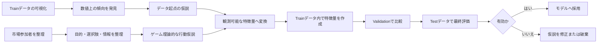

現在行っている、

1. Trainデータをグラフ化する
2. 傾向を観察する
3. 仮説を立てる
4. 特徴量を作る

という流れに、ゲーム理論による**行動・構造起点の仮説**を追加します。

---

## 3. ゲーム理論は価格予測モデルそのものではない

### 3.1 統計・機械学習が扱うもの

統計・機械学習による予測モデルは、予測時点までに得られた情報から、将来の目的変数を推定します。

例として、予測日から90日後の価格上昇率を予測する場合を考えます。

- **入力**：予測日時点までに取得可能な商品・市場データ
- **出力**：90日後の価格上昇率、または一定以上値上がりする確率

概念的には、次の関係を学習します。

```text
予測時点までの特徴量
        ↓
過去データから学習した予測モデル
        ↓
将来の価格・上昇率・値上がり確率
```

### 3.2 ゲーム理論が扱うもの

ゲーム理論は、主に次のような状況を考えるための枠組みです。

- 誰が市場に参加しているか
- それぞれ何を目的としているか
- どのような選択肢を持っているか
- 誰がどの情報を知っているか
- ある参加者の行動に、ほかの参加者がどう反応するか

コレクター市場では、価格は商品属性だけでなく、次の参加者の相互作用で変化します。

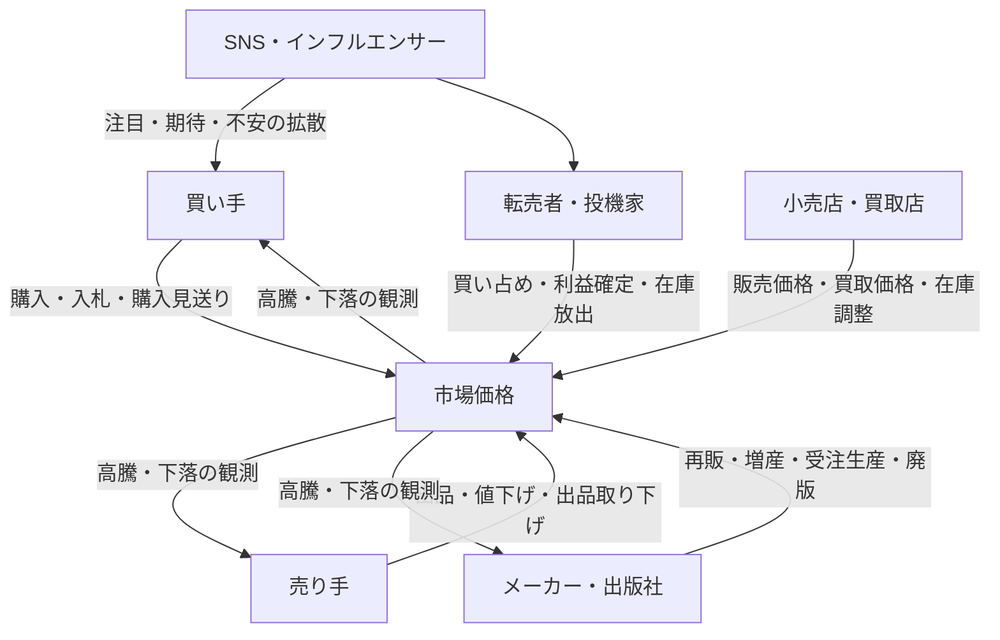

ゲーム理論は、上図の相互作用を整理し、**どの行動をデータとして測るべきか**を考える際に役立ちます。

---

## 4. グラフから立てる仮説とゲーム理論から立てる仮説

### 4.1 グラフから立てる仮説

グラフを観察する方法は、実際のデータに現れた関係を発見するのに向いています。

例：

```text
出品数が減少した期間に、価格が上昇している
```

この観察から、次の特徴量を考えられます。

- 出品数
- 出品数の前週比
- 30日間の出品数減少率
- 出品数の移動平均
- 価格と出品数の相関

ただし、この時点では、**なぜ出品数が減ったのか**までは分かりません。

### 4.2 ゲーム理論から立てる仮説

同じ現象について、市場参加者の行動を考えます。

| 行動仮説 | 背景にある目的 |
|---|---|
| 値上がりを期待した保有者が出品を控えた | より高い価格で売りたい |
| 買い手が急いで購入し、在庫が減った | 品切れ前に確保したい |
| 一部の出品者が大量に買い集めた | 供給を減らして高値で売りたい |
| 出品者が売れない商品を取り下げた | 手間や値下げを避けたい |
| 再販情報を知った売り手が売却を急いだ | 値下がり前に利益を確定したい |

これにより、「出品数」だけでは区別できなかった現象を、追加データで分解できます。

| 確認したい現象 | 特徴量候補 |
|---|---|
| 実際に売れて在庫が減った | 成約件数、販売速度、売り切れ率 |
| 売り手が出品を控えた | 出品取り下げ数、再出品率、新規出品者数 |
| 在庫が一部の売り手に集中した | 出品者別在庫数、在庫集中度 |
| 値上がり期待が強まった | SNS投稿、検索量、買取価格の上昇 |
| 利益確定が始まった | 高騰後の新規出品増加率、値下げ頻度 |

---

## 5. 仮説構築の基本フロー

### 5.1 推奨フロー

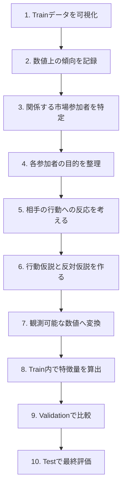

### 5.2 各工程で考えること

| 工程 | 確認する内容 |
|---|---|
| 可視化 | 価格、出来高、出品数、SNS投稿などにどのような変化があるか |
| 参加者の特定 | 買い手、売り手、店舗、転売者、メーカーなど、誰の行動が関係するか |
| 目的の整理 | 安く買う、高く売る、在庫を減らす、注目を集めるなど |
| 反応の予測 | 値上がり、品薄、再販発表などに対して何をするか |
| 反対仮説 | 同じデータを説明できる別の原因はないか |
| 数値化 | 仮説をどのデータで代理測定できるか |
| 検証 | 未知の未来データでも予測性能を改善するか |

---

## 6. コレクター製品で考えられる市場参加者

| 市場参加者 | 主な目的 | 典型的な行動 | 特徴量候補 |
|---|---|---|---|
| コレクター | 欲しい商品を確保する | 購入、入札、長期保有 | ユニーク購入者数、入札者数、リピート購入率 |
| 投資目的の購入者 | 将来の値上がり益を得る | 買い集め、短期保有、利益確定 | 購入後の短期再出品率、出来高急増率 |
| 個人売り手 | 高く、早く売る | 出品、値下げ、取り下げ | 値下げ回数、出品期間、再出品率 |
| 大量出品者 | 在庫全体の利益を最大化する | 在庫調整、価格維持、大量放出 | 出品者別在庫数、在庫集中度 |
| 小売店 | 在庫回転と利益を両立する | 販売価格変更、再入荷 | 店舗在庫、価格改定頻度 |
| 買取店 | 安く仕入れて高く売る | 買取価格変更、買取停止 | 買取価格、販売価格とのスプレッド |
| メーカー | 売上とブランド価値を高める | 再販、増産、限定販売 | 過去の再販頻度、再販までの日数 |
| SNS発信者 | 注目、影響力、収益を得る | 紹介、予想、煽り、レビュー | 投稿数、発信者数、影響度加重投稿数 |

### 6.1 見落としやすい市場参加者（2026-08-02 追加）

上の表は「取引に直接参加する主体」だけを並べていました。しかし、**取引に参加しないのに市場を動かす主体**が存在します。

これらは §16.3 の洗い出し手法（お金とモノの流れを追う、業界構造分析）で点検すると見つかります。

| 市場参加者 | 主な目的 | 市場を動かす手段 | 特徴量候補 |
|---|---|---|---|
| **プラットフォーム**（メルカリ、ヤフオク、eBay） | 流通総額と手数料収入を増やす | 手数料率の改定、規約変更、検索順位の変更、クーポン施策 | 手数料改定日フラグ、施策実施日フラグ、改定前後の出品数変化 |
| **鑑定会社**（PSA、BGSなど） | 鑑定件数と信頼性を高める | 鑑定枚数の公開、鑑定待ち日数、対応タイトルの追加 | 鑑定済み発行枚数、鑑定待ち日数、高評価品の出現率 |
| **海外バイヤーと為替** | 内外価格差で利益を得る | 円安時の買い越し、円高時の売り越し | 為替レート、内外価格差、海外出品比率 |
| **税制・法規制** | （主体ではないが制約として働く） | 確定申告の締切、古物営業法、プラットフォーム間の規制差 | 年末フラグ、月末フラグ、規制変更日 |

**プラットフォームが特に重要です。** 手数料が10%から8%に変わると、**全出品者の利得関数が同時に変わります**。個別商品の要因ではなく、市場全体に同時に効く数少ない共通ショックなので、モデルにとって価値が高い情報です。

---

## 7. ゲーム理論から導ける特徴量の例

### 7.1 売り手同士の競争

売り手は、ほかの出品者より先に売るために値下げする場合があります。

**仮説**

> 最安値付近に多くの出品が集中している商品では、値下げ競争が起こりやすく、価格が下落しやすい。

**特徴量候補**

- 出品者数
- 最安値から5%以内の出品数
- 出品価格の分散
- 値下げした出品の割合
- 平均値下げ回数
- 新規出品から最初の値下げまでの日数
- 1出品者当たりの出品数

---

### 7.2 買い手同士の競争

希少な商品に複数の買い手が集中すると、価格が押し上げられます。

**仮説**

> 出品数に対して独立した買い手の数が多いほど、価格上昇圧力が強い。

**特徴量候補**

- ユニーク購入者数 ÷ 出品数
- 入札者数 ÷ オークション件数
- ウォッチ数 ÷ 出品数
- 1日当たりの販売件数
- 終了直前の入札集中率
- 出品から成約までの中央値

---

### 7.3 メーカーによる再販・増産

価格が高騰すると、メーカーには再販や増産を行う動機が生まれる場合があります。

**仮説**

> 高騰していても、再販可能性が高い商品は長期的な価格上昇が続きにくい。

**特徴量候補**

- メーカー別の過去再販率
- 発売から再販までの平均日数
- 価格上昇後に再販された割合
- 同シリーズ新商品の発売予定
- 受注生産の採用頻度
- 廃版・生産終了の公式情報
- 予測時点で推定した再販確率

---

### 7.4 投機家による利益確定

値上がりが続くほど、既存保有者が売却して利益を確定する可能性があります。


**特徴量候補**

- 直近の値上がり率
- 値上がりの加速度
- 連続上昇日数
- 高値更新後の新規出品数
- 出来高の急増率
- 出品数の反転
- 買取価格が販売価格へ追随する速度

---

### 7.5 市場間の裁定行動

異なる市場で価格差があると、安い市場で買い、高い市場で売る参加者が現れます。

**仮説**

> 市場間価格差が大きい場合、安い市場では買い圧力、高い市場では売り圧力が発生し、価格差は縮小しやすい。

**特徴量候補**

- フリマ・オークション・買取店の価格差
- 手数料と送料を引いた実質価格差
- 最安市場と最高市場の価格差率
- 価格差が継続した日数
- 市場ごとの在庫数
- 市場間価格差の縮小速度

---

## 8. 仮説を特徴量へ変換する方法

### 8.1 抽象的な仮説をそのまま使用しない

次のような仮説は、そのままではモデルへ入力できません。

```text
買い手の競争が強い商品は値上がりしやすい
```

この仮説を、観測可能な数値に分解します。

```text
買い手の競争
    ├─ ユニーク購入者数
    ├─ 入札者数
    ├─ ウォッチ数
    ├─ 販売速度
    └─ 出品数に対する需要の比率
```

### 8.2 代理変数を複数考える

一つの行動を直接観測できない場合は、代理となる変数を使います。

| 観測したい概念 | 代理変数の例 |
|---|---|
| 値上がり期待 | SNS投稿数、出品取り下げ、買取価格上昇 |
| 買い手の競争 | 入札者数、ウォッチ数、成約速度 |
| 売り手の焦り | 値下げ頻度、出品期間、価格改定幅 |
| 利益確定 | 高騰後の新規出品、短期再出品率 |
| 再販リスク | メーカーの過去行動、公式発表、発売周期 |

### 8.3 比率・変化率・相互作用を検討する

単純な件数だけでは、商品の規模の違いを受けやすくなります。

そのため、次のような特徴量も検討します。

```text
需要供給比 = ユニーク購入者数 ÷ 出品数
```

```text
在庫集中度 = 上位出品者が保有する出品数 ÷ 全出品数
```

```text
市場過熱度 = 価格上昇率 × 出来高増加率
```

```text
利益確定圧力 = 含み益の推定値 × 高騰後の新規出品増加率
```

ただし、複雑な特徴量を作るほど、過学習や解釈困難の可能性も高まるため、単純な特徴量との比較が必要です。

---

## 9. 仮説記録テンプレート

特徴量を思いつきで追加するのではなく、次の形式で記録すると、再現性を高められます。

```markdown
## 仮説名
高騰期待による出品控え

### 観察
価格上昇の直前に出品数が減少している。

### 関係する市場参加者
既存保有者、個人売り手、投資目的の購入者

### 行動仮説
既存保有者が今後の値上がりを期待し、現在価格での売却を控えている。

### 反対仮説
単に商品が多く売れた結果として、出品数が減っただけである。

### 必要なデータ
- 成約件数
- 出品取り下げ数
- 新規出品数
- ユニーク出品者数
- 出品者別在庫数

### 特徴量候補
- 出品取り下げ率
- 成約を伴わない出品数減少率
- 新規出品者数の減少率
- 在庫集中度

### リーク確認
すべて予測時点までに取得可能な情報だけで計算する。

### 検証方法
時系列Validationで、ベースラインモデルとの予測性能を比較する。

### 採用基準
複数期間・複数カテゴリで安定して性能が改善する場合に採用する。
```

---

## 10. データリークを防ぐ

ゲーム理論から考えた特徴量であっても、将来情報を使えばデータリークになります。

### 10.1 判断基準

> その特徴量は、実際に予測を実行する時点で取得または計算できたか。

### 10.2 使用可能な例

予測日が2026年1月1日の場合：

- 2026年1月1日までの価格履歴
- 2026年1月1日までの出品数
- 2026年1月1日までのSNS投稿
- 予測日までに公式発表された再販予定
- 過去データだけで推定した再販確率
- 予測日時点の市場間価格差

### 10.3 使用できない例

- 2026年1月20日に発表された再販情報
- 2026年2月のSNS投稿数
- オークション終了後に確定した最終入札者数
- 90日後までの累計販売数
- 将来確定した鑑定枚数

### 10.4 時刻情報の管理

各データに、少なくとも次の日時を持たせると管理しやすくなります。

| 項目 | 意味 |
|---|---|
| `event_time` | 実際に出来事が発生した日時 |
| `known_at` | その情報が一般に知り得る状態になった日時 |
| `collected_at` | システムが実際に取得した日時 |

例：

```text
再販実施日     event_time     = 2026-01-20
公式発表日     known_at       = 2026-01-10
システム取得日 collected_at   = 2026-01-11
```

この情報は、2026年1月15日の予測には使えますが、2026年1月5日の予測には使えません。

---

## 11. Train・Validation・Testの役割

| データ | 主な用途 | 注意点 |
|---|---|---|
| Train | グラフ化、仮説構築、特徴量生成、モデル学習 | 仮説を立てる中心データ |
| Validation | 特徴量・モデル・ハイパーパラメータの比較 | 繰り返し確認するとValidationへ過学習する |
| Test | 最終的な未知データ上の性能評価 | 原則として、設計中に何度も見ない |

時系列予測では、ランダム分割ではなく、過去から未来へ進む形で分割します。

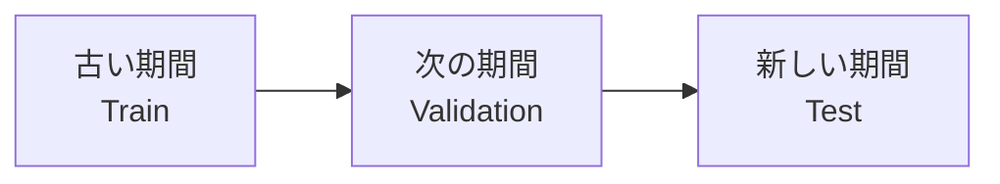

また、より安定した評価を行うために、時点をずらして複数回評価する方法もあります。

```text
検証1：2019〜2022年で学習 → 2023年を評価
検証2：2019〜2023年で学習 → 2024年を評価
検証3：2019〜2024年で学習 → 2025年を評価
```

---

## 12. 特徴量を採用するときの判断基準

ゲーム理論的にもっともらしい特徴量でも、必ず有効とは限りません。

### 採用前に確認する項目

- 予測時点で取得可能か
- 将来情報が混ざっていないか
- 複数のValidation期間で改善するか
- 特定の商品カテゴリだけに依存していないか
- 特定の高騰事例だけで有効になっていないか
- 取得・保存・計算コストに見合うか
- 欠損が多すぎないか
- 操作されやすいデータではないか
- 既存特徴量とほぼ同じ情報ではないか

### 採用の考え方

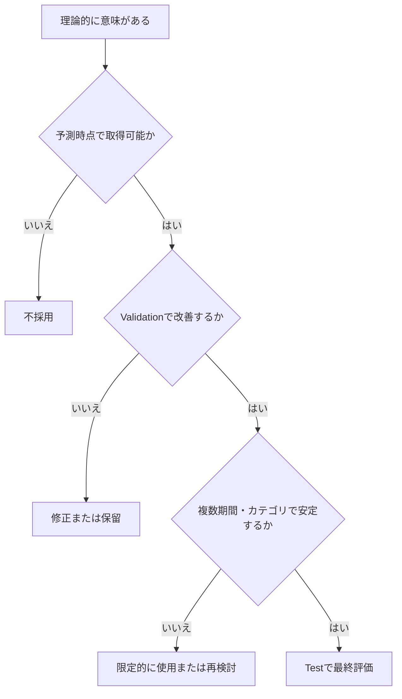

---

## 13. ゲーム理論を使う際の注意点

### 13.1 人間は常に合理的ではない

ゲーム理論では、参加者が自分の利益を考えて行動すると仮定することがあります。

しかし実際のコレクター市場では、次のような行動もあります。

- 思い入れのある商品を相場以上で購入する
- 損失を認めたくないため売却しない
- SNSの熱狂に影響される
- 価格ではなく所有満足を重視する
- 知識不足のまま取引する

したがって、ゲーム理論上の行動仮説は、**実データで検証する必要があります**。

### 13.2 市場参加者の目的は一つではない

同じ購入者でも、目的が異なります。

| 購入者の種類 | 主な目的 |
|---|---|
| 純粋なコレクター | 所有、鑑賞、コンプリート |
| プレイヤー | ゲームや大会での使用 |
| 投資家 | 中長期の値上がり益 |
| 転売者 | 短期的な価格差益 |
| 贈答目的 | プレゼントとしての購入 |

すべての購入者を同じ行動主体として扱うと、仮説が粗くなる可能性があります。

### 13.3 仮説を作りすぎない

ゲーム理論を使うと、多数の仮説を考えられますが、特徴量を無制限に増やすと過学習につながります。

そのため、次の順序を推奨します。

1. 単純なベースラインを作る
2. 一つの仮説につき少数の特徴量を追加する
3. 改善量を測る
4. 改善しない特徴量は削除する
5. 有効な特徴量だけを残す

---

## 14. 将来的に重要になる論点

### 14.1 アプリの予測が市場を動かす可能性

アプリの利用者が増えると、予測結果を見たユーザーの購入によって、実際の価格が動く可能性があります。

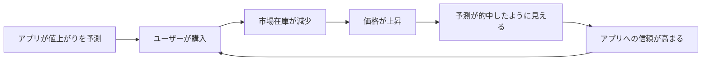

この場合、モデルが外部の市場を予測したのではなく、**予測の公開自体が市場を変えた**可能性があります。

将来的には、次のデータを記録することが重要です。

- 予測の公開日時
- 予測ページの閲覧数
- 商品ページへの遷移数
- 公開前後の販売件数
- 公開前後の出品数
- 公開商品と未公開商品の価格変化

### 14.2 特徴量を意図的に操作される可能性

予測ロジックが知られると、市場参加者がモデルを有利に動かそうとする可能性があります。

例：

- SNS投稿数を人工的に増やす
- 高額な出品を大量に掲載する
- 自作自演の取引で価格を作る
- 一時的に出品を取り下げて品薄に見せる
- 複数アカウントでウォッチ数を増やす

そのため、将来的には特徴量の予測力だけでなく、**操作耐性と信頼度**も評価する必要があります。

---

## 15. 実践時のチェックリスト

### 仮説構築

- [ ] Trainデータだけを使って観察している
- [ ] グラフ上の傾向を文章で説明できる
- [ ] 関係する市場参加者を特定した
- [ ] 各参加者の目的を整理した
- [ ] ある行動に対する他者の反応を考えた
- [ ] 反対仮説を作った
- [ ] 仮説を観測可能な数値へ変換した

### データ設計

- [ ] 予測時点で取得可能な情報だけを使用している
- [ ] `event_time`、`known_at`、`collected_at`を区別している
- [ ] 欠損時の扱いを決めている
- [ ] 市場や商品カテゴリごとの差を確認している
- [ ] データ操作や不正取引の影響を考慮している

### 検証

- [ ] Train・Validation・Testを時間順に分けている
- [ ] ベースラインモデルと比較している
- [ ] 複数の期間で評価している
- [ ] 複数の商品カテゴリで評価している
- [ ] 性能だけでなく取得コストも評価している
- [ ] Testデータを特徴量設計に使用していない

---

## 16. ステークホルダーの洗い出しとゲーム理論の関係

ここから §21 までは、2026-08-02 の議論で追加した内容です。

### 16.1 疑問

```text
ゲーム理論は、市場に出てくるステークホルダーを捉えることが起点になるのか。
それとも、ステークホルダーを洗い出す部分そのものに使える概念なのか。
```

### 16.2 結論

**「起点になる」という理解は正しいです。ただし、洗い出しそのものはゲーム理論の外側の作業です。**

正確に言うと、次のようになります。

```text
ゲーム理論は「誰がいるか」を教えてくれない。

しかし
  「その人について何を知るべきか」を教えてくれる。
  「その人をモデルに入れる必要があるか」を判定してくれる。
```

なぜそう言えるかは、ゲーム理論が「ゲーム」をどう定義しているかを見ると分かります。

```text
ゲーム G = ( N , {S_i} , {u_i} , 情報構造 )

  N        プレイヤー集合        ← 誰が参加しているか
  S_i      各プレイヤーの戦略集合  ← 何を選べるか
  u_i      各プレイヤーの利得関数  ← 何を目的とするか
  情報構造                      ← 誰が何を知っているか
```

注目すべきは、**`N`（プレイヤー集合）が定義の第1要素、つまり理論への「入力」**である点です。理論が導き出す「出力」ではありません。

| 問い | 答え |
|---|---|
| ステークホルダーを捉えることが起点か | **はい。** プレイヤー集合を決めないと、そもそもゲームを定義できない |
| 洗い出しそのものに使える概念か | **生成には使えない。選別と点検には使える** |

#### 身近な例

```text
将棋のルールブックは、
「駒がどう動くか」「どちらが勝ちか」を定義している。

しかし
「今日、誰と誰が対局するか」は書いていない。

対局者を決めるのは、ルールブックの仕事ではない。
```

ゲーム理論も同じです。ルール（構造）は書けますが、参加者リストは外から与える必要があります。

### 16.3 ゲーム理論が提供する3つの「判定基準」

洗い出しには使えませんが、**洗い出した結果を点検する基準**は与えてくれます。実務ではここが一番効きます。

#### 判定基準1：戦略的に反応するか（プレイヤー vs 自然）

ゲーム理論には、戦略的に動かない要因を扱う **「自然（Nature）」** という装置があります。

```text
その主体は、他者の行動を見て自分の行動を変えるか？

  はい  → プレイヤー（相互作用がある）
  いいえ → 自然（外生的に動くだけ）
```

**これが特徴量設計に直結します。**

| 分類 | 特徴量への含意 |
|---|---|
| プレイヤー（反応する） | **交互作用・フィードバック特徴量が必要**。「Aが動いたらBがどう動いたか」を測る |
| 自然（反応しない） | **単なる外生変数でよい**。交互作用は不要 |

具体例で判定してみます。

| 主体 | 判定 | 理由 | 必要な特徴量 |
|---|---|---|---|
| メーカーの再販 | **場合による** | 価格高騰を見て再販を決めるなら**プレイヤー**。生産計画が事前に固定なら**自然** | プレイヤーなら `価格上昇率 × 推定再販確率` の交互作用。自然なら日付変数だけ |
| 為替 | **自然** | コレクター市場が為替を動かすことはない | 為替レートをそのまま入れる |
| SNS発信者 | **プレイヤー** | 価格が動いたから取り上げ、取り上げたから価格が動く（双方向） | `price_change × sns_change` の交互作用 |
| 配布終了日 | **自然** | 事前に決まっており、市場の反応で変わらない | `days_to_distribution_end` だけでよい |
| プラットフォームの手数料改定 | **ほぼ自然** | 個別商品の価格に反応して変えることはない | 改定日フラグ |

> **「この主体はプレイヤーか自然か」を判定するだけで、交互作用特徴量を作るべきかどうかが決まります。**
> これがゲーム理論の、最も実用的な使い道の1つです。

#### 判定基準2：除外テスト

```text
その主体をモデルから外したとき、
他のプレイヤーの最適行動の予測が変わるか？

  変わらない → モデルに入れる必要がない
  変わる    → 必須
```

#### 判定基準3：予測の失敗からの逆算

```text
モデルの予測と現実がズレた
    ↓
「抜けているプレイヤーがいるのでは？」と疑う
```

実務で一番使うのはこれです。§5.1 の「反対仮説を作る」と同じ発想の、参加者版です。

### 16.4 洗い出しに使う方法（ゲーム理論の外側）

では、洗い出しは何でやるのか。ゲーム理論の外にある方法を使います。

| 方法 | 内容 | コレクター市場での使い方 |
|---|---|---|
| **お金とモノの流れを追う** | 取引のノードごとに主体がいる | メーカー→問屋→小売→一次購入者→フリマ→二次購入者→買取店→再販 |
| **業界構造分析** | 供給者・買い手・新規参入・代替品・既存競合の5方向から探す | 「代替品」= 別IPのカード、他の趣味、投資先としての株。ここは見落としやすい |
| **ステークホルダー顕著性モデル**（Mitchell, Agle & Wood, 1997） | 権力・正当性・緊急性の3属性で分類する | 「権力」= 単独で価格を動かせるか。大量出品者とプラットフォームが該当 |
| **プラットフォーム分析** | 場を提供する主体は取引に参加しないが、ルールを決める | メルカリ・ヤフオク・eBay |
| **データから逆に見つける** | 異常なパターンから未知の主体を発見する | 同一価格での大量出品 → 業者の存在 |

この方法で §6 のリストを点検した結果、4つの主体が抜けていることが分かりました。追加分は **§6.1** に記載しています。

### 16.5 実際の作業順序

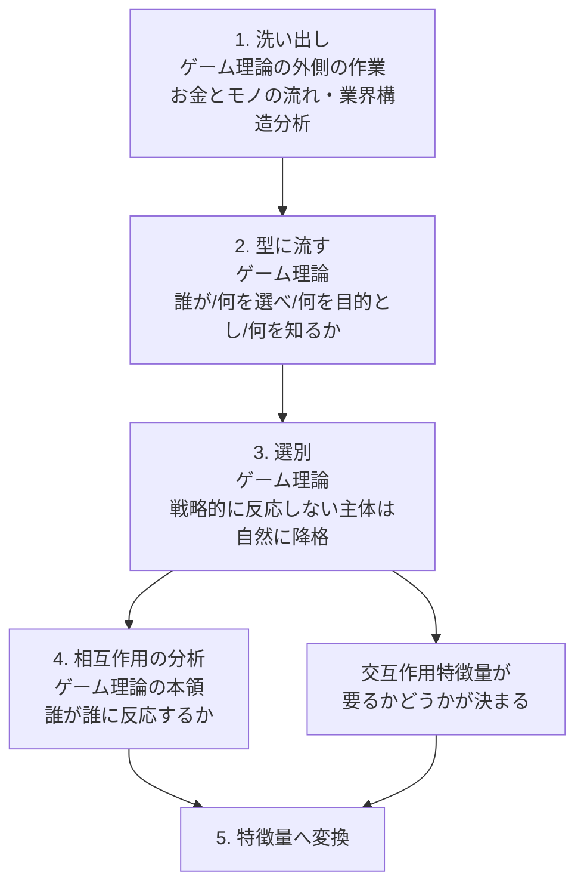

> **ゲーム理論の本当の価値は「答えを出すこと」ではなく、「埋めるべき欄を定義すること」です。**
>
> 主体を1つ挙げるたびに4つの問い（誰が・何を選べ・何を目的とし・何を知るか）が自動的に発生します。
> 洗い出しそのものはできなくても、洗い出しの**深さ**は保証されます。

---

## 17. ゲーム理論の3つの弱点

ゲーム理論を実データで使おうとすると、3つの壁に当たります。

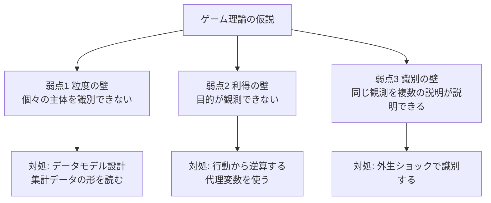

### 17.1 弱点1：粒度の壁（集計は不可逆）

ゲーム理論の仮説は「個々の主体」についてのものですが、手元にあるのは集計値です。

```text
listing_count = 15

この「15」から
  「1人が15個出している」のか
  「15人が1個ずつ出している」のか
は、復元できない。
```

ここで重要なのは、問題の正確な言い方です。

> **データが取りにくいのではありません。**
> **取得した瞬間には一覧ページに両方の情報があったのに、集計して保存した時点で永久に失われているのです。**
>
> **集計は不可逆な操作です。**

エージェントベースモデルの研究でも「集計はパラメータの識別可能性を著しく損なう。特に主体間の相互作用やフィードバックを含むモデルで顕著」と指摘されています。これはまさにゲーム理論が扱う対象そのものです。

この弱点への対処は、2つあります。

- **§18**：すでに集計されてしまったデータから、構造の痕跡を読み取る
- **§19**：そもそも集計せずに保存する（根本対処）

### 17.2 弱点2：利得の壁（目的が観測できない）

```text
ある出品者が値下げした。なぜか？

  a. 早く現金化したい
  b. 在庫を減らしたい
  c. 相場を下げてから買い集めたい
  d. 単に飽きた

行動は見えるが、目的は見えない。
```

ゲーム理論は利得関数 `u_i` を前提として計算しますが、その利得関数こそが観測できません。

### 17.3 弱点3：識別の壁（複数均衡・観測等価）

これが最も根の深い問題です。

```text
同じ観測データを、複数のゲームが同じように説明できる。
さらに、多くのゲームは均衡が複数あり、
理論が一意の予測を出さない。

均衡が2つあるとき、どちらが選ばれるかは理論の外にある。
```

つまり、**データが完璧に揃っていても仮説を区別できない場合がある**ということです。データ収集だけでは解決しません。

計量経済学ではこれを「不完備なモデル」として扱い、点推定をあきらめて**区間で答える（部分識別）**という方法が確立しています（Tamer 2003、Ciliberto & Tamer 2009）。

この弱点への対処は **§20** で扱います。

### 17.4 3つの弱点の要約

| 弱点 | 内容 | 本質 | 主な対処 |
|---|---|---|---|
| 1. 粒度の壁 | 個々の主体を識別できない | **設計の問題**（集計が不可逆） | データモデル設計（§19）、集計値の形を読む（§18） |
| 2. 利得の壁 | 目的が観測できない | **観測の問題** | 代理変数、行動からの逆算 |
| 3. 識別の壁 | 同じ観測を複数の説明が説明できる | **理論の問題** | 外生ショックによる識別（§20） |

**弱点1は設計で解決できます。弱点3は設計では解決できません。** この区別が重要です。

---

## 18. 弱点1への対処A：集計データから構造を読む

### 18.1 出発点となった問い

```text
集計データから特徴量を抽出するときに、
グラフで可視化することで、失われた情報が再度見えてくるのではないか。
仮説を立てて実際にグラフ化するという流れ。
```

**この直感は、かなりの部分で正しいです。** ただし、正確に言うと次のようになります。

> 可視化で見えてくるのは、**失われた情報そのものではなく、その「影」**です。
>
> 個々の出品者が誰かは二度と分かりません。
> しかし「**大口出品者がいる市場かどうか**」は、集計値の**動き方**に痕跡として残ります。

### 18.2 なぜ痕跡が残るのか

#### 身近な例：足音

```text
隣の部屋にいる人の姿は見えない。
しかし、足音を聞けば分かることがある。

  ・大人が1人歩いている  → ドスン、ドスン（大きく、間隔が長い）
  ・子どもが3人走っている → タタタタタ（小さく、不規則で速い）

「誰か」は分からない。
しかし「どういう構成か」は、音の"形"から推測できる。
```

集計データも同じです。`listing_count = 15` という**値**からは何も分かりませんが、`listing_count` の**動き方**には、元の主体の行動ルールが刻まれています。

### 18.3 集計データに残る6つの指紋

具体的に、何をグラフにすれば何が見えるかを整理します。

---

#### 指紋1：増分の粒度（階段の高さ）

**何が分かるか**：大口出品者がいるかどうか

**わかりやすい例**

```text
1人が5個ずつまとめて出品する市場
  listing_count: 10 → 15 → 15 → 20 → 20 → 15
  日次差分:         +5    0   +5    0   -5
  → 差分が「5の倍数」に偏る

15人が1個ずつ出品する市場
  listing_count: 10 → 11 → 13 → 12 → 14 → 15
  日次差分:         +1   +2   -1   +2   +1
  → 差分が「1前後」にばらつく
```

**グラフの描き方**

```text
listing_count の日次差分のヒストグラムを描く

  横軸: 差分の値（-10, -5, -1, 0, +1, +5, +10 ...）
  縦軸: その差分が出た日数

  特定の値（5や10）に山ができる → 大口出品者がいる
  0付近になだらかに分布する     → 小口が多数
```

**本システムでの活用**

| 特徴量名 | 計算式 | 意味 |
|---|---|---|
| `listing_diff_lumpiness_30d` | 直近30日の `listing_count` 差分のうち、絶対値が3以上だった日の割合 | 大口の動きの頻度 |
| `listing_diff_gcd_hint_30d` | 差分の非ゼロ値の最頻値 | 大口の1回あたりの出品数 |

---

#### 指紋2：分散と平均の関係（過分散）

**何が分かるか**：在庫が少数に集中しているか、多数に分散しているか

**わかりやすい例**

```text
多数の独立した小口出品者が、それぞれ気まぐれに出品する
  → 件数はポアソン分布に近くなる
  → 分散 ≒ 平均

少数の大口が在庫をまとめて動かす
  → 平常時は静かだが、動くときは大きく動く
  → 分散 >> 平均（過分散）
```

```text
分散 ÷ 平均 ≒ 1   →  多数の独立した小口出品者
分散 ÷ 平均 >> 1  →  少数の大口出品者が支配している
```

**本システムでの活用（重要）**

| 特徴量名 | 計算式 | 意味 |
|---|---|---|
| `listing_dispersion_30d` | `rolling_var(listing_count, 30) / rolling_mean(listing_count, 30)` | 在庫集中度の代理変数 |

> **これは、§7.1 で「出品者IDがないと作れない」としていた「在庫集中度」の代替品になります。**
> 出品者を識別できなくても、**集計値の散らばり方**から集中の度合いを近似できます。

---

#### 指紋3：変化の先行・遅行（誰が誰に反応しているか）

**何が分かるか**：相互作用の方向と速さ

ゲーム理論の核心は「Aが動いたらBが反応する」です。これは集計値でも、**時間差のある相関**として見えます。

**わかりやすい例**

```text
価格上昇 →  3日後に出品増   →  売り手が価格に反応している
出品減   →  5日後に価格上昇 →  買い手が供給に反応している
SNS増    →  2日後に価格上昇 →  買い手が注目に反応している
```

**グラフの描き方**

```text
ラグ付き相互相関プロット

  横軸: ラグ日数（-14日 〜 +14日）
  縦軸: 2つの系列の相関係数

  ピークが立つラグ = 反応にかかる日数
  ピークが右側     = 前者が先行している
```

**本システムでの活用**

| 特徴量名 | 計算式 | 意味 |
|---|---|---|
| `sns_lead_price_lag` | `sns_mentions` と `price` の相互相関が最大になるラグ日数 | 注目から価格への伝播速度 |
| `listing_lead_price_lag` | `listing_count` と `price` の相互相関が最大になるラグ日数 | 供給から価格への伝播速度 |
| `price_lead_listing_lag` | `price` と `listing_count` の相互相関が最大になるラグ日数 | 価格から供給への伝播速度（売り手の反応速度） |

**注意**：これらは推定に長い履歴（最低でも60〜90日）が必要です。商品ごとに1つの値を持つ「商品属性的な特徴量」になります。また、計算には**予測時点までの履歴だけ**を使ってください。

---

#### 指紋4：減少の内訳（売れたのか、引っ込めたのか）

**何が分かるか**：損失回避による売り渋りが起きているか

**わかりやすい例**

```text
出品数が 20 → 15 に減った。5件減った理由は？

  a. 5件売れた         → 需要が強い（価格は上がりやすい）
  b. 5件取り下げられた  → 売り渋り（供給が細る）

この2つは、価格予測にとって正反対の意味を持つ。
```

`sold_count` があれば、部分的に分解できます。

```text
listing_count の減少 = 成約による減少 + 取り下げによる減少 - 新規出品

新規出品数は分からないが、
「sold_count で説明できない減少」は計算できる。
```

**本システムでの活用**

| 特徴量名 | 計算式 | 意味 |
|---|---|---|
| `unexplained_supply_drop` | `max(0, -(listing_count.diff() + sold_count))` | 成約で説明できない出品数の減少 |
| `unexplained_drop_7d_sum` | 上記の直近7日合計 | 売り渋りの累積 |
| `sold_share_of_drop` | `sold_count / max(1, -listing_count.diff())` | 減少のうち成約が占める割合 |

> **これは、行動経済学ドキュメント §5.4.1 の「損失回避による売り渋り」を、識別子なしで直接測る特徴量です。**
> 現在のサンプルデータ（`listing_count` と `sold_count` がある）で今すぐ作れます。

---

#### 指紋5：値の張り付き・離散性

**何が分かるか**：在庫制約を持つ主体の存在

**わかりやすい例**

```text
listing_count が 常に 0〜3 の範囲でしか動かない
  → 出品者が極端に少ない。1件の出品が価格に与える影響が大きい

listing_count が 特定の値（例: 20）で何度も止まる
  → 在庫上限を持つ主体がいる、または出品枠の制限がある
```

**本システムでの活用**

| 特徴量名 | 計算式 | 意味 |
|---|---|---|
| `listing_count_range_90d` | 直近90日の `listing_count` の最大値 - 最小値 | 市場の厚み |
| `listing_mode_stickiness_30d` | 直近30日で最頻値をとった日数の割合 | 張り付きの強さ |

---

#### 指紋6：ゼロの多さ（流動性）

**何が分かるか**：価格の信頼性

**わかりやすい例**

```text
sold_count が 30日中 28日ゼロ
  → 月に2件しか売れていない
  → 表示されている「価格」は、実際の取引を反映していない可能性がある
  → この商品の予測は、そもそも当てにならない
```

**本システムでの活用**

| 特徴量名 | 計算式 | 意味 |
|---|---|---|
| `zero_sold_rate_30d` | 直近30日で `sold_count == 0` だった日の割合 | 流動性の低さ |
| `sold_count_30d_sum` | 直近30日の成約件数合計 | 取引の厚み |

> これは予測の**信頼度**として使えます。流動性が極端に低い商品は、予測確率が高くても提示しない、といった運用判断に使えます。

---

### 18.4 復元できるもの・できないもの

正直に限界も整理します。

| 情報 | 集計後に復元できるか | 備考 |
|---|---|---|
| 出品者が誰か（識別） | **不可能** | 永久に失われる |
| 個々の出品の価格改定履歴 | **不可能** | 永久に失われる |
| 保有者の取得価格 | **不可能** | そもそも観測されていない |
| 出品者数の正確な値 | **不可能** | オーダー（1人か、10人か、100人か）は推測できる |
| 在庫が集中しているか | **近似できる** | 指紋2（過分散） |
| 大口出品者がいるか | **近似できる** | 指紋1（増分の粒度） |
| 誰が誰に反応しているか | **近似できる** | 指紋3（先行遅行） |
| 売り渋りが起きているか | **近似できる** | 指紋4（減少の内訳） |
| 市場の厚み・流動性 | **測れる** | 指紋5・6 |

そして、最も重要な限界があります。

> **指紋は、複数の構造に対応しうる。**
>
> 過分散が観測されても、「大口出品者がいる」以外に「需要のショックが大きいだけ」でも説明できます。
> つまり、**弱点3（識別の壁）はここでも顔を出します。**

### 18.5 「センス」に頼らないための手順

「グラフで見つける」やり方には、**何を見れば区別できるかを思いつく**という属人的な部分が残ります。これは3つの方法で減らせます。

#### 方法1：シミュレーションで指紋を先に作る（最も効果が高い）

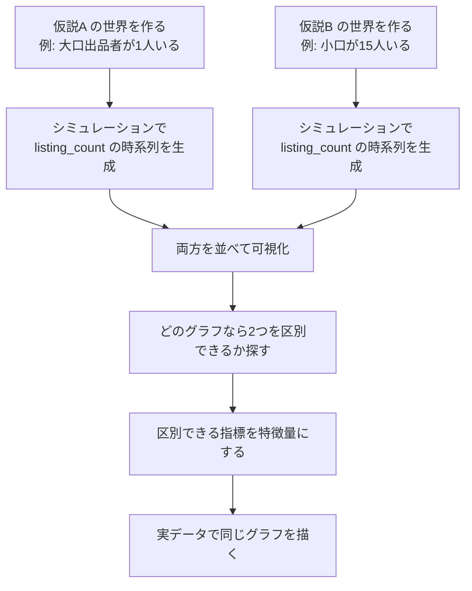

**この順序が重要です。** 実データを先に見ると、「見えた気がする」だけで終わりがちです。

```text
悪い順序: 実データを見る → 何か見えた気がする → 仮説を作る
          （見たいものが見えてしまう）

良い順序: 仮説を作る → シミュレーションで指紋を求める
          → 実データでその指紋を探す
          （何が見えたら仮説を支持するかが、先に決まっている）
```

**本システムでの活用**

このプロジェクトには既に `archive/legacy_collectible_src/generate_sample_data.py` があります。これを「出品者エージェントが行動ルールを持ち、その相互作用の結果として価格と出品数が決まる」形に書き換えれば、素朴なエージェントベースモデルになります。

そのうえで、次を試せます。

| 試すこと | 見るもの |
|---|---|
| 大口1人 vs 小口15人 の2条件でデータを生成する | `listing_count` 差分のヒストグラムが分かれるか |
| 売り渋りあり vs なし の2条件で生成する | `unexplained_supply_drop` が分かれるか |
| 反応が速い売り手 vs 遅い売り手 で生成する | 相互相関のピーク位置が分かれるか |

**分かれなければ、その特徴量は実データでも仮説を区別できません。** 実データで試す前に、これが分かるのが大きな利点です。

#### 方法2：指紋のチェックリストを持つ

§18.3 の6つの指紋を、毎回機械的に確認します。思いつきに頼らないための最も単純な方法です。

#### 方法3：候補を全部作って、機械に選ばせる

差分のヒストグラム統計量、分散平均比、ラグ相関、ゼロ率などを全部特徴量にして、Permutation Importance で絞り込みます。

ただし、**§13.3 のとおり、特徴量を増やしすぎると過学習します**。この方法は「候補を探す」段階に限定し、最終的には意味を説明できるものだけを残してください。

### 18.6 本システムで今すぐ作れる指紋特徴量（まとめ）

現在のサンプルデータ（`price`, `listing_count`, `sold_count`, `sns_mentions`, `trends_score`）だけで作れるものです。

| 優先度 | 特徴量名 | 元になる指紋 | 意味 |
|---:|---|---|---|
| A | `unexplained_supply_drop_7d_sum` | 指紋4 | 売り渋りの累積（損失回避の直接測定） |
| A | `listing_dispersion_30d` | 指紋2 | 在庫集中度の代理 |
| A | `zero_sold_rate_30d` | 指紋6 | 流動性（予測の信頼度） |
| B | `listing_diff_lumpiness_30d` | 指紋1 | 大口出品者の存在 |
| B | `sold_share_of_drop` | 指紋4 | 減少の内訳 |
| C | `sns_lead_price_lag` | 指紋3 | 反応速度（長い履歴が必要） |

> **結論として、「グラフで可視化すれば情報が見えてくる」という発想は正しく、実際に特徴量まで落とせます。**
> ただし、それは失われた情報の復元ではなく、**痕跡からの推測**です。
> そして推測である以上、必ず反対仮説が残ります（§18.4）。

---

## 19. 弱点1への根本対処：データモデル設計

§18 は「すでに集計されてしまった後」の対処でした。ここでは**そもそも集計しない**という根本対処を扱います。

**本番アプリを設計する今の段階で、最も費用対効果が高い作業です。**

### 19.1 原則：集計は不可逆

#### わかりやすい例：スーパーのレシート

```text
2つの店がある。

店A: 「本日の売上 12,340円」だけを記録する
店B: レシート1枚ずつを保存する

1年後、こう聞かれる。
「牛乳とパンは一緒に買われやすいですか？」

  店A → 永久に答えられない
  店B → すぐ答えられる

しかも、
「本日の売上」は、レシートからいつでも計算できる。
逆はできない。
```

これがデータ設計の最重要原則です。

```text
細かいデータ → 集計データ    ： いつでもできる
集計データ  → 細かいデータ    ： 絶対にできない
```

#### 本システムでの意味

```text
悪い保存（現在のサンドボックス）
  date, item_id, listing_count=15, price=1059
      ↑ もう「15人が1個ずつ」なのか「1人が15個」なのか分からない

良い保存
  date, item_id, listing_id, seller_id, listing_price, condition
      ↑ listing_count も price も、後からいつでも作れる
```

**出品者IDは、多くのフリマ・オークションの一覧ページに最初から表示されています。** 取得コストはほとんど変わりません。にもかかわらず、集計して保存すると永久に失われます。

### 19.2 3層のデータモデル

データ基盤の標準的な設計パターン（メダリオンアーキテクチャなどと呼ばれます）を、本システム向けに整理します。


| 層 | 役割 | 原則 | やってはいけないこと |
|---|---|---|---|
| **第1層：取得層** | 取得したものをそのまま残す | **追記のみ**（immutable） | 集計する／上書きする／消す |
| **第2層：整形層** | 分析しやすい形に揃える | **いつでも再計算できる** | ここに人手の判断を埋め込んで再現できなくする |
| **第3層：特徴量層** | モデルの入力を作る | **いつでも作り直せる** | ここだけを保存して第1層を捨てる |

**最も重要なルールは1つです。**

> **第1層を捨てないこと。**
>
> 第2層・第3層は、第1層があればいつでも作り直せます。
> 仮説が変われば特徴量も変わりますが、第1層があれば追いつけます。

### 19.3 具体的なテーブル設計

#### 19.3.1 `listings_snapshot`（出品スナップショット・日次）← 最重要

日次で、その商品の出品一覧を**1件ずつ**保存します。

| カラム | 型 | 意味 | これがあると作れるもの |
|---|---|---|---|
| `snapshot_date` | date | 取得日 | — |
| `item_id` | str | 商品ID | — |
| `listing_id` | str | 出品ID（URLやサイト内IDから） | 掲載期間、値下げ履歴、取り下げの検出 |
| `seller_id` | str | 出品者ID | **在庫集中度、出品者数、1人あたり出品数** |
| `listing_price` | int | この出品の価格 | **価格分散、最安値±5%の出品数、値下げ競争の強さ** |
| `condition` | str | 商品状態 | 状態調整済み価格 |
| `is_auction` | bool | オークションか固定価格か | 市場別の分析 |
| `listed_at` | datetime | 掲載開始日時（取れれば） | 掲載期間 |
| `collected_at` | datetime | システムが取得した日時 | リーク防止（§10.4） |

> **`listing_id` と `seller_id` と `listing_price` の3つを保存するだけで、§7 で挙げた特徴量のほとんどが作れるようになります。**
> 取得コストは、一覧ページを取る時点でほぼゼロです。

#### 19.3.2 `listing_events`（出品の変化イベント）

`listings_snapshot` の日次差分から**自動生成**します。手で集める必要はありません。

| カラム | 意味 |
|---|---|
| `listing_id` | 出品ID |
| `event_date` | 発生日 |
| `event_type` | `created` / `price_changed` / `removed` / `sold` |
| `old_price` | 変更前の価格 |
| `new_price` | 変更後の価格 |

**`removed` と `sold` の区別が決定的に重要です。**

```text
出品が一覧から消えた。売れたのか、取り下げられたのか？

  売れた     → 需要が強い（価格は上がりやすい）
  取り下げた → 売り渋り（損失回避の可能性）

多くのサイトでは「売り切れ」表示が出るので、区別できる。
ここを区別して保存すれば、
§18.3 の指紋4（推定）が、直接測定に変わる。
```

#### 19.3.3 その他のテーブル

| テーブル | 主なカラム | 目的 |
|---|---|---|
| `transactions` | `item_id`, `sold_at`, `sold_price`, `condition`, `marketplace` | 成約価格の分布。**保有者の推定取得価格**を作る材料になる（行動経済学ドキュメント §5.4.9） |
| `items` | `item_id`, `ip_name`, `category`, `release_type`, `release_date` | 商品マスタ |
| `market_events` | `item_id`, `event_type`, `event_time`, `known_at`, `collected_at` | 再販・配布終了など。**3つの時刻を必ず持つ**（§10.4） |
| `platform_events` | `platform`, `event_type`, `event_time`, `known_at` | 手数料改定・規約変更。**§6.1 で追加したプラットフォームに対応** |
| `fx_rates` | `date`, `pair`, `rate` | 為替（§6.1 の海外バイヤーに対応） |
| `daily_item_aggregates` | `date`, `item_id`, `listing_count`, `min_price`, `median_price`, `price_std`, `seller_count`, `hhi` | **他のテーブルから導出する**。ここは保存しなくても再計算できる |

### 19.4 何を保存すると何が解けるか

投資対効果の判断材料です。

| 保存する情報 | 追加コスト | 解ける弱点 | 作れるようになる特徴量 |
|---|---|---|---|
| `listing_id` | **ほぼゼロ**（URLにある） | 弱点1 | 掲載期間、取り下げ率、値下げ回数 |
| `seller_id` | **ほぼゼロ**（一覧に表示） | 弱点1 | 在庫集中度、出品者数、1人あたり出品数 |
| 各出品の `listing_price` | **ほぼゼロ**（一覧に表示） | 弱点1 | 価格分散、最安値±5%の出品数、値下げ競争 |
| `sold` と `removed` の区別 | 小 | 弱点1・2 | **売り渋りの直接測定** |
| `condition` | 小 | — | 状態調整済み価格 |
| プラットフォーム施策 | 中（手動収集） | — | 全市場に効く共通ショック |
| 買取価格 | 中（別サイト） | 弱点2 | 販売価格とのスプレッド、追随速度 |
| 入札履歴 | 大 | 弱点2 | 入札者数、終了直前の入札集中 |

**上4つは、コストがほぼゼロなのに効果が最も大きい**という点に注目してください。

### 19.5 移行の順序

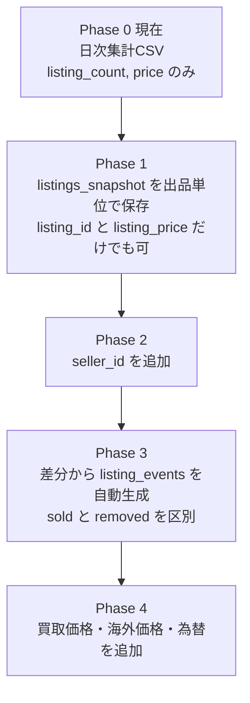

**重要な注意**

> **Phase 1 の実装は後回しでかまいませんが、「保存だけ」は今すぐ始める価値があります。**
>
> 分析コードを書くのは後でもできます。しかし、**保存を始めていない期間のデータは、永久に手に入りません。**
> 半年後に「出品者IDが欲しかった」と気づいても、その半年分は失われています。
>
> 逆に言えば、**保存さえしておけば、分析はいつでも追いつけます。**

### 19.6 現在のサンドボックスへの適用

現在のサンドボックスは学習用なので、本番のデータモデルをそのまま作る必要はありません。ただし、次の1点だけ試す価値があります。

```text
generate_sample_data.py を書き換えて、
「日次集計」ではなく「出品単位」でサンプルデータを生成する。

  現在: daily_snapshots.csv（date, item_id, listing_count, price, ...）
  変更: listings_snapshot.csv（date, item_id, listing_id, seller_id, listing_price, ...）
        daily_snapshots.csv は、そこから集計して生成する
```

これをやると、次の3つが同時に手に入ります。

| 得られるもの | 内容 |
|---|---|
| データモデルの練習 | 本番と同じ3層構造を小規模で体験できる |
| 指紋の検証環境 | §18.5 のシミュレーションがそのまま実行できる |
| 集計の不可逆性の実感 | 集計前と集計後で、作れる特徴量がどれだけ違うかを手で確かめられる |

---

## 20. 弱点2・弱点3への対処

### 20.1 弱点3に対する問い：行動経済学は識別の壁を補うか

```text
弱点3（同じ観測を複数の説明が説明できる）は、
行動経済学を併用することで補われているのではないか。
```

**結論：半分は補います。ただし完全には解決しません。**

| 面 | 評価 |
|---|---|
| 補う面 | **複数均衡の問題を「回避」する**。これは大きい |
| 補わない面 | **説明の複数性は残る**。問題の場所が移動しただけ |

### 20.2 補う面：level-k モデルは均衡を計算しない

標準的なゲーム理論の均衡（ナッシュ均衡）は、**不動点**として定義されます。

```text
「全員が、他の全員の戦略に対して最適な戦略をとっている状態」

  → この条件を満たす組み合わせが複数あることが多い
  → どれが実現するかは、理論の外
```

一方、行動ゲーム理論の **level-k / 認知階層モデル**（§4.4 の議論、および行動経済学ドキュメント §4.4.2）は、**不動点を計算しません**。

```text
level-0 を決める（例: ランダムに選ぶ）
    ↓
level-1 = level-0 に対する最適反応
    ↓
level-2 = level-1 に対する最適反応
    ↓
level-3 = level-2 に対する最適反応
```

**逐次的に計算するだけなので、答えが一意に決まります。** 均衡を探さないので、複数均衡の問題が原理的に発生しません。

これは実証研究でも指摘されている利点です。均衡が複数あるゲームでは「均衡＋ノイズ」のモデルは一意の予測を与えられませんが、level-k モデルは与えられます。

> **つまり、「行動経済学が弱点3を補う」という理解は、この点については正しいです。**

### 20.3 補わない面：問題が移動しただけ

しかし、別の場所で同じ問題が再発します。

#### わかりやすい例

```text
観察: 高騰後、保有者が売らない

行動経済学の説明候補
  a. 損失回避     — 買値を割ったので売れない
  b. 保有効果     — 持っているだけで高く感じる
  c. サンクコスト — 高く買ったので安く売れない
  d. 外挿的期待   — もっと上がると思っている

どれも同じ観測を説明できる。
「均衡の選択」問題が「バイアスの選択」問題に変わっただけ。
```

さらに、level-k モデルには**新しい任意性**が入ります。

```text
level-0 を何と置くか？

  ランダム？
  直前の相場？
  定価？

置き方によって、level-1 以降のすべてが変わる。
これは均衡選択問題の裏返しである。
```

### 20.4 本当に効く対処：外生ショックによる識別

理論の中で解こうとせず、**データの外から来る変化**を使います。これが最も確実な方法です。

#### わかりやすい例

```text
「高騰後に出品が増えない」を説明する2つの仮説

  仮説A（ゲーム理論）  : もっと上がると読んで待っている
  仮説B（行動経済学）  : 含み損を確定したくないので売れない

平常時のデータでは、この2つは区別できない。
どちらも「出品が増えない」を説明する。

しかし「再販発表」という外生ショックが起きると、予測が分かれる。

  仮説Aなら → 値上がり期待が崩れるので、出品が殺到するはず
  仮説Bなら → 含み損がさらに深まるので、むしろ出品は増えないはず

→ 再販発表後の出品数の動きが、2つを区別する。
```

これが、**外生ショックによる識別**の考え方です。

#### 使えるショックの一覧

| ショック | 外生性 | 何を識別できるか |
|---|---|---|
| 再販・増産の発表 | 高い | 期待による出し惜しみ vs 損失回避 |
| 配布終了 | 高い（日程が事前に決まっている） | 希少性への反応の強さ |
| プラットフォームの手数料改定 | 非常に高い（全商品に同時） | 売り手のコスト感応度 |
| 大手YouTube掲載 | 中（狙って起きることもある） | 注目の効果 |
| 為替の急変 | 非常に高い | 海外需要の寄与度 |
| 鑑定会社の対応タイトル追加 | 高い | 供給の可視化の効果 |

#### 本システムでの活用

**過去のショックへの反応そのものを、特徴量にできます。**

| 特徴量名 | 計算式 | 意味 |
|---|---|---|
| `past_restock_impact` | 過去の再販イベント時の、7日後価格変化率の平均 | その商品の再販への脆弱性 |
| `past_event_response_mean` | 過去の全イベント時の価格反応率の平均 | 反応の敏感さ |
| `event_response_vs_category` | 上記を同カテゴリ平均で割ったもの | 相対的な反応の強さ |
| `response_persistence` | イベント後、価格が元の水準に戻るまでの日数 | 反応の持続性 |

> **これは、観測できない参加者構造の代理変数を、過去の反応そのものから作るという発想です。**
>
> 転売者が多い商品は再販に強く反応し、純粋なコレクターが多い商品は反応が鈍い、といった構造の違いが、
> 「過去の反応の大きさ」に反映されているはずです。
>
> `event_type` は現在のサンプルデータにあるので、**今すぐ実装できます**。

### 20.5 弱点2（利得の壁）への対処

利得（目的）は直接観測できませんが、次の順で近づけます。

| 段階 | 方法 | 本システムでの例 |
|---|---|---|
| 1 | **代理変数を使う** | 「早く売りたい」→ 値下げ頻度、掲載期間 |
| 2 | **行動の非対称性を見る** | 含み益局面と含み損局面で行動が違えば、利得が金銭以外を含む証拠 |
| 3 | **外生ショックへの反応で分ける** | §20.4 |
| 4 | **構造推定で逆算する** | §21.3（難易度が高い） |

---

## 21. 弱点を補完する方法の全体像

### 21.1 6つの方法の比較

| 方法 | 何を解くか | 難易度 | 本システムでの実行可能性 |
|---|---|---|---|
| **1. データモデル設計**（§19） | 弱点1 | 低 | **今すぐ着手すべき**。本番アプリの設計中である今が最適 |
| **2. 外生ショックによる識別**（§20.4） | 弱点2・3 | 低 | **今すぐできる**。`event_type` が既にある |
| **3. 集計データの指紋を読む**（§18） | 弱点1 | 中 | **今すぐできる**。現サンプルデータで実装可能 |
| **4. エージェントベースシミュレーション**（§18.5） | 弱点1・3 | 中 | 次の段階。`generate_sample_data.py` を発展させる |
| **5. 行動経済学の併用** | 弱点2・3の一部 | 中 | 別ドキュメントで整理済み |
| **6. 構造推定** | 弱点1・2・3 | **高** | 将来。今は「存在を知っておく」で十分 |

### 21.2 優先順位

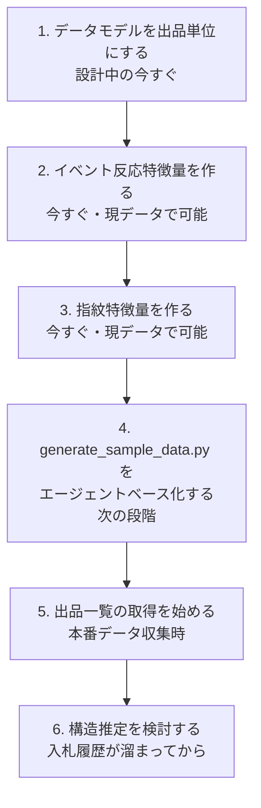

| 順位 | やること | いつ | 理由 |
|---:|---|---|---|
| 1 | 本番アプリのデータ収集を**出品単位**にする | 設計中の今 | **集計は不可逆。後から取り返せない。最も安く、最も効く** |
| 2 | **イベント反応特徴量**を作る | 今すぐ | 識別子不要。現データで実装できる |
| 3 | **指紋特徴量**を作る（§18.6 の優先度A） | 今すぐ | 識別子不要。現データで実装できる |
| 4 | `generate_sample_data.py` を**エージェントベース化**する | 次の段階 | 仮説ごとの指紋を設計できる。学習用としても筋が良い |
| 5 | 出品**一覧**の取得を始める | 本番データ収集時 | IDが取れなくても、価格分布から構造を近似できる |
| 6 | 構造推定を検討する | 将来 | 入札履歴が溜まってから |

### 21.3 構造推定について（知っておく価値のある分野）

「ゲーム理論を実データに当てる」ために作られた、確立した学問分野があります。**実証産業組織論（Empirical Industrial Organization）** と呼ばれます。

| 手法 | 何をするか | 本システムとの関係 |
|---|---|---|
| **BLP**（Berry, Levinsohn & Pakes, 1995） | **集計された市場シェアから、個人レベルの好みの分布を復元する** | 弱点1にそのまま対応する手法。ただし製品属性と市場の定義が必要 |
| **GPV**（Guerre, Perrigne & Vuong, 2000） | **観測された入札額から、入札者の私的価値の分布をノンパラメトリックに復元する** | ヤフオクの入札履歴があれば直接適用できる。コレクター市場との相性が最も良い |
| **動学ゲームの推定**（Bajari, Benkard & Levin, 2007） | 時間をまたぐ戦略的行動を推定する | 在庫を持ち越す出品者の行動に対応 |
| **部分識別**（Tamer, 2003） | 均衡が複数あるとき、点推定をあきらめて区間で答える | 弱点3に対応 |

**BLPは「集計データから個人の異質性を復元する」ことで有名になった手法**で、まさに弱点1そのものを扱っています。

**正直な評価**

```text
今の学習段階では、手を出すべきではない。
大学院レベルの計量経済学であり、実装コストも高い。

ただし、次の2点で知っておく価値がある。

  1. 「原理的には解決されている問題である」と分かる
  2. 将来ヤフオクの入札履歴を扱うなら、GPV は現実的な選択肢になる
```

### 21.4 まとめ図

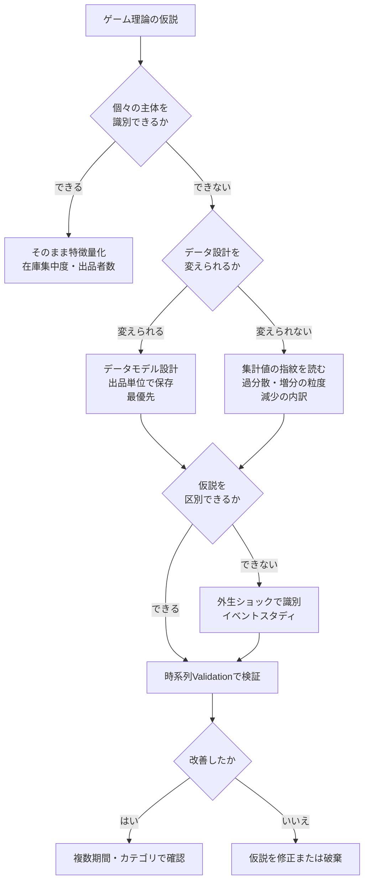

---

## 22. 用語集

### ゲーム理論

複数の参加者が互いの行動に影響を与える状況で、それぞれの選択や結果を分析する理論です。相手の反応、利害関係、ルール、情報の差などを考えます。

### 市場参加者

市場で意思決定を行う主体です。コレクター市場では、買い手、売り手、店舗、メーカー、転売者、SNS発信者などが該当します。

### 仮説

観察した現象について、「なぜその現象が起きたのか」「どの条件で再び起きるのか」を説明する暫定的な考えです。

### 反対仮説

最初の仮説と同じデータを、別の原因で説明する仮説です。反対仮説を考えることで、早すぎる結論を避けられます。

### 特徴量

予測モデルに入力する数値やカテゴリ情報です。価格履歴、出品数、発売日、SNS投稿数などが該当します。

### 目的変数

予測したい対象です。例として、90日後の価格、将来の価格上昇率、一定以上値上がりしたかどうかなどがあります。

### Trainデータ

仮説の構築、特徴量の作成、モデルの学習に使用するデータです。

### Validationデータ

特徴量、アルゴリズム、設定値を比較し、モデルを改善するためのデータです。

### Testデータ

設計が完了したモデルを、未知の未来データとして最終評価するためのデータです。原則として、特徴量設計やモデル選択には使用しません。

### データリーク

実際の予測時点では知り得ない未来情報が、学習や特徴量に混入することです。見かけ上の精度が高くても、本番では再現できません。

### 時系列分割

古いデータで学習し、それより新しいデータで評価する分割方法です。将来価格の予測では、ランダム分割より適切な場合が多くあります。

### 代理変数

直接測れない概念を、代わりに測定する変数です。例えば「値上がり期待」を直接測れない場合、SNS投稿数や出品取り下げ数を代理変数として使います。

### 相互作用

一つの特徴量の効果が、別の特徴量の値によって変わることです。例えば、価格上昇率が高くても、出品数が急増している場合は将来下落する可能性があります。

### 需要供給比

需要を表す数値を、供給を表す数値で割った指標です。例として、ユニーク購入者数を出品数で割る方法があります。

### 在庫集中度

市場の在庫が、少数の出品者へどれだけ集中しているかを示す指標です。集中度が高いと、一部の出品者の行動が価格へ大きな影響を与える可能性があります。

### 流動性

商品を適正価格で、どれだけ速く売買できるかを表す性質です。価格が上昇していても、取引件数が極端に少なければ流動性が低い可能性があります。

### 再販リスク

メーカーが再び商品を供給し、希少性が低下する可能性です。予測時点までの情報から推定した確率であれば、特徴量として利用できます。

### フィードバック

ある変化が参加者の行動を変え、その行動が元の変化をさらに強めたり弱めたりする構造です。価格上昇が注目を集め、購入を増やしてさらに価格を上げる場合などがあります。

### ベースラインモデル

高度な特徴量を追加する前に作る、単純な比較対象モデルです。複雑な仮説や特徴量が本当に改善をもたらしたか判断するために使用します。

### 過学習

Trainデータの偶然や特殊な事例まで学習し、未知のデータでは性能が低下する状態です。

### 市場間裁定

同じ商品が異なる市場で違う価格になっているとき、安い市場で買い、高い市場で売ることで利益を得ようとする行動です。

### プレイヤー集合

ゲームの定義の第1要素で、「誰が参加しているか」を表します。理論への入力であり、理論が導き出す出力ではありません。

### 自然（Nature）

ゲーム理論において、戦略的に反応しない外生的な要因を扱うための装置です。為替や配布終了日などが該当します。プレイヤーか自然かの判定は、交互作用特徴量が必要かどうかを決めます。

### 集計の不可逆性

細かいデータから集計データは作れますが、集計データから細かいデータは復元できない、という性質です。データモデル設計における最重要の原則です。

### 指紋（シグネチャ）

集計データの動き方に残る、元の主体構造の痕跡です。増分の粒度、分散と平均の関係、先行遅行、減少の内訳などが該当します。情報そのものではなく、その影です。

### 過分散

件数データの分散が平均より大きい状態です。少数の大口が動いている市場で現れやすく、在庫集中度の代理変数として使えます。

### 相互相関（ラグ付き相関）

2つの時系列を時間方向にずらしながら計算した相関です。ピークが立つラグが「反応にかかる日数」を示し、誰が誰に反応しているかの手がかりになります。

### 外生ショック

市場の内部要因ではなく、外から与えられる変化です。再販発表、配布終了、手数料改定などが該当します。同じ観測を説明する複数の仮説を区別するために使えます。

### イベントスタディ

外生ショックの前後で対象がどう反応したかを比較する分析手法です。反応の大きさ自体を、観測できない参加者構造の代理変数として使えます。

### 3層のデータモデル

取得層（生ログ・追記のみ）、整形層（型を揃える）、集計・特徴量層（モデル入力）の3層でデータを管理する設計です。第1層を捨てないことが最重要のルールです。

### エージェントベースシミュレーション

個々の主体に行動ルールを与え、その相互作用の結果として集計データを生成するシミュレーションです。「どの行動ルールなら、観測された集計パターンが出るか」を逆向きに探すために使えます。

### level-k モデル・認知階層モデル

相手を何手先まで読むかに個人差があるとして参加者を分類する、行動ゲーム理論のモデルです。不動点（均衡）を計算せず逐次的に最適反応を求めるため、複数均衡の問題が発生しません。

### 複数均衡

1つのゲームに、条件を満たす均衡が複数存在する状態です。理論が一意の予測を出せなくなるため、実データでの検証を難しくします。

### 部分識別

複数均衡などにより点推定ができない場合に、パラメータを1つの値ではなく区間として推定する方法です。

### 構造推定（実証産業組織論）

ゲーム理論のモデルを実際の市場データから推定する分野です。BLP（集計データから個人の好みの分布を復元する）、GPV（入札額から私的価値の分布を復元する）などの手法があります。

---

## 23. まとめ

今回の考え方を一文で表すと、次のようになります。

> グラフからデータ上の規則性を探し、ゲーム理論から市場参加者の行動と相互作用を考え、両方から得た仮説を観測可能な特徴量へ変換し、時系列のValidation・Testで有効性を検証する。

重要なのは、ゲーム理論を正解として扱うことではありません。

```text
ゲーム理論
    ↓
行動や市場構造について仮説を立てる
    ↓
特徴量候補を作る
    ↓
統計・機械学習で予測力を検証する
    ↓
有効なものだけを採用する
```

この方法により、グラフ上の数値だけを観察する場合よりも、次のような仮説を考えやすくなります。

- なぜ供給が減ったのか
- なぜ買い手が増えたのか
- 高騰後に誰が売却するのか
- メーカーはどの段階で再販するのか
- 市場参加者は他者の行動へどう反応するのか
- 予測情報の公開によって市場自体が変化しないか

ゲーム理論は、価格を直接予言するためのものではなく、**価格を生み出す人間の行動と市場構造を理解し、より良い特徴量を設計するための思考法**として活用できます。

### 23.1 2026-08-02 の追記分のまとめ

§16〜§21 で追加した内容を、3点にまとめます。

#### 1. ゲーム理論は参加者リストを作らないが、点検はできる

```text
洗い出す      → ゲーム理論の外側（お金とモノの流れ、業界構造分析）
型に流す      → ゲーム理論（誰が/何を選べ/何を目的とし/何を知るか）
プレイヤーか自然かを判定 → ゲーム理論
      ↓
交互作用特徴量が要るかどうかが決まる
```

#### 2. 最大の弱点は「データが取れない」ことではなく「集計が不可逆」なこと

```text
細かいデータ → 集計データ  ： いつでもできる
集計データ  → 細かいデータ ： 絶対にできない

したがって、
分析コードは後回しでよいが、保存だけは今すぐ始める。
保存していない期間のデータは、永久に手に入らない。
```

#### 3. 今すぐできることが3つある

| やること | 必要なもの | 参照 |
|---|---|---|
| 本番のデータ収集を出品単位にする | 設計判断のみ | §19 |
| イベント反応特徴量を作る | `event_type`（既にある） | §20.4 |
| 指紋特徴量を作る | `listing_count`, `sold_count`（既にある） | §18.6 |

最後に、追記分を通じた最も重要な一文です。

> **ゲーム理論が「特徴量に落としにくい」のは、理論の性質ではなく、データ設計の結果である。**
> **設計を変えれば、弱点1はほぼ消える。そして設計を変えられるのは、今だけである。**
