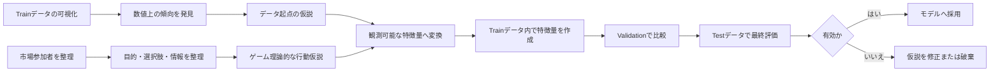
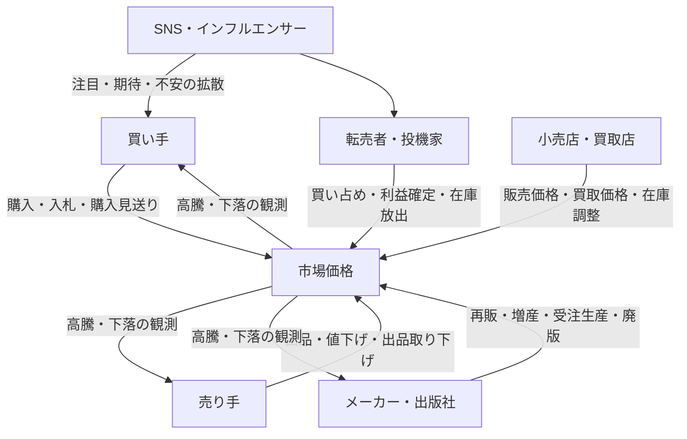
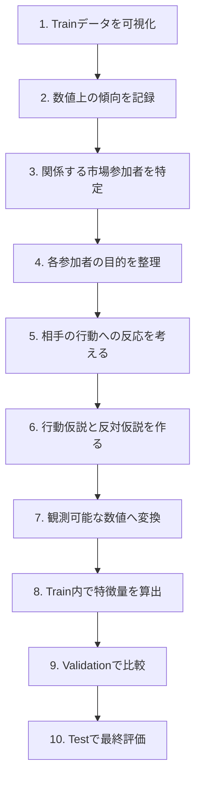
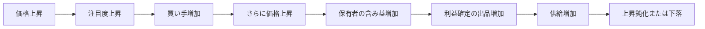
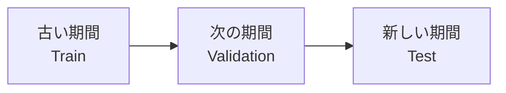
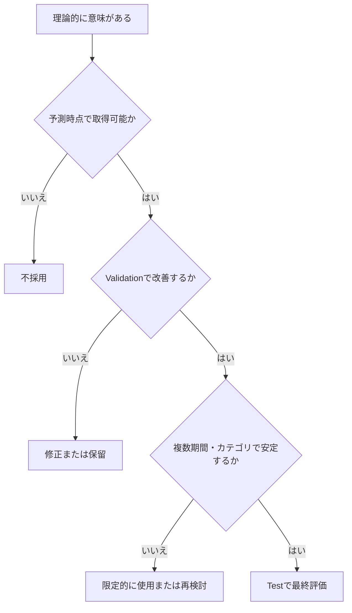
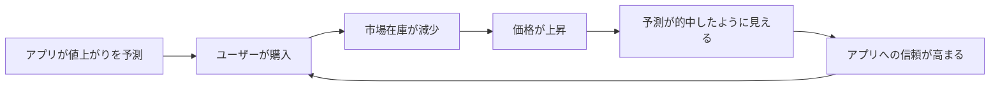

# ゲーム理論を活用したコレクター製品の価格予測モデル設計

## 1. この文書の目的

この文書は、コレクター製品の将来価格を予測するモデルを構築する際に、**ゲーム理論をどのように活用できるか**を整理したものです。

ここでの結論は、次のとおりです。

> ゲーム理論は、将来価格を直接かつ正確に計算する予測モデルではない。
> しかし、市場参加者の行動や相互作用を考えることで、グラフだけでは見つけにくい仮説を立て、有効な特徴量候補を発見するための材料になり得る。

したがって、ゲーム理論と統計・機械学習は相反するものではなく、次のような補完関係にあります。

| 役割 | 主な問い |
|---|---|
| 統計・機械学習 | 過去のデータ上で、どの特徴が将来価格と関係していたか |
| ゲーム理論 | 市場参加者は何を目的に、他者の行動へどう反応するか |
| 検証 | その仮説から作った特徴量は、未来データでも予測に役立つか |

---

## 2. 全体像



現在行っている、

1. Trainデータをグラフ化する
2. 傾向を観察する
3. 仮説を立てる
4. 特徴量を作る

という流れに、ゲーム理論による**行動・構造起点の仮説**を追加します。

---

## 3. ゲーム理論は価格予測モデルそのものではない

### 3.1 統計・機械学習が扱うもの

統計・機械学習による予測モデルは、予測時点までに得られた情報から、将来の目的変数を推定します。

例として、予測日から90日後の価格上昇率を予測する場合を考えます。

- **入力**：予測日時点までに取得可能な商品・市場データ
- **出力**：90日後の価格上昇率、または一定以上値上がりする確率

概念的には、次の関係を学習します。

```text
予測時点までの特徴量
        ↓
過去データから学習した予測モデル
        ↓
将来の価格・上昇率・値上がり確率
```

### 3.2 ゲーム理論が扱うもの

ゲーム理論は、主に次のような状況を考えるための枠組みです。

- 誰が市場に参加しているか
- それぞれ何を目的としているか
- どのような選択肢を持っているか
- 誰がどの情報を知っているか
- ある参加者の行動に、ほかの参加者がどう反応するか

コレクター市場では、価格は商品属性だけでなく、次の参加者の相互作用で変化します。



ゲーム理論は、上図の相互作用を整理し、**どの行動をデータとして測るべきか**を考える際に役立ちます。

---

## 4. グラフから立てる仮説とゲーム理論から立てる仮説

### 4.1 グラフから立てる仮説

グラフを観察する方法は、実際のデータに現れた関係を発見するのに向いています。

例：

```text
出品数が減少した期間に、価格が上昇している
```

この観察から、次の特徴量を考えられます。

- 出品数
- 出品数の前週比
- 30日間の出品数減少率
- 出品数の移動平均
- 価格と出品数の相関

ただし、この時点では、**なぜ出品数が減ったのか**までは分かりません。

### 4.2 ゲーム理論から立てる仮説

同じ現象について、市場参加者の行動を考えます。

| 行動仮説 | 背景にある目的 |
|---|---|
| 値上がりを期待した保有者が出品を控えた | より高い価格で売りたい |
| 買い手が急いで購入し、在庫が減った | 品切れ前に確保したい |
| 一部の出品者が大量に買い集めた | 供給を減らして高値で売りたい |
| 出品者が売れない商品を取り下げた | 手間や値下げを避けたい |
| 再販情報を知った売り手が売却を急いだ | 値下がり前に利益を確定したい |

これにより、「出品数」だけでは区別できなかった現象を、追加データで分解できます。

| 確認したい現象 | 特徴量候補 |
|---|---|
| 実際に売れて在庫が減った | 成約件数、販売速度、売り切れ率 |
| 売り手が出品を控えた | 出品取り下げ数、再出品率、新規出品者数 |
| 在庫が一部の売り手に集中した | 出品者別在庫数、在庫集中度 |
| 値上がり期待が強まった | SNS投稿、検索量、買取価格の上昇 |
| 利益確定が始まった | 高騰後の新規出品増加率、値下げ頻度 |

---

## 5. 仮説構築の基本フロー

### 5.1 推奨フロー



### 5.2 各工程で考えること

| 工程 | 確認する内容 |
|---|---|
| 可視化 | 価格、出来高、出品数、SNS投稿などにどのような変化があるか |
| 参加者の特定 | 買い手、売り手、店舗、転売者、メーカーなど、誰の行動が関係するか |
| 目的の整理 | 安く買う、高く売る、在庫を減らす、注目を集めるなど |
| 反応の予測 | 値上がり、品薄、再販発表などに対して何をするか |
| 反対仮説 | 同じデータを説明できる別の原因はないか |
| 数値化 | 仮説をどのデータで代理測定できるか |
| 検証 | 未知の未来データでも予測性能を改善するか |

---

## 6. コレクター製品で考えられる市場参加者

| 市場参加者 | 主な目的 | 典型的な行動 | 特徴量候補 |
|---|---|---|---|
| コレクター | 欲しい商品を確保する | 購入、入札、長期保有 | ユニーク購入者数、入札者数、リピート購入率 |
| 投資目的の購入者 | 将来の値上がり益を得る | 買い集め、短期保有、利益確定 | 購入後の短期再出品率、出来高急増率 |
| 個人売り手 | 高く、早く売る | 出品、値下げ、取り下げ | 値下げ回数、出品期間、再出品率 |
| 大量出品者 | 在庫全体の利益を最大化する | 在庫調整、価格維持、大量放出 | 出品者別在庫数、在庫集中度 |
| 小売店 | 在庫回転と利益を両立する | 販売価格変更、再入荷 | 店舗在庫、価格改定頻度 |
| 買取店 | 安く仕入れて高く売る | 買取価格変更、買取停止 | 買取価格、販売価格とのスプレッド |
| メーカー | 売上とブランド価値を高める | 再販、増産、限定販売 | 過去の再販頻度、再販までの日数 |
| SNS発信者 | 注目、影響力、収益を得る | 紹介、予想、煽り、レビュー | 投稿数、発信者数、影響度加重投稿数 |

---

## 7. ゲーム理論から導ける特徴量の例

### 7.1 売り手同士の競争

売り手は、ほかの出品者より先に売るために値下げする場合があります。

**仮説**

> 最安値付近に多くの出品が集中している商品では、値下げ競争が起こりやすく、価格が下落しやすい。

**特徴量候補**

- 出品者数
- 最安値から5%以内の出品数
- 出品価格の分散
- 値下げした出品の割合
- 平均値下げ回数
- 新規出品から最初の値下げまでの日数
- 1出品者当たりの出品数

---

### 7.2 買い手同士の競争

希少な商品に複数の買い手が集中すると、価格が押し上げられます。

**仮説**

> 出品数に対して独立した買い手の数が多いほど、価格上昇圧力が強い。

**特徴量候補**

- ユニーク購入者数 ÷ 出品数
- 入札者数 ÷ オークション件数
- ウォッチ数 ÷ 出品数
- 1日当たりの販売件数
- 終了直前の入札集中率
- 出品から成約までの中央値

---

### 7.3 メーカーによる再販・増産

価格が高騰すると、メーカーには再販や増産を行う動機が生まれる場合があります。

**仮説**

> 高騰していても、再販可能性が高い商品は長期的な価格上昇が続きにくい。

**特徴量候補**

- メーカー別の過去再販率
- 発売から再販までの平均日数
- 価格上昇後に再販された割合
- 同シリーズ新商品の発売予定
- 受注生産の採用頻度
- 廃版・生産終了の公式情報
- 予測時点で推定した再販確率

---

### 7.4 投機家による利益確定

値上がりが続くほど、既存保有者が売却して利益を確定する可能性があります。



**特徴量候補**

- 直近の値上がり率
- 値上がりの加速度
- 連続上昇日数
- 高値更新後の新規出品数
- 出来高の急増率
- 出品数の反転
- 買取価格が販売価格へ追随する速度

---

### 7.5 市場間の裁定行動

異なる市場で価格差があると、安い市場で買い、高い市場で売る参加者が現れます。

**仮説**

> 市場間価格差が大きい場合、安い市場では買い圧力、高い市場では売り圧力が発生し、価格差は縮小しやすい。

**特徴量候補**

- フリマ・オークション・買取店の価格差
- 手数料と送料を引いた実質価格差
- 最安市場と最高市場の価格差率
- 価格差が継続した日数
- 市場ごとの在庫数
- 市場間価格差の縮小速度

---

## 8. 仮説を特徴量へ変換する方法

### 8.1 抽象的な仮説をそのまま使用しない

次のような仮説は、そのままではモデルへ入力できません。

```text
買い手の競争が強い商品は値上がりしやすい
```

この仮説を、観測可能な数値に分解します。

```text
買い手の競争
    ├─ ユニーク購入者数
    ├─ 入札者数
    ├─ ウォッチ数
    ├─ 販売速度
    └─ 出品数に対する需要の比率
```

### 8.2 代理変数を複数考える

一つの行動を直接観測できない場合は、代理となる変数を使います。

| 観測したい概念 | 代理変数の例 |
|---|---|
| 値上がり期待 | SNS投稿数、出品取り下げ、買取価格上昇 |
| 買い手の競争 | 入札者数、ウォッチ数、成約速度 |
| 売り手の焦り | 値下げ頻度、出品期間、価格改定幅 |
| 利益確定 | 高騰後の新規出品、短期再出品率 |
| 再販リスク | メーカーの過去行動、公式発表、発売周期 |

### 8.3 比率・変化率・相互作用を検討する

単純な件数だけでは、商品の規模の違いを受けやすくなります。

そのため、次のような特徴量も検討します。

```text
需要供給比 = ユニーク購入者数 ÷ 出品数
```

```text
在庫集中度 = 上位出品者が保有する出品数 ÷ 全出品数
```

```text
市場過熱度 = 価格上昇率 × 出来高増加率
```

```text
利益確定圧力 = 含み益の推定値 × 高騰後の新規出品増加率
```

ただし、複雑な特徴量を作るほど、過学習や解釈困難の可能性も高まるため、単純な特徴量との比較が必要です。

---

## 9. 仮説記録テンプレート

特徴量を思いつきで追加するのではなく、次の形式で記録すると、再現性を高められます。

```markdown
## 仮説名
高騰期待による出品控え

### 観察
価格上昇の直前に出品数が減少している。

### 関係する市場参加者
既存保有者、個人売り手、投資目的の購入者

### 行動仮説
既存保有者が今後の値上がりを期待し、現在価格での売却を控えている。

### 反対仮説
単に商品が多く売れた結果として、出品数が減っただけである。

### 必要なデータ
- 成約件数
- 出品取り下げ数
- 新規出品数
- ユニーク出品者数
- 出品者別在庫数

### 特徴量候補
- 出品取り下げ率
- 成約を伴わない出品数減少率
- 新規出品者数の減少率
- 在庫集中度

### リーク確認
すべて予測時点までに取得可能な情報だけで計算する。

### 検証方法
時系列Validationで、ベースラインモデルとの予測性能を比較する。

### 採用基準
複数期間・複数カテゴリで安定して性能が改善する場合に採用する。
```

---

## 10. データリークを防ぐ

ゲーム理論から考えた特徴量であっても、将来情報を使えばデータリークになります。

### 10.1 判断基準

> その特徴量は、実際に予測を実行する時点で取得または計算できたか。

### 10.2 使用可能な例

予測日が2026年1月1日の場合：

- 2026年1月1日までの価格履歴
- 2026年1月1日までの出品数
- 2026年1月1日までのSNS投稿
- 予測日までに公式発表された再販予定
- 過去データだけで推定した再販確率
- 予測日時点の市場間価格差

### 10.3 使用できない例

- 2026年1月20日に発表された再販情報
- 2026年2月のSNS投稿数
- オークション終了後に確定した最終入札者数
- 90日後までの累計販売数
- 将来確定した鑑定枚数

### 10.4 時刻情報の管理

各データに、少なくとも次の日時を持たせると管理しやすくなります。

| 項目 | 意味 |
|---|---|
| `event_time` | 実際に出来事が発生した日時 |
| `known_at` | その情報が一般に知り得る状態になった日時 |
| `collected_at` | システムが実際に取得した日時 |

例：

```text
再販実施日     event_time     = 2026-01-20
公式発表日     known_at       = 2026-01-10
システム取得日 collected_at   = 2026-01-11
```

この情報は、2026年1月15日の予測には使えますが、2026年1月5日の予測には使えません。

---

## 11. Train・Validation・Testの役割

| データ | 主な用途 | 注意点 |
|---|---|---|
| Train | グラフ化、仮説構築、特徴量生成、モデル学習 | 仮説を立てる中心データ |
| Validation | 特徴量・モデル・ハイパーパラメータの比較 | 繰り返し確認するとValidationへ過学習する |
| Test | 最終的な未知データ上の性能評価 | 原則として、設計中に何度も見ない |

時系列予測では、ランダム分割ではなく、過去から未来へ進む形で分割します。



また、より安定した評価を行うために、時点をずらして複数回評価する方法もあります。

```text
検証1：2019〜2022年で学習 → 2023年を評価
検証2：2019〜2023年で学習 → 2024年を評価
検証3：2019〜2024年で学習 → 2025年を評価
```

---

## 12. 特徴量を採用するときの判断基準

ゲーム理論的にもっともらしい特徴量でも、必ず有効とは限りません。

### 採用前に確認する項目

- 予測時点で取得可能か
- 将来情報が混ざっていないか
- 複数のValidation期間で改善するか
- 特定の商品カテゴリだけに依存していないか
- 特定の高騰事例だけで有効になっていないか
- 取得・保存・計算コストに見合うか
- 欠損が多すぎないか
- 操作されやすいデータではないか
- 既存特徴量とほぼ同じ情報ではないか

### 採用の考え方



---

## 13. ゲーム理論を使う際の注意点

### 13.1 人間は常に合理的ではない

ゲーム理論では、参加者が自分の利益を考えて行動すると仮定することがあります。

しかし実際のコレクター市場では、次のような行動もあります。

- 思い入れのある商品を相場以上で購入する
- 損失を認めたくないため売却しない
- SNSの熱狂に影響される
- 価格ではなく所有満足を重視する
- 知識不足のまま取引する

したがって、ゲーム理論上の行動仮説は、**実データで検証する必要があります**。

### 13.2 市場参加者の目的は一つではない

同じ購入者でも、目的が異なります。

| 購入者の種類 | 主な目的 |
|---|---|
| 純粋なコレクター | 所有、鑑賞、コンプリート |
| プレイヤー | ゲームや大会での使用 |
| 投資家 | 中長期の値上がり益 |
| 転売者 | 短期的な価格差益 |
| 贈答目的 | プレゼントとしての購入 |

すべての購入者を同じ行動主体として扱うと、仮説が粗くなる可能性があります。

### 13.3 仮説を作りすぎない

ゲーム理論を使うと、多数の仮説を考えられますが、特徴量を無制限に増やすと過学習につながります。

そのため、次の順序を推奨します。

1. 単純なベースラインを作る
2. 一つの仮説につき少数の特徴量を追加する
3. 改善量を測る
4. 改善しない特徴量は削除する
5. 有効な特徴量だけを残す

---

## 14. 将来的に重要になる論点

### 14.1 アプリの予測が市場を動かす可能性

アプリの利用者が増えると、予測結果を見たユーザーの購入によって、実際の価格が動く可能性があります。



この場合、モデルが外部の市場を予測したのではなく、**予測の公開自体が市場を変えた**可能性があります。

将来的には、次のデータを記録することが重要です。

- 予測の公開日時
- 予測ページの閲覧数
- 商品ページへの遷移数
- 公開前後の販売件数
- 公開前後の出品数
- 公開商品と未公開商品の価格変化

### 14.2 特徴量を意図的に操作される可能性

予測ロジックが知られると、市場参加者がモデルを有利に動かそうとする可能性があります。

例：

- SNS投稿数を人工的に増やす
- 高額な出品を大量に掲載する
- 自作自演の取引で価格を作る
- 一時的に出品を取り下げて品薄に見せる
- 複数アカウントでウォッチ数を増やす

そのため、将来的には特徴量の予測力だけでなく、**操作耐性と信頼度**も評価する必要があります。

---

## 15. 実践時のチェックリスト

### 仮説構築

- [ ] Trainデータだけを使って観察している
- [ ] グラフ上の傾向を文章で説明できる
- [ ] 関係する市場参加者を特定した
- [ ] 各参加者の目的を整理した
- [ ] ある行動に対する他者の反応を考えた
- [ ] 反対仮説を作った
- [ ] 仮説を観測可能な数値へ変換した

### データ設計

- [ ] 予測時点で取得可能な情報だけを使用している
- [ ] `event_time`、`known_at`、`collected_at`を区別している
- [ ] 欠損時の扱いを決めている
- [ ] 市場や商品カテゴリごとの差を確認している
- [ ] データ操作や不正取引の影響を考慮している

### 検証

- [ ] Train・Validation・Testを時間順に分けている
- [ ] ベースラインモデルと比較している
- [ ] 複数の期間で評価している
- [ ] 複数の商品カテゴリで評価している
- [ ] 性能だけでなく取得コストも評価している
- [ ] Testデータを特徴量設計に使用していない

---

## 16. 用語集

### ゲーム理論

複数の参加者が互いの行動に影響を与える状況で、それぞれの選択や結果を分析する理論です。相手の反応、利害関係、ルール、情報の差などを考えます。

### 市場参加者

市場で意思決定を行う主体です。コレクター市場では、買い手、売り手、店舗、メーカー、転売者、SNS発信者などが該当します。

### 仮説

観察した現象について、「なぜその現象が起きたのか」「どの条件で再び起きるのか」を説明する暫定的な考えです。

### 反対仮説

最初の仮説と同じデータを、別の原因で説明する仮説です。反対仮説を考えることで、早すぎる結論を避けられます。

### 特徴量

予測モデルに入力する数値やカテゴリ情報です。価格履歴、出品数、発売日、SNS投稿数などが該当します。

### 目的変数

予測したい対象です。例として、90日後の価格、将来の価格上昇率、一定以上値上がりしたかどうかなどがあります。

### Trainデータ

仮説の構築、特徴量の作成、モデルの学習に使用するデータです。

### Validationデータ

特徴量、アルゴリズム、設定値を比較し、モデルを改善するためのデータです。

### Testデータ

設計が完了したモデルを、未知の未来データとして最終評価するためのデータです。原則として、特徴量設計やモデル選択には使用しません。

### データリーク

実際の予測時点では知り得ない未来情報が、学習や特徴量に混入することです。見かけ上の精度が高くても、本番では再現できません。

### 時系列分割

古いデータで学習し、それより新しいデータで評価する分割方法です。将来価格の予測では、ランダム分割より適切な場合が多くあります。

### 代理変数

直接測れない概念を、代わりに測定する変数です。例えば「値上がり期待」を直接測れない場合、SNS投稿数や出品取り下げ数を代理変数として使います。

### 相互作用

一つの特徴量の効果が、別の特徴量の値によって変わることです。例えば、価格上昇率が高くても、出品数が急増している場合は将来下落する可能性があります。

### 需要供給比

需要を表す数値を、供給を表す数値で割った指標です。例として、ユニーク購入者数を出品数で割る方法があります。

### 在庫集中度

市場の在庫が、少数の出品者へどれだけ集中しているかを示す指標です。集中度が高いと、一部の出品者の行動が価格へ大きな影響を与える可能性があります。

### 流動性

商品を適正価格で、どれだけ速く売買できるかを表す性質です。価格が上昇していても、取引件数が極端に少なければ流動性が低い可能性があります。

### 再販リスク

メーカーが再び商品を供給し、希少性が低下する可能性です。予測時点までの情報から推定した確率であれば、特徴量として利用できます。

### フィードバック

ある変化が参加者の行動を変え、その行動が元の変化をさらに強めたり弱めたりする構造です。価格上昇が注目を集め、購入を増やしてさらに価格を上げる場合などがあります。

### ベースラインモデル

高度な特徴量を追加する前に作る、単純な比較対象モデルです。複雑な仮説や特徴量が本当に改善をもたらしたか判断するために使用します。

### 過学習

Trainデータの偶然や特殊な事例まで学習し、未知のデータでは性能が低下する状態です。

### 市場間裁定

同じ商品が異なる市場で違う価格になっているとき、安い市場で買い、高い市場で売ることで利益を得ようとする行動です。

---

## 17. まとめ

今回の考え方を一文で表すと、次のようになります。

> グラフからデータ上の規則性を探し、ゲーム理論から市場参加者の行動と相互作用を考え、両方から得た仮説を観測可能な特徴量へ変換し、時系列のValidation・Testで有効性を検証する。

重要なのは、ゲーム理論を正解として扱うことではありません。

```text
ゲーム理論
    ↓
行動や市場構造について仮説を立てる
    ↓
特徴量候補を作る
    ↓
統計・機械学習で予測力を検証する
    ↓
有効なものだけを採用する
```

この方法により、グラフ上の数値だけを観察する場合よりも、次のような仮説を考えやすくなります。

- なぜ供給が減ったのか
- なぜ買い手が増えたのか
- 高騰後に誰が売却するのか
- メーカーはどの段階で再販するのか
- 市場参加者は他者の行動へどう反応するのか
- 予測情報の公開によって市場自体が変化しないか

ゲーム理論は、価格を直接予言するためのものではなく、**価格を生み出す人間の行動と市場構造を理解し、より良い特徴量を設計するための思考法**として活用できます。
