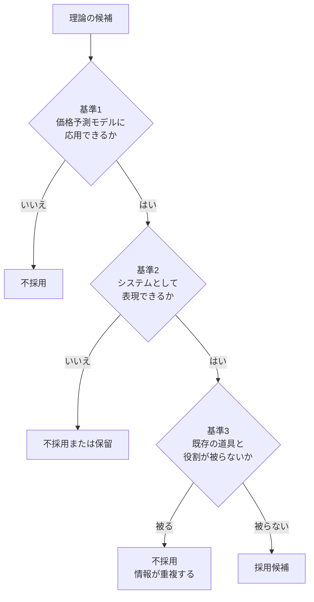
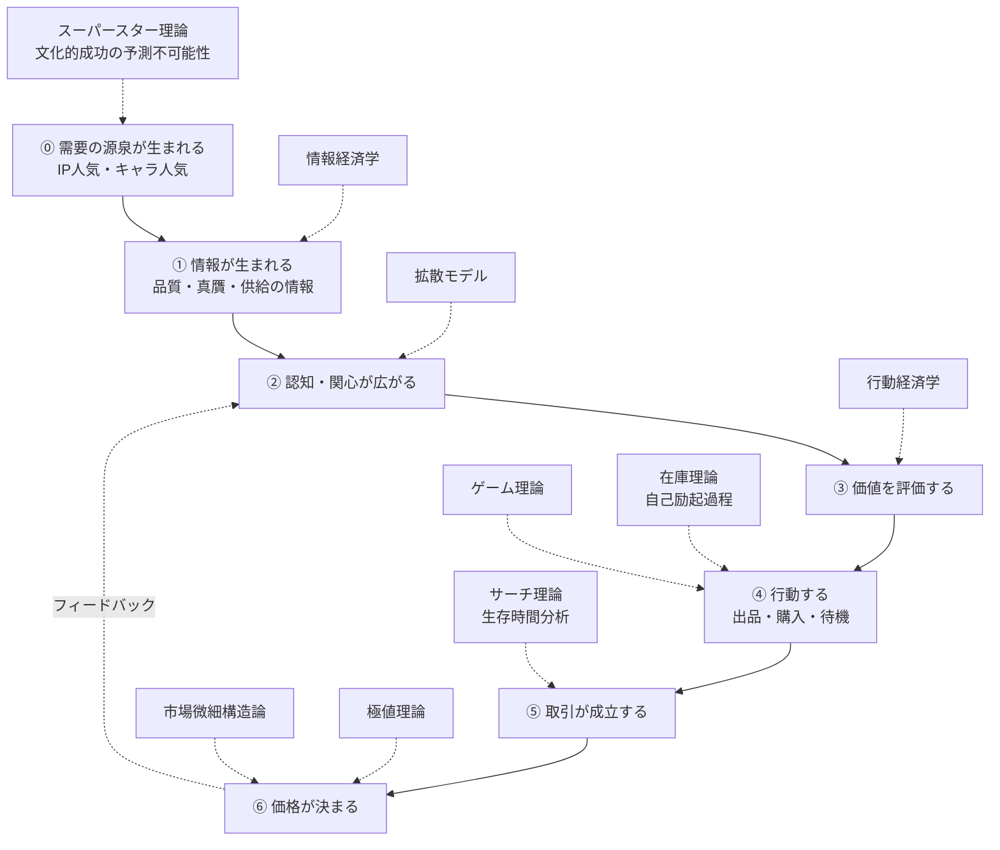
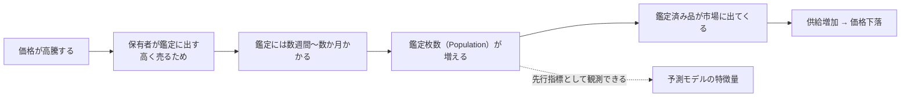
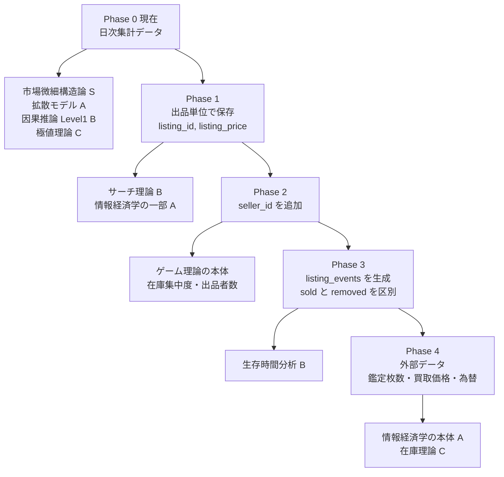
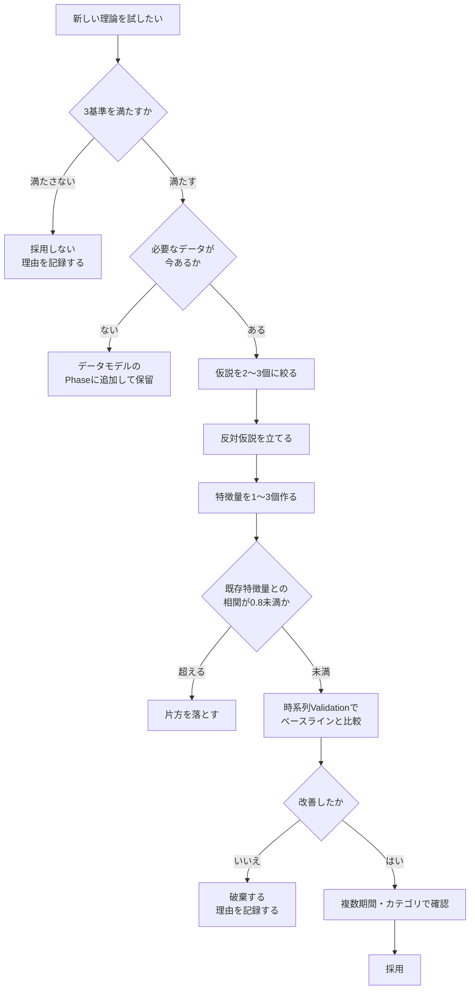
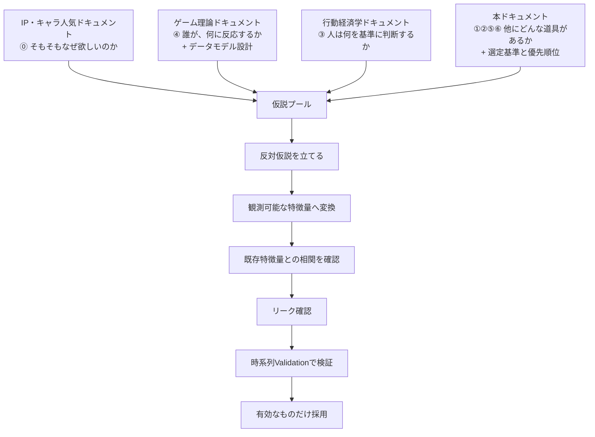

# 仮説を生むための理論の選定と優先順位

作成日: 2026-08-02 JST

関連文書:

- [ゲーム理論を活用したコレクター製品の価格予測モデル設計](./game_theory_for_collector_price_prediction.md)
- [行動経済学は特徴量設計に使えるか](./behavioral_economics_for_feature_design.md)
- [IP・キャラクター人気を価格予測に使う](./ip_character_popularity_for_price_prediction.md)

> **更新履歴**
>
> - 2026-08-02: 初版
> - 2026-08-03: §3 の経路に ⓪ の層（需要の源泉）を追加。IP・キャラ人気を扱う文書を新設し、相互リンクを追加。

---

## 1. このドキュメントの目的

これまでの議論で、仮説を生むための道具として **ゲーム理論** と **行動経済学** の2つを検討しました。

このドキュメントでは、次の問いに答えます。

```text
他に、仮説を生む道具となり得る学問や理論はあるか。
価格予測モデルに応用できるものはどれか。
```

12の候補を調査し、3つの基準で評価した結果を、**優先順位つき**で記載します。

### 1.1 結論を先に

| 優先度 | 理論 | 立てる問い | 現データで使えるか |
|---|---|---|---|
| **S** | 市場微細構造論 | その価格はどれだけ信頼できるか | **○** |
| **A** | 拡散モデル | 関心はいつ冷めるか | **○** |
| **A** | 情報経済学 | 品質が分からないとき何が起きるか | × |
| **B** | サーチ理論 | なぜ同じ商品に複数の価格があるか | × |
| **B** | 生存時間分析 | この出品はいつ売れるか | × |
| **B** | 因果推論 | イベントの効果をどう測るか | ○ |
| **C** | 極値理論 / 在庫理論 / 自己励起過程 | （後述） | 部分的 |
| **D** | 臨界現象 / ヴェブレン財 / 情報理論 | （後述） | — |
| **除外** | LPPL（対数周期パワー則） | — | — |

最も重要な一文は、次のものです。

> **道具を増やすほど良い、ではない。**
> **価格予測に応用でき、システムとして表現でき、既存の道具と役割が被らないものだけを採用する。**

---

## 2. 選定の3基準

道具の候補は無数にあります。しかし、次の3つを同時に満たさないものは採用しません。



### 2.1 基準1：価格予測モデルに応用できるか

具体的には、次の形で書けることを求めます。

```text
条件Xが成り立つとき、価格は平均してY方向に動く
```

| 満たす例 | 満たさない例 |
|---|---|
| 「流動性が低い商品ほど、少ない取引で価格が動く」 | 「市場は複雑系である」 |
| 「関心の累積が飽和に近づくと、成長が鈍る」 | 「人間の欲望は無限である」 |

**「方向」が言えないものは、特徴量になりません。**

### 2.2 基準2：システムとして表現できるか

これが実務上、最も厳しい基準です。次の4つに答えられる必要があります。

| 問い | 具体例 |
|---|---|
| **どのデータが必要か** | `price`, `sold_count`, `listing_price`, 鑑定枚数 |
| **どこから取得するか** | 既存CSV／出品一覧ページ／鑑定会社サイト／外部API |
| **どのテーブルに入るか** | `daily_item_aggregates` / `listings_snapshot` / 新規テーブル |
| **どう計算するか** | 疑似コードまで書けるか |

**「理論としては面白いが、データにできない」ものは、この時点で落とします。**

### 2.3 基準3：既存の道具と役割が被らないか

情報が重複する特徴量を増やしても、過学習が進むだけです。

判定方法は、**「立てる問いが違うか」**です。

```text
同じ問いに違う言葉で答えているだけなら、それは重複。
違う問いに答えているなら、それは新しい軸。
```

この判定を視覚的に行うために、次の §3 の図を使います。

---

## 3. 価格が決まるまでの経路と、各理論の担当

役割が被らないことを確認する最も確実な方法は、**価格が決まるまでの経路を分解し、各理論をその上に配置する**ことです。

### 3.1 経路の分解



### 3.2 担当の対応表

| 段階 | 何が起きるか | 担当する理論 | 立てる問い |
|---:|---|---|---|
| **⓪** | **需要の源泉が生まれる** | **スーパースター理論ほか**（[専用文書](./ip_character_popularity_for_price_prediction.md)） | **そもそも、なぜその商品が欲しいのか** |
| ① | 情報が生まれる | **情報経済学** | 品質が買い手に分からないとき何が起きるか |
| ② | 認知・関心が広がる | **拡散モデル** | 関心はどう広がり、いつ冷めるか |
| ③ | 価値を評価する | **行動経済学**（既存） | 人は何を基準に判断するか |
| ④ | 行動する | **ゲーム理論**（既存） | 誰が、何に反応するか |
| ④ | 行動が伝播する | **在庫理論 / 自己励起過程** | 供給の波はどう伝わるか／なぜ連鎖するか |
| ⑤ | 取引が成立する | **サーチ理論 / 生存時間分析** | なぜ複数価格が並ぶか／いつ売れるか |
| ⑥ | 価格が決まる | **市場微細構造論** | その価格はどれだけ信頼できるか |
| ⑥ | 極端な価格が出る | **極値理論** | 大きな変動はどう起きるか |
| 全体 | 効果を測る | **因果推論** | イベントの効果をどう測るか |

### 3.3 この図から分かること

> **既存の2つ（行動経済学・ゲーム理論）は、経路の③と④しか担当していません。**
>
> ⓪①②⑤⑥は空白でした。新しい理論は、そこを埋めるものです。

これが「役割が被らない」ことの根拠です。

| 既存の空白 | 埋める理論 | 何が分かるようになるか |
|---|---|---|
| **⓪ 需要の源泉** | **スーパースター理論ほか** | **そもそも、なぜその商品が欲しいのか** |
| ① 情報の質 | 情報経済学 | 鑑定・状態・真贋が価格に与える影響 |
| ② 関心の伝播 | 拡散モデル | 注目が**いつ**冷めるか |
| ⑤ マッチング | サーチ理論・生存時間分析 | なぜ価格がばらつくか、いつ売れるか |
| ⑥ 価格の信頼性 | 市場微細構造論 | その価格が実体を反映しているか |

### 3.4 ⓪の層について（2026-08-03 追加）

⓪ の層は、初版では存在に気づいていませんでした。

```text
既存の道具は、いずれも「すでに需要がある商品」を前提にしていた。

  行動経済学     : 買いたい人がいる。その人がどう判断するか
  ゲーム理論     : 参加者がいる。その人たちがどう相互作用するか
  市場微細構造論 : 取引がある。その取引が価格をどう動かすか

「なぜそもそも欲しいのか」は、どの道具も答えていなかった。
```

アニメ商品では、その答えが「**キャラが好きだから**」です。したがって、扱う商材がアニメIPである以上、⓪ の層は「その他の候補の1つ」ではなく**需要の主要因**になります。

詳細は専用文書に分けました。

- [IP・キャラクター人気を価格予測に使う](./ip_character_popularity_for_price_prediction.md)

**なお、⓪ の層で出てくる理論の多くは、既存の概念と重複します。** 何が新規で何が言い換えかは、上記文書の §7（重複分析）にまとめています。

---

## 4. 評価結果と優先順位

### 4.1 スコア表

3基準で12理論を評価した結果です。

| 理論 | 基準1<br>予測への応用 | 基準2<br>システム表現 | 基準3<br>役割の独立性 | 総合 |
|---|:---:|:---:|:---:|:---:|
| 市場微細構造論 | **高**（ラベルに直結） | **高**（現データで可） | **高**（新しい軸） | **S** |
| 拡散モデル | **高** | **高**（現データで可） | 中（限定注意の延長） | **A** |
| 情報経済学 | **高** | 中（外部取得が必要） | **高**（新しい軸） | **A** |
| サーチ理論 | 中 | 中（出品一覧が必要） | **高**（新しい軸） | **B** |
| 生存時間分析 | 中〜高 | 中（出品単位が必要） | 中 | **B** |
| 因果推論 | 中（測定手法） | **高** | **高**（手法の軸） | **B** |
| 極値理論 | 中 | **高**（現データで可） | 中 | **C** |
| 在庫理論 | 中 | 低（上流データが必要） | 中 | **C** |
| 自己励起過程 | 中 | 低（実装コストが高い） | 低（群集行動と重複） | **C** |
| 臨界現象 | **低**（否定的な検証結果） | 高 | 低 | **D** |
| ヴェブレン財 | 低（定量化が困難） | 低 | 低 | **D** |
| 情報理論 | 低 | 中 | 低（サーチ理論と重複） | **D** |
| LPPL | — | — | — | **除外** |

### 4.2 ランクの意味

| ランク | 意味 | 対応 |
|---|---|---|
| **S** | 今すぐ着手すべき。効果が最も期待できる | 最初の1つ |
| **A** | 次に着手する。効果が期待でき、実装も現実的 | 2番目・3番目 |
| **B** | データ基盤が整ってから着手する | Phase 1 以降 |
| **C** | 余力があれば。または特定条件下で有効 | 将来 |
| **D** | 現時点では採用しない。理由を明記して保留 | 保留 |
| **除外** | 反証できないため採用しない | 採用しない |

---

## 5. 【優先度S】市場微細構造論

### 5.1 立てる問い

```text
取引はどう成立し、その価格はどれだけ信頼できるのか。
```

これまでの2つの道具は「**なぜその価格になるのか**」を扱いました。
微細構造論は「**その価格はどれだけ信頼できるのか**」を扱います。まったく別の軸です。

### 5.2 なぜ最優先か

**このプロジェクトのラベルに直結するためです。**

```text
ラベル = 「30日後に +30% 以上上がったか」

流動性が低い商品では、たった1件の取引で +30% が達成されてしまう。

つまり流動性は
  ・ラベルの発生確率そのものに効く
  ・その +30% が本物かどうかの判断にも効く

二重に重要。
```

さらに、**現在のサンプルデータだけで実装できます**。効果検証を今日から始められる唯一のS級候補です。

### 5.3 核心となる考え方

| 概念 | 内容 | わかりやすい例 |
|---|---|---|
| **価格インパクト** | 1件の取引が価格をどれだけ動かすか | 大きな池に石を投げても波は小さいが、洗面器なら水があふれる |
| **実効スプレッド** | 買値と売値の実質的な差 | 「買うなら1万2千円、売るなら8千円」の4千円分 |
| **非流動性** | 売買のしにくさ | 買い手が少ないと、売りたいときに大きく値下げが必要 |
| **在庫リスク** | 売り手が在庫を持ち続けるコスト | 保管・資金拘束・値下がりリスク |

### 5.4 コレクター市場での仮説

| 仮説 | 予測への含意 |
|---|---|
| 流動性が低い商品ほど、少ない取引で価格が大きく動く | +30%達成が起きやすいが、**戻りも早い** |
| 流動性が低い商品の表示価格は、実際の取引を反映していない | 予測の**信頼度**が低い |
| 買いのインパクトと売りのインパクトが非対称なら、需給が偏っている | 偏りの方向が価格の方向 |
| 流動性が急に改善した商品は、関心が集まり始めている | 上昇の先行指標 |

### 5.5 システムとしての表現

#### 必要なデータ

| データ | 取得元 | 現状 |
|---|---|---|
| `price` | 既存の日次集計 | **あり** |
| `sold_count` | 既存の日次集計 | **あり** |

**追加取得は不要です。**

#### 特徴量の定義

| 特徴量 | 計算式 | 意味 |
|---|---|---|
| `illiq_30d` | `mean( \|Δprice\| / max(1, sold_count), 30 )` | Amihud非流動性。1件の取引あたりの価格変動 |
| `illiq_z_90d` | `illiq_30d` の90日zスコア | 流動性の急変 |
| `spread_roll_60d` | `2 × √( -Cov(Δp_t, Δp_{t-1}) )` | Rollの実効スプレッド |
| `turnover_30d` | `sold_count_30d_sum / listing_count` | 回転率 |
| `impact_asymmetry` | 上昇日の`illiq` ÷ 下落日の`illiq` | 買いと売りのどちらが重いか |
| ~~`zero_trade_rate_30d`~~ | `sold_count == 0` の日の割合 | **重複のため不採用**（下記） |

> **重複の検出例**
>
> `zero_trade_rate_30d` は、ゲーム理論ドキュメント §18.3 の指紋6 で定義済みの
> `zero_sold_rate_30d` と**まったく同じ計算**です。
>
> このように、別の理論から出発しても同じ特徴量にたどり着くことがあります。
> **既存の名前（`zero_sold_rate_30d`）を使い、新規には作りません。**
> これが §14.3 のルール（追加前に既存特徴量を確認する）の実例です。

#### 疑似コード

```python
import numpy as np

# --- Amihud非流動性 ---
# 「1件の取引あたり、価格が何%動くか」
df["ret_abs"] = df.groupby("item_id")["price"].pct_change().abs()
df["illiq_raw"] = df["ret_abs"] / df["sold_count"].clip(lower=1)

# 予測時点の前日までに限定する（shift(1) を必ず入れる）
df["illiq_30d"] = (
    df.groupby("item_id")["illiq_raw"]
      .transform(lambda s: s.shift(1).rolling(30, min_periods=10).mean())
)

# --- Rollの実効スプレッド ---
# 価格変化の負の自己共分散から、往復の取引コストを逆算する
def roll_spread(s: "pd.Series", window: int = 60) -> "pd.Series":
    dp = s.diff()
    cov = dp.shift(1).rolling(window, min_periods=20).cov(dp.shift(2))
    return 2 * np.sqrt(np.maximum(-cov, 0))

df["spread_roll_60d"] = (
    df.groupby("item_id")["price"].transform(roll_spread)
)

# --- 回転率 ---
df["sold_30d"] = (
    df.groupby("item_id")["sold_count"]
      .transform(lambda s: s.shift(1).rolling(30, min_periods=10).sum())
)
df["turnover_30d"] = df["sold_30d"] / df["listing_count"].clip(lower=1)
```

#### 計算のタイミング

```text
第3層（集計・特徴量層）で日次バッチ計算する。
第1層・第2層の変更は不要。
```

### 5.6 反対仮説と検証

**反対仮説**

> 非流動性が予測に効くのは、単に「マイナーな商品」を識別しているだけであり、
> 流動性そのものが原因ではない（カテゴリの代理変数にすぎない）。

**検証方法**

```text
カテゴリごとに層別して、カテゴリ内でも illiq_30d が効くかを確認する。

  カテゴリ内で効く   → 流動性そのものが効いている
  カテゴリ間でしか効かない → カテゴリの代理変数にすぎない
```

**リーク確認**

```text
・すべての rolling に shift(1) が入っているか
・Rollのスプレッドは2期分ずらす必要がある（Δp_t と Δp_{t-1} の両方が過去である必要）
```

### 5.7 実行可能性

| 項目 | 評価 |
|---|---|
| 追加データ | **不要** |
| 実装難易度 | **低**（pandas のみ） |
| 着手時期 | **今すぐ** |
| 期待効果 | **高**（ラベルの発生機構に直結） |

---

## 6. 【優先度A】拡散モデル（Bass / 感染モデル）

### 6.1 立てる問い

```text
関心はどう広がり、いつ飽和し、いつ冷めるのか。
```

### 6.2 なぜ有力か

行動経済学ドキュメント §5.4.2（限定注意）で、次のように書きました。

```text
注目度の急増は「短期プラス・中期マイナス」の可能性がある。
対策として days_since_attention_peak を入れる。
```

しかしこれは、**「ピークを過ぎたかどうか」しか言えません。**

拡散モデルは、**ピークが来る前に「あとどれくらいで飽和するか」を言えます。**

```text
行動経済学  : 注目が集まると上がり、後で反転する（事後的）
拡散モデル  : 累積がS字のどこにいるかで、残り余地が分かる（事前的）
```

これが「既存の道具の延長ではあるが、新しい情報を持つ」と判定した理由です。

### 6.3 核心となる考え方

| モデル | 内容 |
|---|---|
| **Bassモデル** | 新製品の普及は、外部影響（広告・ニュース）と内部影響（口コミ）の2要素でS字カーブを描く |
| **感染モデル（SIR）** | まだ知らない人が減ると、伝播が止まる |
| 共通の含意 | **飽和が近づくと成長が鈍る。成長率のピークは、飽和の約半分の時点で来る** |

#### わかりやすい例

```text
累積の関心量（S字カーブ）

  累積
   ▲
   │                    ┌──────── 飽和（もう新規の関心が来ない）
   │                ┌───┘
   │            ┌───┘   ← 変曲点。ここで成長率が最大
   │        ┌───┘
   │    ┌───┘
   │┌───┘
   └────────────────────────────────▶ 時間
    立ち上がり   加速     減速    飽和

変曲点を過ぎたら、関心の伸びは鈍る一方になる。
価格のピークは、この変曲点より【後】に来ることが多い。
```

### 6.4 コレクター市場での仮説

| 仮説 | 予測への含意 |
|---|---|
| `trends_score` の累積がS字カーブに乗る | 現在位置から残り余地が推定できる |
| 累積の増加率がピークを打った時点が、関心の折り返し | 変曲点の検出が転換点の先行指標 |
| 価格のピークは、関心の変曲点より遅れて来る | 変曲点から価格ピークまでの日数が測れる |
| 飽和後は、価格が実体（実需）まで戻る | 飽和度が高いほど、その後の下落リスクが大きい |

### 6.5 システムとしての表現

#### 必要なデータ

| データ | 取得元 | 現状 |
|---|---|---|
| `trends_score` | 既存の日次集計 | **あり** |
| `sns_mentions` | 既存の日次集計 | **あり** |

**追加取得は不要です。**

#### 特徴量の定義

| 特徴量 | 計算式 | 意味 |
|---|---|---|
| `cum_attention_90d` | `trends_score` の90日累積 | 到達した関心の総量 |
| `attention_growth` | 累積の増加率 | S字のどこにいるか |
| `attention_accel` | 増加率の変化 | 変曲点の検出 |
| `days_past_inflection` | 変曲点からの経過日数 | 折り返してからの時間 |
| `saturation_ratio` | 現在の累積 ÷ 推定最終累積 | **飽和度** |
| `attention_half_life` | 関心が半減するまでの日数 | 冷めやすさ |

#### 疑似コード

```python
# --- 累積と成長率 ---
df["cum_att_90d"] = (
    df.groupby("item_id")["trends_score"]
      .transform(lambda s: s.shift(1).rolling(90, min_periods=20).sum())
)
df["att_growth"] = df.groupby("item_id")["cum_att_90d"].pct_change()
df["att_accel"] = df.groupby("item_id")["att_growth"].diff()

# --- 変曲点の検出 ---
# 成長率が最大を打った日（加速がプラスからマイナスに転じた日）
df["is_inflection"] = (
    (df["att_accel"] < 0) & (df.groupby("item_id")["att_accel"].shift(1) > 0)
)

# --- 変曲点からの経過日数 ---
def days_since_flag(flags: "pd.Series") -> "pd.Series":
    idx = np.arange(len(flags))
    last = np.where(flags.to_numpy(), idx, np.nan)
    last = pd.Series(last).ffill().to_numpy()
    return pd.Series(idx - last, index=flags.index)

df["days_past_inflection"] = (
    df.groupby("item_id")["is_inflection"].transform(days_since_flag)
)

# --- 飽和度（簡易版）---
# 推定最終累積を「これまでの最大成長率から外挿した値」で近似する
# より厳密にはBassモデルのパラメータ推定を行う
df["saturation_ratio"] = (
    df["cum_att_90d"]
    / df.groupby("item_id")["cum_att_90d"]
        .transform(lambda s: s.shift(1).rolling(180, min_periods=60).max())
).clip(upper=1.0)
```

### 6.6 反対仮説と検証

**反対仮説**

> 関心の累積がS字を描くのは、単に「イベントがあって、その後静かになった」だけであり、
> 拡散のメカニズムとは関係ない。

**検証方法**

```text
event_type で層別する。

  イベントを伴わない関心の立ち上がり → 純粋な口コミ的拡散に近い
  イベントを伴う立ち上がり           → 外部影響が主

Bassモデルの2要素（外部影響・内部影響）に対応するので、
層別すること自体がモデルの検証になる。
```

### 6.7 実行可能性

| 項目 | 評価 |
|---|---|
| 追加データ | **不要** |
| 実装難易度 | 低〜中（簡易版は pandas のみ。Bassモデルの厳密な推定は中） |
| 着手時期 | **今すぐ**（Sの次） |
| 期待効果 | 高（限定注意の改良版） |

---

## 7. 【優先度A】情報経済学（レモン市場・シグナリング）

### 7.1 立てる問い

```text
品質が買い手に分からないとき、市場で何が起きるのか。
```

### 7.2 なぜ有力か

**コレクター市場そのものの構造だからです。**

```text
中古品の状態は、写真だけでは分からない。
真贋も、素人には判別できない。

だからこそ PSA / BGS といった鑑定会社が存在する。

つまり、鑑定サービスは
「レモン市場の問題に対する、市場が出した解答」である。
```

既存の2つの道具は、この軸をまったく扱っていませんでした。

### 7.3 核心となる考え方

| 概念 | 内容 |
|---|---|
| **レモン市場**（Akerlof 1970） | 品質が分からないと、買い手は平均品質を想定した価格しか払わない → 良品が市場から退出 → 平均品質が下がる → さらに価格が下がる |
| **シグナリング**（Spence） | 情報を持つ側が、**コストのかかる行動**で品質を伝える |
| **スクリーニング** | 情報を持たない側が、仕組みで情報を引き出す |

#### わかりやすい例

```text
中古カード市場に、状態の良いカードと悪いカードが混ざっている。
買い手には区別がつかない。

  → 買い手は「平均的な状態」を想定した価格しか出さない
  → 状態の良いカードの持ち主は「その値段では売らない」と引っ込める
  → 市場に残るのは状態の悪いカードばかりになる
  → 買い手はさらに価格を下げる

これが「レモン市場」の悪循環。

鑑定に出すと、この循環から抜けられる。
  鑑定にはコストと時間がかかる
  → 悪いカードを鑑定に出しても割に合わない
  → 「鑑定に出した」こと自体が、良品である証拠になる（シグナル）

実際、鑑定済みカードは未鑑定の同等品の2〜10倍で取引されることがある。
```

### 7.4 コレクター市場での仮説

| 仮説 | 予測への含意 |
|---|---|
| 鑑定の普及度が高いカテゴリほど、価格が安定する | 予測の難易度がカテゴリで違う |
| 高額品ほど鑑定シグナルの価値が大きい | 価格帯で鑑定プレミアムが変わる |
| 出品者の情報開示量（写真枚数、状態記述）が価格プレミアムになる | 出品品質が価格に効く |
| **鑑定枚数の急増は、将来の供給増の先行指標である** | **下落の予兆になる** |

### 7.5 特に価値が高い仮説：鑑定枚数は供給の先行指標



> **鑑定には時間がかかるため、「鑑定枚数の増加」は「将来の供給増」を数週間〜数か月先取りして観測できます。**
>
> これは既存の2つの道具からは出てこない仮説であり、かつ**公開データで観測可能**です。

### 7.6 システムとしての表現

#### 必要なデータ

| データ | 取得元 | 現状 | 取得難易度 |
|---|---|---|---|
| 鑑定発行枚数（Population） | 鑑定会社の公開サイト | **なし** | 低〜中 |
| 鑑定済みかどうか | 出品一覧・タイトル | **なし** | 低（Phase 1 で同時取得） |
| 商品状態（グレード） | 出品一覧 | **なし** | 低（Phase 1 で同時取得） |
| 出品者評価 | 出品詳細 | **なし** | 中 |
| 写真枚数・説明文の長さ | 出品詳細 | **なし** | 中 |

#### 新規テーブルの提案

```text
grading_population
  item_id          商品ID
  grading_company  鑑定会社（PSA / BGS など）
  grade            グレード（10, 9.5, 9, ...）
  population       その時点の発行枚数
  observed_at      観測日時
  collected_at     取得日時
```

**日次または週次のスナップショットで追記します**（ゲーム理論ドキュメント §19.2 の第1層の原則に従う）。

#### 特徴量の定義

| 特徴量 | 計算式 | 意味 |
|---|---|---|
| `pop_total` | 全グレードの発行枚数合計 | 可視化された供給量 |
| `pop_growth_90d` | `pop_total` の90日増加率 | **将来の供給増の先行指標** |
| `pop_high_grade_ratio` | 高グレード（9以上）の割合 | 良品の希少度 |
| `graded_ratio` | 出品のうち鑑定済みの割合 | 市場の情報環境 |
| `graded_premium` | 鑑定済み平均価格 ÷ 未鑑定平均価格 | シグナルの価値 |
| `info_disclosure_score` | 写真枚数・説明文長さの合成 | 出品者の情報開示量 |

#### 疑似コード

```python
# --- 鑑定枚数の増加率（供給の先行指標）---
pop = (
    grading_population
    .groupby(["item_id", "observed_at"])["population"].sum()
    .rename("pop_total").reset_index()
)
pop["pop_growth_90d"] = (
    pop.groupby("item_id")["pop_total"]
       .transform(lambda s: s.shift(1).pct_change(90))
)

# --- 鑑定プレミアム ---
g = listings_snapshot.assign(
    is_graded=lambda d: d["condition"].str.contains("PSA|BGS", na=False)
)
prem = (
    g.groupby(["snapshot_date", "item_id", "is_graded"])["listing_price"]
     .median().unstack("is_graded")
)
prem["graded_premium"] = prem[True] / prem[False]
```

### 7.7 反対仮説と検証

**反対仮説**

> 鑑定枚数の増加が価格下落に先行するのは、
> 単に「高騰した商品ほど鑑定に出される」という逆の因果であり、
> 高騰の後は自然に下がるだけである。

**検証方法**

```text
高騰の大きさを揃えて（同程度の上昇率の商品群の中で）比較する。

  同じ上昇率でも、鑑定枚数の伸びが大きい商品のほうがよく下がる
      → 鑑定枚数に独自の情報がある

  上昇率を揃えると差が消える
      → 上昇率の代理変数にすぎない
```

### 7.8 実行可能性

| 項目 | 評価 |
|---|---|
| 追加データ | **必要**（鑑定会社サイト、出品一覧） |
| 実装難易度 | 中（取得の仕組みが必要） |
| 着手時期 | **本番アプリのデータ収集設計に含める**（Phase 1 と同時） |
| 期待効果 | 高（他にない先行指標） |

---

## 8. 【優先度B】サーチ理論

### 8.1 立てる問い

```text
なぜ同じ商品に、複数の価格が同時に存在するのか。
```

### 8.2 なぜ有力か

ゲーム理論ドキュメント §7.1 で「出品価格の分散」を特徴量に挙げましたが、**理論的な意味づけがありませんでした**。サーチ理論がそれを与えます。

### 8.3 核心となる考え方

| 結果 | 内容 |
|---|---|
| **ダイヤモンドの逆説**（Diamond 1971） | 探索コストがどれだけ小さくても存在すれば、売り手が多数いても独占価格になりうる。**競争は必ずしも価格を下げない** |
| **Burdett-Judd モデル**（1983） | 買い手の**情報にばらつき**があると、価格分散が**均衡として**発生する |

> **価格分散は「市場の未熟さ」ではなく、探索コストがある市場の正常な姿です。**
> **そして分散の大きさが、探索コストの代理変数になります。**

#### わかりやすい例

```text
同じカードが、3つの出品で 8,000円 / 12,000円 / 15,000円 で並んでいる。

  「なぜ誰も8,000円のを買わないのか？」

答え: 全員が3つとも見ているわけではないから。
  ある買い手は1つしか見ずに買う → 高い出品も売れる
  ある買い手は3つとも見る       → 安い出品を選ぶ

この「見る数のばらつき」があるかぎり、価格差は消えない。
```

### 8.4 コレクター市場での仮説

| 仮説 | 予測への含意 |
|---|---|
| 探索コストが高い商品ほど、価格分散が大きい | 分散が商品特性の指標になる |
| 価格分散が大きい市場では、最安値が相場を代表しない | **最安値ではなく中央値を使うべき** |
| 分散の縮小は、買い手の情報改善を意味する | 話題化の先行指標になりうる |

### 8.5 システムとしての表現

| 特徴量 | 計算式 | 必要データ |
|---|---|---|
| `price_dispersion_cv` | 出品価格の標準偏差 ÷ 平均 | `listings_snapshot.listing_price` |
| `min_to_median_ratio` | 最安値 ÷ 中央値 | 同上 |
| `dispersion_change_30d` | 分散の30日変化 | 同上 |
| `n_listings_within_5pct` | 最安値の5%以内にある出品数 | 同上 |
| `title_ambiguity` | 型番の有無、表記ゆれの種類数 | `listings_snapshot` のタイトル |

```python
# 出品単位データから、日次の価格分散を作る
disp = (
    listings_snapshot
    .groupby(["snapshot_date", "item_id"])["listing_price"]
    .agg(["mean", "std", "median", "min", "count"])
    .reset_index()
)
disp["price_dispersion_cv"] = disp["std"] / disp["mean"]
disp["min_to_median_ratio"] = disp["min"] / disp["median"]
```

### 8.6 実行可能性

| 項目 | 評価 |
|---|---|
| 追加データ | **必要**（出品一覧。出品者IDは不要） |
| 実装難易度 | 低（集計するだけ） |
| 着手時期 | **Phase 1**（出品単位の保存を始めたら同時に） |
| 期待効果 | 中 |

---

## 9. 【優先度B】生存時間分析

### 9.1 立てる問い

```text
この出品は、いつ売れるのか。
```

### 9.2 核心となる考え方

**ハザード関数** = 「今日まで売れ残った出品が、今日売れる確率」

```text
価格を説明変数に入れると、
  「この価格なら、あと何日で売れるか」が推定できる。

逆に、売れるまでの日数の分布から、
  「この商品の需要はどれくらい強いか」が測れる。
```

Cox比例ハザードモデルが標準的な手法で、`lifelines` ライブラリで容易に実装できます。

### 9.3 コレクター市場での仮説

| 仮説 | 予測への含意 |
|---|---|
| 需要が強い商品ほど、出品の生存期間が短い | 生存期間が需要の直接的な指標になる |
| 価格弾力性（値下げで売却確率がどれだけ上がるか）は商品で異なる | 弾力性が低い商品は値下げしても売れない＝実需が薄い |
| 生存期間の分布が急に短くなったら、需要が増している | 上昇の先行指標 |

### 9.4 システムとしての表現

| 特徴量 | 意味 | 必要データ |
|---|---|---|
| `median_survival_days` | 出品の中央生存日数 | `listing_events` |
| `hazard_at_current_price` | 現在価格での日次売却確率 | `listing_events` + `listing_price` |
| `price_elasticity_of_sale` | 価格を1%下げたときの売却確率の変化 | 同上 |
| `survival_change_30d` | 中央生存日数の30日変化 | 同上 |

```python
from lifelines import CoxPHFitter

# listing_events から「出品ごとの生存期間」を作る
spans = build_listing_spans(listing_events)  # listing_id, duration, event(=売れたら1)

cph = CoxPHFitter()
cph.fit(
    spans[["duration", "event", "log_price", "is_graded", "seller_rating"]],
    duration_col="duration",
    event_col="event",
)
# 係数から価格弾力性を読む
```

> **注意：`removed`（取り下げ）と `sold`（売却）を区別する必要があります**（ゲーム理論ドキュメント §19.3.2）。
> 取り下げは「打ち切り（censoring）」として扱い、売却を「イベント」として扱います。
> ここを区別しないと、生存時間分析は成立しません。

### 9.5 実行可能性

| 項目 | 評価 |
|---|---|
| 追加データ | **必要**（`listing_events`、sold と removed の区別） |
| 実装難易度 | 中（`lifelines` で実装は容易だが、データ整備が必要） |
| 着手時期 | **Phase 3**（listing_events の生成後） |
| 期待効果 | 中〜高 |

---

## 10. 【優先度B】因果推論（合成コントロール法）

### 10.1 立てる問い

```text
このイベントは、価格をどれだけ動かしたのか。
```

これは特徴量を生む理論ではなく、**測定精度を上げる手法**です。

### 10.2 核心となる考え方

```text
「もしこのイベントが起きなかったら、価格はどうなっていたか」

これは観測できない。
しかし、【似た商品の加重平均】で人工的に作ることができる。

  実際の価格 - 人工的な価格 = イベントの純粋な効果
```

#### わかりやすい例

```text
商品Aで「再販発表」があった。価格は10%下がった。

  しかしこの10%のうち、どこまでが再販のせいか？
  市場全体が下げていただけかもしれない。

  → 再販がなかった似た商品B, C, D の加重平均を作る
  → 「もしAに再販がなかったら」の価格を再現する
  → 実際のAとの差が、再販の効果
```

### 10.3 このプロジェクトでの価値

ゲーム理論ドキュメント §20.4 で「過去のイベント反応の大きさを特徴量にする」と書きました。合成コントロール法は、その **`past_event_response_mean` の推定精度を上げます**。

```text
素朴な方法: イベント後7日の価格変化率
    → 市場全体の動きが混ざる

合成コントロール法: イベント後7日の価格変化率 - 対照群の変化率
    → イベント固有の効果だけが残る
```

### 10.4 システムとしての表現

| 特徴量 | 計算式 | 必要データ |
|---|---|---|
| `event_effect_pure` | 実際の変化率 - 合成対照群の変化率 | 既存データ |
| `past_restock_effect_pure` | 過去の再販時の純粋効果の平均 | 既存データ |
| `event_effect_persistence` | 効果が消えるまでの日数 | 既存データ |

対照群の作り方は、まず単純な方法から始めます。

```text
Level 1（今すぐ）: 同カテゴリの平均を対照群にする
Level 2         : 同IPかつ同カテゴリの平均
Level 3         : イベント前の価格推移が似た商品を重みづけで選ぶ（合成コントロール）
```

### 10.5 実行可能性

| 項目 | 評価 |
|---|---|
| 追加データ | **不要**（Level 1・2 なら） |
| 実装難易度 | 低（Level 1）〜 中（Level 3） |
| 着手時期 | イベント反応特徴量を作るとき |
| 期待効果 | 中（既存特徴量の質が上がる） |

---

## 11. 【優先度C】余力があれば

### 11.1 極値理論

```text
問い: 極端な価格変動は、どう起きるのか。
```

| 項目 | 内容 |
|---|---|
| **なぜ関係するか** | **ラベルが「+30%以上」という裾の事象そのもの**。正規分布を仮定すると裾を過小評価する |
| 特徴量 | `tail_index`（裾の重さ）、`threshold_exceedance_rate_180d`（過去の+30%超えの頻度）、`expected_shortfall` |
| 必要データ | 既存データのみ |
| 弱点 | 推定に十分なデータ量が必要。180日程度では推定が不安定になりやすい |
| 判定 | **データが溜まってから。ただし `threshold_exceedance_rate_180d` は今すぐ作れて有用** |

### 11.2 在庫理論・ブルウィップ効果

```text
問い: 供給の波は、どう伝わり、どう増幅されるのか。
```

| 項目 | 内容 |
|---|---|
| **核心** | **ブルウィップ効果**：末端の需要変動が、上流に行くほど増幅される |
| コレクター市場での仮説 | 小売の在庫調整が、二次市場の供給を**遅れて大きく**揺らす |
| 特徴量 | `supply_oscillation_period`（供給の振動周期）、`upstream_event_lag`（上流イベントからの遅延）、`supply_amplification` |
| 必要データ | 上流（小売・問屋）の在庫データ。**取得が困難** |
| 判定 | **保留**。上流データが取れる見通しが立ってから |

### 11.3 自己励起過程（Hawkes過程）

```text
問い: なぜイベントが連鎖するのか。
```

| 項目 | 内容 |
|---|---|
| **核心** | 過去のイベントが将来のイベント率を上げる。**分岐比**（1件が平均何件を誘発するか）が鍵。1を超えると爆発的、下回ると収束 |
| 実績 | SNSカスケードの予測で、自己回帰ベースラインより短期予測誤差が25〜30%改善という報告がある |
| 特徴量 | 推定分岐比、減衰時定数、外生的到着率 |
| 弱点 | **行動経済学の「群集行動」と情報が重複する可能性がある**。実装コストも高い |
| 判定 | **後回し**。まず群集行動の単純な特徴量（`price_sns_coupling` など）で足りるか確認する |

---

## 12. 【優先度D・除外】採用しないもの

**採用しない理由を明記しておくことが重要です。** 後から「なぜ検討しなかったのか」を再検討できるようにするためです。

### 12.1 臨界現象・早期警戒シグナル（D）

```text
理論: 暴落の前に、分散と自己相関が上昇する（critical slowing down）
```

生態系や気候の転換点研究では確立していますが、**金融市場では検証結果が否定的です**。

| 検証内容 | 結果 |
|---|---|
| 米欧5市場（ダウ、S&P500、NASDAQ、DAX、FTSE）の過去約100年 | **暴落前に自己相関の上昇は見られなかった** ← 理論の中核が否定された |
| 同上 | ただし**分散の上昇は一貫して見られた** ← こちらは使える |

> これは行動経済学ドキュメント §5.3.2 の教訓（**有名だから信じない**）を適用すべき典型例です。

| 使ってよい | 使うべきでない |
|---|---|
| `realized_vol_30d` の上昇トレンドを特徴量にする | ラグ1自己相関の上昇を暴落の前兆とみなす |

### 12.2 ヴェブレン財・顕示的消費（D）

```text
理論: 価格が上がるほど需要が増える（通常の需給と逆）
```

- 高額コレクター品では起こりうると考えられ、仮説としては面白い
- しかし**定量化が難しく、行動経済学の「群集行動」と区別できない**
- 基準3（役割の独立性）を満たさない

**判定：保留。** 群集行動の特徴量で説明できない残差が見つかったら、再検討する。

### 12.3 情報理論（エントロピー）（D）

```text
理論: 出品価格分布のエントロピーが、市場の合意度を表す
```

- 「エントロピーが下がる＝相場が固まる」という解釈は自然
- しかし**サーチ理論の価格分散と情報が重複する**
- 基準3を満たさない

**判定：保留。** サーチ理論の特徴量を先に試し、足りなければ追加する。

### 12.4 LPPL（対数周期パワー則）（除外）

```text
理論: バブル崩壊の日時を予測できる（Sornette）
```

| 問題 | 内容 |
|---|---|
| 事後的な当てはめは印象的 | しかし**事前予測の再現性に強い批判**があり、決着していない |
| パラメータが多い | どんな系列にも当てはめられてしまう |
| **反証しにくい** | 行動経済学ドキュメント §5.6 のアンチパターン1（反証できない説明）に該当 |

**判定：除外。** 基準1（方向を予測する）を、検証可能な形で満たしていません。

---

## 13. 段階的な導入計画

### 13.1 導入順は、データモデルのPhaseで決まる

**重要な発見です。**

> どの理論を使えるようになるかは、**ゲーム理論ドキュメント §19.5 のデータモデルPhaseで決まります。**
> 理論の重要度ではなく、**データの粒度**が導入順を決めます。



### 13.2 Phase別の対応表

| Phase | 必要なデータ整備 | 使えるようになる理論 | 作れる主な特徴量 |
|---|---|---|---|
| **0（現在）** | なし | **市場微細構造論**、**拡散モデル**、因果推論(Level1)、極値理論 | `illiq_30d`, `days_past_inflection`, `event_effect_pure`, `threshold_exceedance_rate_180d` |
| **1** | 出品単位のスナップショット保存 | **サーチ理論**、情報経済学の一部 | `price_dispersion_cv`, `graded_ratio`, `graded_premium` |
| **2** | `seller_id` の追加 | ゲーム理論の本体 | `在庫集中度`, `出品者数` |
| **3** | `listing_events` の生成（sold/removed の区別） | **生存時間分析** | `median_survival_days`, `price_elasticity_of_sale` |
| **4** | 外部データ（鑑定枚数・買取価格・為替） | **情報経済学の本体**、在庫理論 | `pop_growth_90d`, 買取スプレッド |

### 13.3 実行順（推奨）

```text
【今週】
  1. illiq_30d を作り、ベースラインとの差分を測る
     → 効いたら illiq_z_90d, turnover_30d を追加

【今月】
  2. days_past_inflection, attention_accel を作る
     → 既存の trends_change_7d と比較する
  3. event_effect_pure（Level 1: 同カテゴリ平均を対照群）を作る

【本番アプリの設計時】
  4. listings_snapshot の保存を始める（Phase 1）
     → 同時に鑑定済みフラグ・状態も取る
  5. 鑑定枚数の日次取得を始める（Phase 4 の一部）
     → 取得を始めない限り、過去分は永久に手に入らない

【データが溜まってから】
  6. サーチ理論・生存時間分析・極値理論
```

> **5番目（鑑定枚数の取得）は、他より先に「保存だけ」始める価値があります。**
> ゲーム理論ドキュメント §19.5 と同じ理由です。**集計や分析は後からできますが、取得していない期間は永久に取り戻せません。**

---

## 14. 役割の重複チェック

採用した理論が、本当に別々の情報を持つかを確認します。

### 14.1 問いの一覧（重複がないことの確認）

| 理論 | 立てる問い | 主な情報源 |
|---|---|---|
| **スーパースター理論ほか（⓪）** | **そもそも、なぜその商品が欲しいのか** | **キャラ・IPの人気指標** |
| 情報経済学 | 品質が分からないとき何が起きるか | 鑑定・状態・出品者評価 |
| 拡散モデル | 関心はいつ冷めるか | `trends_score` の累積の形 |
| 行動経済学 | 人は何を基準に判断するか | 価格の参照点からの距離 |
| ゲーム理論 | 誰が、何に反応するか | 出品者の構成・在庫の集中 |
| サーチ理論 | なぜ複数の価格が並ぶか | 出品価格の分散 |
| 生存時間分析 | いつ売れるか | 出品の生存期間 |
| 市場微細構造論 | その価格は信頼できるか | 取引量あたりの価格変動 |
| 極値理論 | 極端な変動はどう起きるか | 価格変化分布の裾 |
| 因果推論 | 効果をどう測るか | （手法） |

**主な情報源がすべて異なることが、重複していないことの根拠です。**

### 14.2 重複の疑いがあるペアと、その対処

| ペア | 重複の疑い | 対処 |
|---|---|---|
| 拡散モデル ↔ 行動経済学（限定注意） | どちらも `trends_score` を使う | 拡散モデルは**累積の形**、限定注意は**スパイクの大きさ**。両方入れて相関を確認する。相関が0.8を超えたら片方を落とす |
| サーチ理論 ↔ 情報理論 | どちらも価格分布のばらつき | **情報理論は採用しない**（§12.3） |
| 自己励起過程 ↔ 行動経済学（群集行動） | どちらもイベントの連鎖 | **自己励起過程は後回し**（§11.3） |
| 市場微細構造論 ↔ ゲーム理論（流動性） | どちらも取引の厚み | 微細構造論は**価格インパクト**、ゲーム理論は**参加者の構成**。切り口が違うので両方使う |
| 市場微細構造論 ↔ ゲーム理論 §18.3 指紋6 | **実際に重複していた** | `zero_trade_rate_30d` と `zero_sold_rate_30d` が同一。**既存の `zero_sold_rate_30d` に統一**（§5.5 参照） |

### 14.3 追加時のルール

```text
新しい特徴量を追加するとき、必ず次を確認する。

  1. 既存の特徴量との相関を計算する
  2. 相関が 0.8 を超えるものがあれば、どちらか一方だけを残す
  3. 残す基準は「意味を説明しやすいほう」
```

---

## 15. 道具を増やすときの規律

道具が11個になると、仮説が爆発します。ゲーム理論ドキュメント §13.3 と行動経済学ドキュメント §5.6 で書いた注意が、そのまま効いてきます。

### 15.1 4つのルール

| リスク | ルール |
|---|---|
| 仮説が無制限に増え、特徴量が膨張する | **1つの道具につき、最大2〜3仮説まで** |
| どの道具が効いたのか分からなくなる | **道具を1つずつ追加し、そのたびにベースラインとの差分を測る** |
| 「理論的にもっともらしい」で採用してしまう | **理論的な正しさは採用理由にならない** |
| 道具どうしで情報が重複する | **追加前に既存特徴量との相関を確認する** |

### 15.2 判断フロー



### 15.3 最初の一歩の推奨

**11個すべてに手を出さないでください。**

```text
まず1つだけ。

  illiq_30d を作り、ベースラインとの差分を測る。

これが効くかどうかで、
「新しい理論を導入する」という活動自体の費用対効果が分かる。

効いたら次へ。効かなかったら、なぜ効かなかったのかを考える。
```

---

## 16. 用語集

### 市場微細構造論

取引がどのように成立し、その過程で価格がどう形成されるかを研究する分野です。価格インパクト、スプレッド、流動性などを扱います。

### 価格インパクト

1件の取引が価格をどれだけ動かすかを表す量です。流動性が低いほど大きくなります。

### Amihud非流動性

価格変化率の絶対値を取引量で割った値です。「1単位の取引あたり、価格がどれだけ動くか」を表し、価格と取引量だけで計算できます。

### 実効スプレッド

買値と売値の実質的な差です。Rollの推定量を使うと、価格変化の負の自己共分散から推定できます。

### サーチ理論

買い手と売り手が出会うまでにコストがかかる市場を分析する理論です。価格分散が均衡として発生することを説明します。

### ダイヤモンドの逆説

探索コストがどれだけ小さくても存在すれば、多数の売り手がいても独占価格になりうるという結果です。

### 価格分散

同一商品に複数の価格が同時に存在することです。探索コストの代理変数として使えます。

### レモン市場

品質が買い手に分からないため、良品が市場から退出してしまう現象です。Akerlof (1970) が提示しました。

### シグナリング

情報を持つ側が、コストのかかる行動によって品質を伝えることです。鑑定に出すことがその例です。

### 鑑定枚数（Population）

鑑定会社が発行したグレード付き商品の累計枚数です。可視化された供給量にあたり、増加率は将来の供給増の先行指標になりえます。

### 拡散モデル

新製品や情報が広がる過程をS字カーブで表すモデルです。Bassモデルや感染モデル（SIR）が代表例です。

### 変曲点

S字カーブで成長率が最大になる点です。ここを過ぎると成長は鈍る一方になります。

### 飽和度

現在の累積が、最終的に到達する累積のどれくらいに達しているかを表す比率です。

### 生存時間分析

「イベントが起きるまでの時間」を分析する手法です。出品が売れるまでの日数の分析に使えます。

### ハザード関数

「今日まで生存していたものが、今日イベントを起こす確率」です。出品では「今日まで売れ残った出品が、今日売れる確率」にあたります。

### 打ち切り（censoring）

イベントが起きる前に観測が終わることです。出品の取り下げは「売れる前に観測が終わった」ため、打ち切りとして扱います。

### 極値理論

分布の裾（極端な値）を扱う統計理論です。正規分布では裾を過小評価するため、暴騰・暴落の分析に使われます。

### ブルウィップ効果

末端の需要変動が、サプライチェーンの上流に行くほど増幅される現象です。

### 自己励起過程（Hawkes過程）

過去のイベントが将来のイベント発生率を高める点過程モデルです。分岐比が1を超えると爆発的に広がります。

### 分岐比

1件のイベントが平均して何件のイベントを誘発するかを表す量です。

### 合成コントロール法

「イベントが起きなかった場合」を、似た対象の加重平均で人工的に構成する因果推論の手法です。

### 臨界減速（critical slowing down）

転換点に近づくと、系の回復が遅くなり、分散と自己相関が上昇するという理論です。金融市場では自己相関の上昇が確認されていません。

### LPPL（対数周期パワー則）

バブル崩壊の時期を予測すると主張するモデルです。事前予測の再現性に批判があります。

---

## 17. まとめ

### 17.1 今回の結論を一文で

> 仮説を生む道具は、増やすほど良いわけではない。
> **価格予測に応用でき、システムとして表現でき、既存の道具と役割が被らないものだけを、優先順位をつけて1つずつ導入する。**

### 17.2 3つのポイント

#### 1. 既存の2つは、価格形成の一部しか担当していなかった

```text
情報 → 認知 → 評価 → 行動 → 取引 → 価格
              ↑      ↑
        行動経済学  ゲーム理論

①情報 ②認知 ⑤取引 ⑥価格 が空白だった。
新しい理論は、そこを埋める。
```

#### 2. 導入順は、理論の重要度ではなくデータの粒度で決まる

```text
Phase 0（現在の日次集計）  → 市場微細構造論、拡散モデル
Phase 1（出品単位の保存）  → サーチ理論、情報経済学の一部
Phase 3（listing_events）  → 生存時間分析
Phase 4（外部データ）      → 情報経済学の本体
```

#### 3. 最初の一歩は1つだけ

```text
illiq_30d（Amihud非流動性）を作り、ベースラインとの差分を測る。

理由:
  ・追加データが不要（price と sold_count だけ）
  ・実装が容易（pandas のみ）
  ・ラベル（+30%以上）の発生機構に直結している
  ・既存のどの特徴量とも情報が被らない
```

### 17.3 4つの文書の関係



---

## 18. 参考文献

### 市場微細構造論

- Amihud (2002) "Illiquidity and Stock Returns: Cross-Section and Time-Series Effects", *Journal of Financial Markets*: https://www.cis.upenn.edu/~mkearns/finread/amihud.pdf
- Roll (1984) の実効スプレッド推定量（解説を含む）: https://arxiv.org/pdf/1412.5072

### サーチ理論

- Hopkins "Price Dispersion"（ダイヤモンドの逆説とBurdett-Juddの解説）: https://homepages.econ.ed.ac.uk/~hopkinse/price-d.pdf
- Backus, Podwol & Schneider "Search Costs and Equilibrium Price Dispersion in Auction Markets": https://business.columbia.edu/sites/default/files-efs/pubfiles/15057/backuspodwolschneider_2013_wp_dispersionauctions.pdf
- 概説: Understanding the Diamond Paradox: https://umbrex.com/resources/economics-concepts/microeconomic-theory/diamond-paradox-search-and-price-dispersion/

### 情報経済学

- Akerlof "The Market for Lemons"（概説）: https://en.wikipedia.org/wiki/The_Market_for_Lemons
- PSA鑑定の価格効果（実務資料）: https://www.cardchasersmtl.com/en-us/blogs/blog/everything-you-need-to-know-about-psa-card-grading-value-process-and-myths

### 拡散モデル・自己励起過程

- A Tutorial on Hawkes Processes for Events in Social Media: https://arxiv.org/pdf/1708.06401
- Modeling social media contagion using Hawkes processes: https://arxiv.org/pdf/2010.14623

### 生存時間分析

- Duration Analysis 概説（ScienceDirect）: https://www.sciencedirect.com/topics/economics-econometrics-and-finance/duration-analysis
- lifelines documentation: https://lifelines.readthedocs.io/

### 臨界現象（否定的な検証結果）

- "Lack of Critical Slowing Down Suggests that Financial Meltdowns Are Not Critical Transitions, yet Rising Variability Could Signal Systemic Risk", *PLOS One*: https://journals.plos.org/plosone/article?id=10.1371%2Fjournal.pone.0144198
- "Early warning signals for stock market crashes", *EPJ Data Science*: https://epjdatascience.springeropen.com/articles/10.1140/epjds/s13688-024-00457-2
