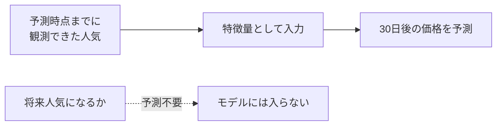
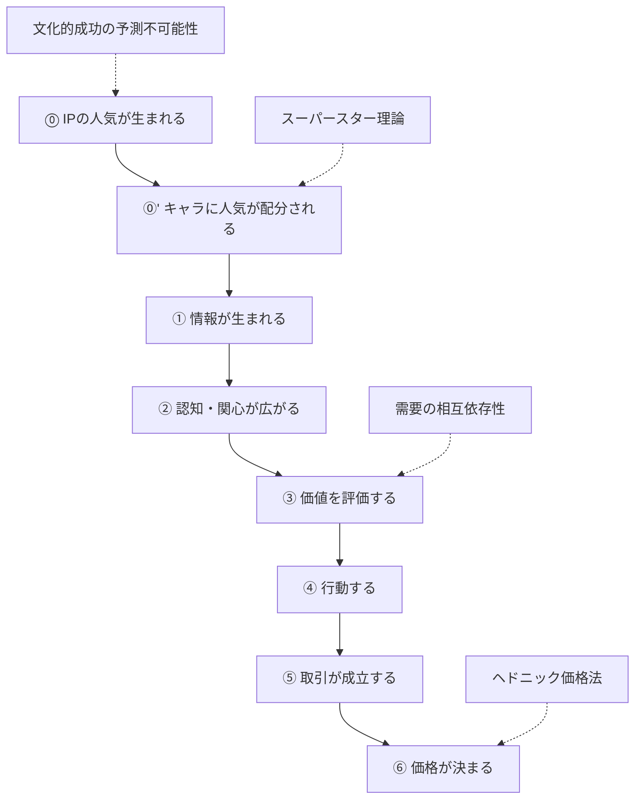
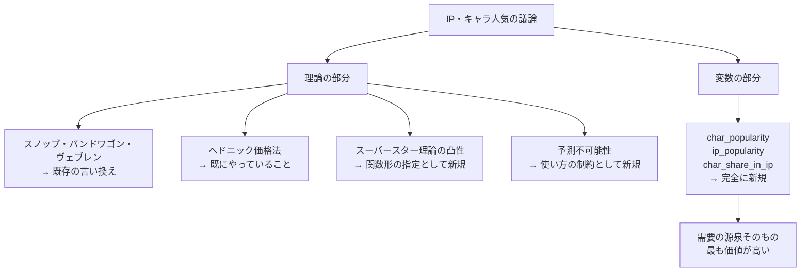
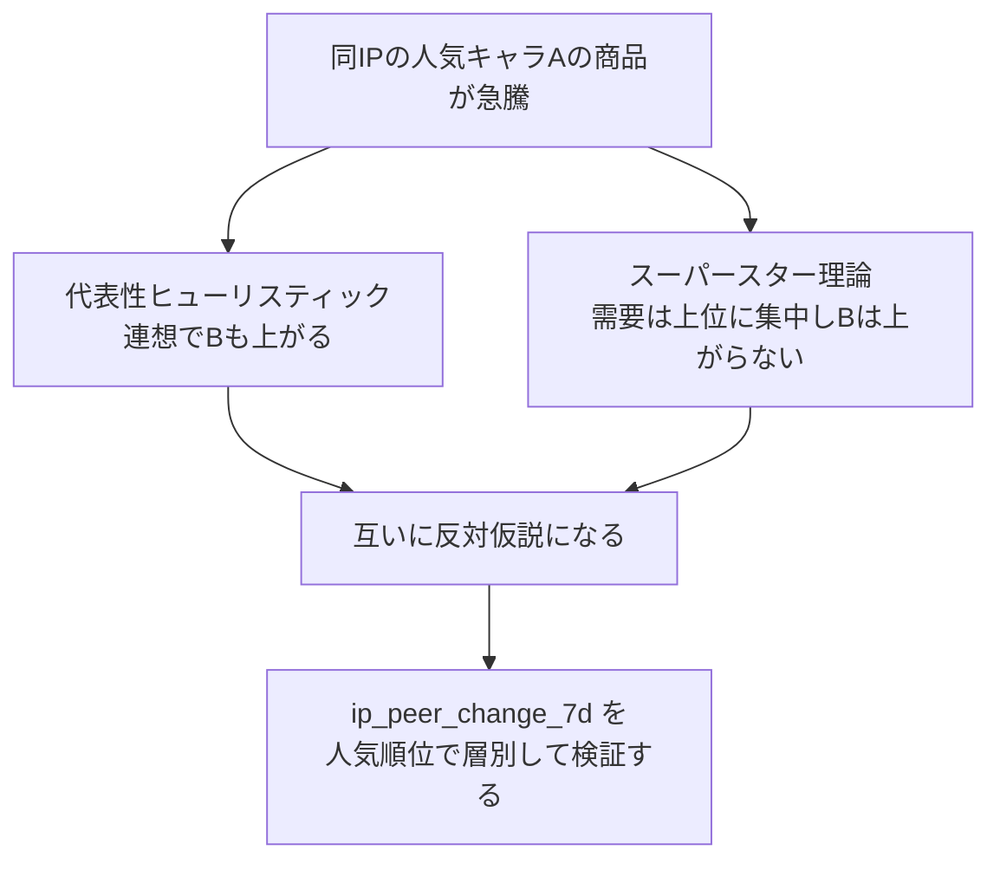
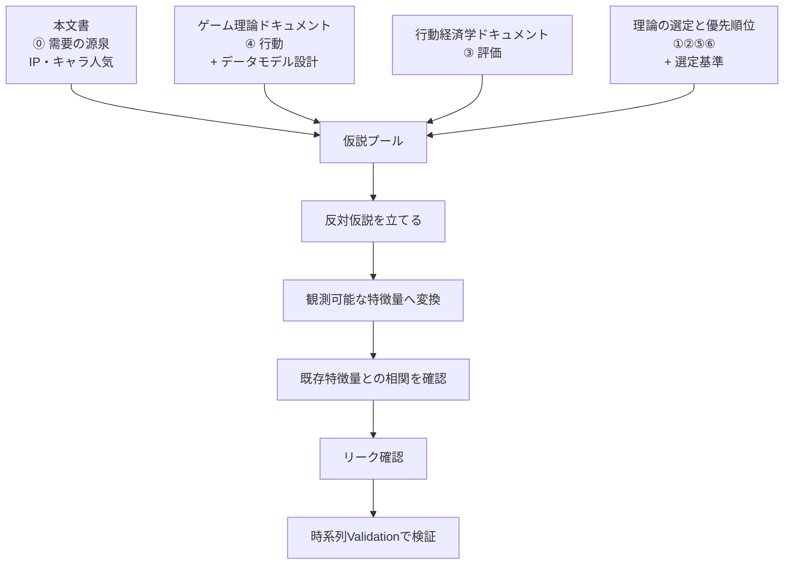

# IP・キャラクター人気を価格予測に使う

作成日: 2026-08-03 JST

関連文書:

- [ゲーム理論を活用したコレクター製品の価格予測モデル設計](./game_theory_for_collector_price_prediction.md)
- [行動経済学は特徴量設計に使えるか](./behavioral_economics_for_feature_design.md)
- [仮説を生むための理論の選定と優先順位](./hypothesis_generating_frameworks.md)

---

## 1. このドキュメントの目的

このドキュメントは、次の疑問を扱います。

```text
今回開発するシステムはコレクタブル商品、特にアニメ商品を扱う。
IP（作品）の人気も、キャラクターの人気も、価格に反映されると予想している。

このようなアニメやキャラ人気が価格に反映するかどうか、
理論的に仮説を立てるための道具、理論、概念はあるか。
```

そして、議論の過程で生じた**誤解**と、**既存の理論との使い分け**も、あわせて記録します。

---

## 2. 結論：使える。難しくない

### 2.1 まず、3つの誤解を解く

議論の途中で、次の誤解が生じました。**同じ誤解を後から読む人がしないように、最初に整理します。**

| 誤解 | 正しい理解 |
|---|---|
| 「人気は価格に影響するが、**特徴量にするのは難しい**」と言っている | **難しくない。** このアプリにとっては**最優先クラス**の特徴量 |
| 「**特定の文化圏（国など）でしか有効でない**」と言っている | **文化圏で有効性は変わらない。** 変わるのは測定手段（どのサイトを見るか）だけ |
| 「キャラが**人気になるかどうかを予測**しないといけない」 | **予測は不要。** 「今どれだけ人気か」を観測して入力するだけ |

### 2.2 結論

> **アニメ・キャラ人気は価格に影響します。そして特徴量として使えます。難しくありません。**
> **むしろ、アニメ商品を扱うこのアプリにとっては、需要の源泉そのものです。**

---

## 3. なぜ「予測不可能性」の話が誤解を生むのか

この節は、**誤解の再発を防ぐために置いています。**

### 3.1 何が「予測できない」のか

文化的成功に関する研究（§5.4）は、「人気は予測できない」という結論を出しています。しかし、それが指しているのは**たった1つのこと**です。

```text
予測できない : まだ無名のキャラが、これから人気に【なるか】
予測できる   : すでに人気が観測できているキャラの商品が、今後どう動くか
```

**そして、価格予測モデルが必要としているのは後者だけです。**

### 3.2 なぜ後者だけでよいのか

特徴量とは「**予測時点までに観測できた情報**」です。

キャラ人気は、予測時点で**すでに観測できています**。検索量も、閲覧数も、二次創作の数も、今日の値が取れます。それをそのまま入力にするだけです。

**これは、すでに使っている特徴量とまったく同じ構造です。**

| 特徴量 | 必要なこと | 必要ないこと |
|---|---|---|
| `price_change_7d` | 過去7日の価格変化を**観測**する | 「7日後に上がるか」を当てる |
| `trends_change_7d` | 過去7日の検索量変化を**観測**する | 「検索量が今後増えるか」を当てる |
| **`char_popularity`** | **今のキャラ人気を観測する** | **「将来人気になるか」を当てる** |



> **「人気の予測」と「人気を使った価格の予測」は、まったく別の問題です。**
> このアプリがやるのは後者だけです。

### 3.3 では「予測不可能性」の知見は何の役に立つのか

**使い方を制約する**という、メタ的な役割を持ちます。

| やってはいけない | やるべき |
|---|---|
| 「まだ無名のキャラが人気になるか」を当てにいく | 「人気が出始めたキャラの商品がどこまで上がるか」を予測する |
| 品質（作画、ストーリー）から人気を予測しようとする | 観測された人気の**水準と勢い**を入力にする |

---

## 4. 文化圏について

**理論の有効性が国や文化圏で変わる、という主張はしていません。**

変わるのは**測定手段**です。これは「どのサイトからデータを取るか」という実装の話であり、理論の妥当性とは無関係です。

| 見たい需要 | 使う測定手段 |
|---|---|
| 国内需要 | 日本語Wikipedia、ピクシブ百科事典、pixiv、日本語圏のSNS |
| 海外需要 | 英語Wikipedia、MyAnimeList、Reddit |

そして、これは**むしろプラス材料**です。

```text
両方取ると、内外の人気の差が測れる
    ↓
海外で人気が先行しているキャラが分かる
    ↓
「海外需要後追い型」の価格上昇を先読みできる
```

これは既存の課題仕様（`docs/assignment/collectible_prediction_sandbox_assignment.md` §6.6 の価格パターン「海外需要後追い型」）に、そのまま対応します。

**特徴量の例**

| 特徴量 | 計算式 | 意味 |
|---|---|---|
| `char_pop_jp` | 日本語Wikipediaの閲覧数 | 国内の関心 |
| `char_pop_en` | 英語Wikipediaの閲覧数 | 海外の関心 |
| `pop_gap_en_jp` | `char_pop_en / char_pop_jp` | 海外先行の度合い |
| `pop_gap_change_30d` | 上記の30日変化 | 海外需要の立ち上がり |

---

## 5. 価格形成における位置づけ

### 5.1 ⓪の層

[仮説を生むための理論の選定と優先順位](./hypothesis_generating_frameworks.md) §3 では、価格が決まるまでの経路を6段階に分解しました。

IP・キャラ人気は、**その6段階よりも手前**に位置します。



> **既存の3文書は、①〜⑥しか扱っていませんでした。**
> **「そもそも需要はどこから来るのか」という ⓪ の層が、まるごと空白でした。**

### 5.2 なぜ空白だったか

既存の道具は、いずれも「**すでに需要がある商品**」を前提にしていました。

| 既存の道具 | 前提 |
|---|---|
| 行動経済学 | 買いたい人がいる。その人がどう判断するか |
| ゲーム理論 | 参加者がいる。その人たちがどう相互作用するか |
| 市場微細構造論 | 取引がある。その取引が価格をどう動かすか |

**「なぜそもそも欲しいのか」は、どの道具も答えていませんでした。** アニメ商品では、その答えが「キャラが好きだから」です。

---

## 6. 4つの理論

### 6.1 スーパースター理論

#### 立てる問い

```text
なぜ、一部のキャラに人気が極端に集中するのか。
```

#### 核心

| 理論 | 説明 |
|---|---|
| **Rosen (1981)** | **わずかな才能の差が、莫大な報酬差を生む**。理由は「同時消費」（1つの作品を無限の人が同時に楽しめる）と「代替不可能性」（2番手を10人分見ても、1番手1人分に勝てない） |
| **Adler (1985)** | **才能に差がなくてもスターは生まれる**。「消費資本」— 語り合える相手を見つけるコストが低いから、みんなが知っているスターを選ぶ |

#### わかりやすい例

```text
人気2位のキャラのグッズを10個買っても、
人気1位のキャラのグッズ1個の満足には届かない。

だから、需要は上位に極端に集中する。
```

#### 最も重要な含意：関係が線形ではない

```text
順位   1位   2位   3位  ...  10位  11位  ...  50位
価格  ████████████████
       　    ███████
       　    　      ████
       　    　      　       ██
       　    　      　       ██
       　    　      　       　        █

1位と2位の価格差は、10位と11位の価格差よりはるかに大きい。
```

**これは特徴量の作り方を直接変えます。**

| やってはいけない | やるべき |
|---|---|
| `character_rank` をそのまま線形に入れる | `log(character_rank)` または `1 / character_rank` |
| 人気度を単純な連続値で入れる | 上位フラグ（`is_top3`, `is_top10`）を併用する |
| 全キャラを同じ扱いにする | 人気帯で層別する |

**なぜ重要か**：線形で入れると、モデルは「順位が1つ下がると価格が一定額下がる」という誤った関係を学びます。実際は上位ほど急峻です。

#### Adlerの含意：人気の「持続」が予測子になる

```text
Adlerの理論が正しいなら、人気は品質ではなく
「みんなが知っていること」で決まる。

→ 一度定着した人気は、自己増殖して長持ちする
→ 「過去に人気だった期間の長さ」自体が、将来の人気の予測子になる
```

| 特徴量 | 意味 |
|---|---|
| `rank_stability_365d` | 過去1年の人気順位の標準偏差（小さいほど定着） |
| `days_in_top10` | 過去に上位10位以内にいた日数 |
| `rank_trend_90d` | 順位の変化トレンド |

---

### 6.2 需要の相互依存性（バンドワゴン・スノッブ・ヴェブレン）

#### 立てる問い

```text
他人が買うことが、自分の需要をどう変えるか。
```

#### 核心

Harvey Leibenstein (1950, QJE) が、他人の消費が自分の需要に与える影響を3種類に分けました。

| 効果 | 内容 | コレクター市場での例 |
|---|---|---|
| **バンドワゴン効果** | 他人が買うほど、自分も欲しくなる | 人気キャラのグッズは、人気だからさらに欲しくなる |
| **スノッブ効果** | 他人が持つほど、欲しくなくなる | 「みんな持っている」カードは価値を感じない |
| **ヴェブレン効果** | 価格が高いほど欲しくなる | 高額であること自体がステータスになる |

#### 最も価値のある部分：バンドワゴンとスノッブが同時に働く

```text
バンドワゴン ← キャラの人気（多くの人が「欲しい」と思っている）
スノッブ     ← 商品の希少性（実際に持っている人は少ない）

この2つが両立するとき、価格は最も高くなる。
```

| キャラ人気 | 発行枚数 | 予想される価格 | 理由 |
|---|---|---|---|
| **高** | **少** | **最も高い** | 欲しい人が多く、持っている人が少ない |
| 高 | 多 | 中程度 | 欲しい人は多いが、誰でも手に入る |
| 低 | 少 | 低い | 希少だが、欲しい人がいない |
| 低 | 多 | 最も低い | 両方だめ |

> **これは単独の特徴量ではなく、交互作用そのものです。**

| 特徴量 | 計算式 |
|---|---|
| `popularity_scarcity` | `log(1/character_rank) × log(1/print_run)` |
| `demand_supply_gap` | `キャラ人気の順位` - `発行枚数の順位` |

**ただし、この理論の大部分は既存の概念と重複します。詳しくは §7 を参照してください。**

---

### 6.3 ヘドニック価格法

#### 立てる問い

```text
価格を属性に分解すると、キャラ人気の値段はいくらか。
```

#### 核心

商品を **属性の束** として分解し、各属性の暗黙の価格を推定する手法です。美術品の価格研究では標準的な方法です。

```text
価格 = f( IP人気, キャラ人気, レアリティ, 発行年, 状態, カード種別, ... )

各属性の係数 = その属性の「1単位あたりの値段」
```

#### 実装の3段階

| 段階 | 方法 | 注意点 |
|---|---|---|
| **1（簡単）** | `character_id` をカテゴリ変数として入れる | キャラ数が多いと過学習する |
| **2（推奨）** | `character_id` を **target encoding**（平滑化つき）で数値化 | **リークに厳重注意** |
| **3（発展）** | キャラを**階層構造**（IP → キャラ）で扱い、階層ベイズや混合効果モデルで推定 | データが少ないキャラをIP平均に縮小推定できる |

段階3の考え方が特に有効です。

```text
データが多いキャラ   → そのキャラ自身の平均に近づける
データが少ないキャラ → 所属IPの平均に近づける（縮小推定）

これにより、マイナーキャラでも合理的な推定ができる。
```

#### リークの注意

```python
# 誤り：全期間のデータでキャラの平均価格を計算（未来が混ざる）
char_mean = df.groupby("character_id")["price"].transform("mean")

# 正しい：予測時点より前のデータだけで、拡大窓で計算
char_mean = (
    df.sort_values("date")
      .groupby("character_id")["price"]
      .transform(lambda s: s.shift(1).expanding(min_periods=5).mean())
)
```

**この理論も、大部分は既存の実践と重複します。§7 を参照してください。**

---

### 6.4 文化的成功の予測不可能性

#### 立てる問い

```text
人気は事前に予測できるのか。
```

#### 決定的な実験

Salganik, Dodds & Watts (2006, Science) の **MusicLab実験**。

```text
実験設計:
  14,341人の参加者に、無名アーティストの48曲を聴かせてダウンロードさせる

  条件A: 他人のダウンロード数が【見えない】
  条件B: 他人のダウンロード数が【見える】（複数の独立した並行世界を作る）

結果:
  条件Bでは、
    ・成功の不平等が拡大した（一部の曲に極端に集中）
    ・成功が【予測不可能】になった
      同じ曲が、ある世界では1位、別の世界では40位になった
```

#### 含意

> **文化的な人気は、品質だけでは決まりません。社会的影響によって経路依存的に決まります。**

**ただし、§3 で述べたとおり、これは「使えない」という意味ではありません。**

| 段階 | 予測可能性 | 対応 |
|---|---|---|
| 人気の**発生** | **予測困難** | **予測しない**（モデルに不要） |
| 人気の**増幅** | 予測可能 | 拡散モデル（S字カーブの位置） |
| 人気の**飽和・減衰** | 予測可能 | 減衰率（§8.5） |

---

## 7. 既存の理論・概念との重複分析

**ここが、このドキュメントで最も実務的に重要な節です。**

新しい概念を追加するときは、既存と重複していないかを必ず確認します（フレームワーク文書 §14.3）。

### 7.1 結論：新しいのは「理論」ではなく「変数」



| | 評価 |
|---|---|
| 理論として新しかったもの | **少ない**。凸性の指定と、予測不可能性による制約くらい |
| 変数として新しいもの | **完全に新規**。キャラ人気・IP人気は既存文書に一切登場していない |
| **価値の所在** | **理論ではなく変数のほう** |

### 7.2 強く被るもの（新規に作らない）

| 新しく出てきた概念 | 既存の概念 | 判定 |
|---|---|---|
| **スノッブ効果** | 希少性ヒューリスティック（行動経済学 §5.4.5） | **ほぼ同一**。経済学の言い方と心理学の言い方の違い |
| **バンドワゴン効果** | 群集行動・外挿的期待（行動経済学 §5.4.3） | **ほぼ同一** |
| **ヴェブレン効果** | ヴェブレン財（フレームワーク文書 §12.2 で **D級・保留** と判定済み） | **完全に同一**。判定を維持し、保留のまま |
| **ヘドニック価格法** | ルールベース特徴量作成（`feature_discovery_methods.md` §2） | **実質同じ**。「意味を説明できる特徴量を作ってモデルに入れる」こと |

**対処**

```text
スノッブ効果の特徴量     → 既存の scarcity_window, supply_thinning を使う
バンドワゴン効果の特徴量 → 既存の price_sns_coupling, momentum_accel を使う
ヴェブレン効果の特徴量   → 作らない（保留のまま）
ヘドニック価格法         → 新しい特徴量ではなく、
                           「キャラを固定効果として扱う」という実装アイデアだけを採用
```

### 7.3 部分的に被るが、区別できるもの

#### 7.3.1 Adler版スーパースター理論 ↔ 群集行動

**時間軸が違います。**

| | 見ているもの | 対応する特徴量 |
|---|---|---|
| 群集行動 | **短期のフロー**（今、みんなが買っているか） | `price_sns_coupling`, `momentum_accel` |
| Adler版スーパースター | **長期のストック**（昔から、みんなが知っているか） | `rank_stability_365d`, `days_in_top10` |

**異なる特徴量になるので共存できます。** ただし相関チェックは必要です。

#### 7.3.2 スーパースター理論 ↔ 代表性ヒューリスティック（最も重要な関係）

**この2つは、同じ状況で正反対の予測をします。**

```text
状況: 同じIPの人気キャラAの商品が急騰した。
      では、同IPの不人気キャラBの商品はどうなるか？

代表性ヒューリスティック（行動経済学 §5.4.7）
  → 「同じIPだから、Bも上がるはず」と連想する人がいる
  → Bも上がる

スーパースター理論
  → 人気は上位に集中する。BはAの代替にならない
  → Bは上がらない。むしろ資金がAに吸われて下がる可能性すらある
```



> **これは、ゲーム理論文書 §4.7（互いに反対仮説を供給する）の新しい実例です。**
> **どちらが正しいかで、既存の `ip_peer_change_7d` の符号が変わります。**

**検証方法（既存データで可能）**

```text
同IP内で、人気順位別に ip_peer_change_7d の効果を層別する。

  上位キャラでも下位キャラでも正の効果
      → 代表性ヒューリスティックを支持

  上位キャラだけ正、下位キャラは無効か負
      → スーパースター理論を支持
```

**新しいデータは不要です。** キャラの人気順位さえ手に入れば、既存の `ip_peer_change_7d` で検証できます。

#### 7.3.3 スーパースター理論 ↔ 極値理論

| | 役割 |
|---|---|
| スーパースター理論 | **なぜ**分布の裾が重くなるのか（説明） |
| 極値理論（フレームワーク文書 §11.1） | 重い裾を**どう推定するか**（手法） |

**説明と手法なので競合しません。組み合わせる関係です。**

### 7.4 被らないもの（新規部分）

| 新規部分 | 内容 | なぜ新規か |
|---|---|---|
| **人気の凸性** | 人気ランクは `log` を取る、上位フラグを併用する | 既存の道具は「関数形」を指定していなかった |
| **人気 × 希少性の交互作用** | `character_popularity × print_run` | 個々の効果は既存にあるが、**キャラ人気という変数と掛け合わせるのは新規** |
| **`char_share_in_ip`** | 作品内でのキャラのシェア | IPとキャラを分離する発想は既存文書に一切ない |
| **減衰率** | 放送終了後に人気がどれだけ残るか | 「人気の質」を測る発想は既存にない |
| **文化的成功の予測不可能性** | 「発生」は予測せず「増幅」を予測する | 既存の道具の**使い方を制約する**メタ的な役割 |

### 7.5 最も重要な重複チェック：`char_popularity` ↔ `trends_score`

**理論の重複より、こちらのほうが実務上は深刻です。**

#### 被る可能性が高い

```text
現在の trends_score    = その商品の検索量
新しい char_popularity = そのキャラの検索量

商品名にキャラ名が入っていれば、
実質的に同じものを測っている可能性がある。
```

#### しかし、構造が違う

| | 性質 |
|---|---|
| `trends_score`（商品の検索量） | **商品固有** |
| `char_popularity`（キャラの検索量） | **同じキャラの全商品に共通** |

つまり、キャラ人気は商品間の**共通因子**です。この構造の違いを使うと、分解できます。

```text
商品への関心 = キャラ由来の共通成分 + 商品固有の成分

  trends_score_residual = trends_score - （キャラ人気から説明される分）
```

| 特徴量 | 意味 | 解釈 |
|---|---|---|
| `char_popularity` | キャラ全体への関心 | 需要の土台 |
| `trends_score_residual` | その商品だけへの関心 | **キャラ人気では説明できない、商品固有の話題性** |

> **`trends_score_residual` が高い商品 = キャラ人気以上に、その商品自体が注目されている**
>
> これは重複を解消するだけでなく、**新しい情報を取り出す**方法です。

```python
# キャラ人気で trends_score を回帰し、その残差を特徴量にする
# （予測時点までのデータだけで係数を推定すること）
import numpy as np

def residualize(group):
    x = np.log1p(group["char_popularity"])
    y = np.log1p(group["trends_score"])
    # 予測時点までの拡大窓で係数を推定する簡易版
    beta = (x * y).expanding().sum() / (x * x).expanding().sum()
    return y - beta.shift(1) * x

df["trends_score_residual"] = (
    df.sort_values("date").groupby("item_id", group_keys=False).apply(residualize)
)
```

---

## 8. 人気の測定

理論より、**ここが実務上の勝負どころ**です。フレームワーク文書 §2.2 の「システムとして表現できるか」に該当します。

### 8.1 指標の候補

| 指標 | 取得元 | 更新頻度 | 種類 | 評価 |
|---|---|---|---|---|
| **Wikipedia の閲覧数** | Wikimedia Analytics API（無料・公式） | **日次** | フロー | **最有力**（§8.2） |
| **pixiv のタグ別作品数** | pixiv | 日次可 | ストック＋フロー | 二次創作の量＝ファン活動の強度 |
| Google Trends のキャラ名検索量 | Google Trends | 日次 | フロー | 表記ゆれ・同名異義に弱い |
| X の言及数 | X API | 日次 | フロー | ノイズが多い |
| MyAnimeList のお気に入り数 | MAL API | 累積 | ストック | 定着度の指標 |
| 公式人気投票の順位 | 雑誌・公式サイト | 年1回程度 | ストック | 信頼性は高いが頻度が低い |
| **グッズの種類数** | 通販サイト | 週次 | — | **供給側の信念の表出**（§8.3） |

### 8.2 最有力：Wikipedia の閲覧数

#### なぜ最有力か

| 理由 | 内容 |
|---|---|
| 無料の公式API | Wikimedia Analytics API |
| 日次データ | 1日単位で取得できる |
| **過去分を遡れる** | **これが決定的**。今日から始めても、過去数年分が手に入る |
| 表記ゆれに強い | ページ単位なので、同名異義の混入が起きない |
| IPとキャラの両方 | 作品ページとキャラページが別々に存在する |
| 実証実績 | 映画の興行収入予測で有効性が報告されている |

> **「過去分を遡れる」という性質は、他の指標にありません。**
>
> ゲーム理論文書 §19 で「集計は不可逆。保存していない期間は永久に失われる」と書きましたが、
> **Wikipedia閲覧数は、その例外です。** 後から始めても間に合います。

#### エンドポイント

```text
https://wikimedia.org/api/rest_v1/metrics/pageviews/per-article/
    {project}/{access}/{agent}/{article}/daily/{start}/{end}

例:
  project : ja.wikipedia.org
  access  : all-access
  agent   : user          ← 重要。all-agents だとボットが混ざる
  article : ページタイトル（URLエンコード）
  start   : 20250101
  end     : 20251231
```

| 注意点 | 内容 |
|---|---|
| **agent は `user` を使う** | `all-agents` にするとボットのアクセスが混入し、人間の関心を測れない |
| User-Agent ヘッダが必要 | 連絡先（メールまたはURL）を含めることが求められている |
| レート制限 | 200リクエスト/秒 |

#### テーブル設計

```text
popularity_snapshot
  observed_date     観測日
  entity_type       'ip' または 'character'
  entity_id         IP ID または キャラID
  source            'wikipedia_ja' / 'wikipedia_en' / 'pixiv' / ...
  metric            'pageviews' / 'work_count' / 'favorites'
  value             値
  collected_at      取得日時
```

**ゲーム理論文書 §19.2 の第1層（取得層）の原則に従い、加工せず追記のみで保存します。**

### 8.3 もう1つの推奨：グッズの種類数（供給側の信念）

これは他にない発想です。

```text
メーカーは市場調査をして、人気キャラのグッズを多く作る。

つまり、グッズのラインナップ自体が
「メーカーが予測したキャラ人気」の表出である。

→ 素人の観測より、専門家の判断が織り込まれている可能性がある
```

ゲーム理論文書 §16.3 の「プレイヤーの信念を読む」に相当します。

**ただし逆因果に注意**が必要です（グッズが多いから人気に見えるだけ、という可能性）。

### 8.4 IP人気とキャラ人気を分離する

**単独の絶対値ではなく、相対シェアを使うべきです。**

| 特徴量 | 計算式 | 意味 |
|---|---|---|
| `ip_popularity` | IP名の閲覧数 | 作品全体の勢い |
| `char_popularity` | キャラ名の閲覧数 | キャラの絶対的な注目 |
| **`char_share_in_ip`** | `char_popularity / ip_popularity` | **作品内でのキャラのシェア** |
| `char_share_change_90d` | 上記の90日変化 | 作品内での地位の変化 |

`char_share_in_ip` があると、次のケースを区別できます。

```text
IPは落ち目だが、キャラのシェアは上昇している
  → そのキャラの商品は下がりにくい

IPは好調だが、キャラのシェアは低下している
  → そのキャラの商品は、IP全体ほどは上がらない
```

### 8.5 ストックとフローを分ける

| 種類 | 内容 | 指標の例 | 価格への効き方 |
|---|---|---|---|
| **ストック** | これまでの人気の蓄積 | 累計お気に入り数、二次創作の総数 | **下値を支える** |
| **フロー** | 今の勢い | 日次閲覧数、新規投稿数 | **上昇を生む** |

```text
ストック高 × フロー低 → 安定しているが動かない（下値は堅い）
ストック低 × フロー高 → 急騰しうるが、続かない可能性が高い
ストック高 × フロー高 → 最も上がりやすい
ストック低 × フロー低 → 動かない
```

**注意**：ストック指標（累計値）は単調増加するため、そのままでは時系列特徴量になりません。増加率に変換して使ってください。

### 8.6 人気の「質」を測る：減衰率

**露出と人気は別物です。**

```text
放送中は、誰でも露出が多い。
本物の人気は、放送が終わった後に持続するかで決まる。
```

| 特徴量 | 計算式 | 意味 |
|---|---|---|
| `attention_decay_rate` | 放送終了後の閲覧数の減衰の速さ | **人気の質** |
| `days_since_broadcast_end` | 放送終了からの経過日数 | 減衰の進行度 |
| `residual_attention_ratio` | 現在の閲覧数 ÷ 放送中のピーク | どれだけ残ったか |

> **減衰率が小さいキャラ = 本物の人気 = 価格が持続する**、という仮説が立てられます。
> これは「一時的なバズ」と「定着した人気」を区別する、最も直接的な指標です。

---

## 9. 特徴量の一覧と優先順位

### 9.1 作るもの

| 優先度 | 特徴量 | 根拠 | 重複リスク |
|---:|---|---|---|
| 1 | `char_popularity`, `ip_popularity` | 需要の源泉 | `trends_score` と要確認 |
| 2 | `char_share_in_ip` | IPとキャラの分離 | **低い** |
| 3 | `trends_score_residual` | 重複の解消策 | **低い**（解消策そのもの） |
| 4 | `log(char_rank)`, `is_top10` | スーパースター理論の凸性 | 低い |
| 5 | `char_popularity × print_run` | バンドワゴン × スノッブ | 中（希少性系と要確認） |
| 6 | `attention_decay_rate` | 人気の質 | 中（`days_since_trends_peak` と要確認） |
| 7 | `rank_stability_365d` | Adlerの定着効果 | 中（群集行動系と要確認） |
| 8 | `pop_gap_en_jp` | 海外需要の先行 | 低い |
| 9 | キャラの target encoding | ヘドニック価格法 | 低い（ただしリーク注意） |

### 9.2 作らないもの（重複のため）

| 作らないもの | 代わりに使うもの |
|---|---|
| スノッブ効果の特徴量 | 既存の `scarcity_window`, `supply_thinning` |
| バンドワゴン効果の特徴量 | 既存の `price_sns_coupling`, `momentum_accel` |
| ヴェブレン効果の特徴量 | 作らない（フレームワーク文書 §12.2 の保留判定を維持） |

### 9.3 追加時の手順

```text
1. char_popularity と trends_score の相関を計算する
     相関 > 0.8 → trends_score_residual に変換して使う
     相関 < 0.8 → 両方そのまま使える

2. char_popularity × print_run と、既存の希少性系特徴量の相関を確認する

3. 上位キャラ・下位キャラで層別し、ip_peer_change_7d の符号が変わるか確認する
     → 代表性ヒューリスティック vs スーパースター理論 の決着がつく
```

---

## 10. 落とし穴

| 落とし穴 | 内容 | 対策 |
|---|---|---|
| **逆因果** | 価格が上がったからキャラが話題になった可能性 | 時間差（相互相関）で先行関係を確認する |
| **リーク** | 人気投票の結果を発表日より前に使ってしまう | `known_at` を持つ（ゲーム理論文書 §10.4） |
| **リーク（target encoding）** | キャラの平均価格を全期間で計算してしまう | 拡大窓と `shift(1)` を使う（§6.3） |
| **共通要因** | アニメ放送が、人気と価格の両方を同時に動かしている | 放送イベントで層別する |
| **表記ゆれ・同名異義** | キャラ名が一般語だと検索量が汚染される | **Wikipediaのページ単位で取れば発生しない** |
| **生存者バイアス** | 現在人気のキャラだけを見ている | 人気が出なかったキャラも含めてデータを取る |
| **ストック指標の単調増加** | 累計値は減らないので時系列特徴量にならない | 増加率（フロー）に変換する |

---

## 11. 検証計画（仮説記録テンプレートの記入例）

ゲーム理論文書 §9 のテンプレートを、今回の仮説で埋めた例です。

```markdown
## 仮説名
同IP内の波及は、人気上位キャラに限定される（スーパースター仮説）

### 観察
同じIPの人気キャラの商品が急騰した後、
同IPの他商品も動くことがあるが、動かないこともある。

### 関係する概念
スーパースター理論（Rosen 1981, Adler 1985）

### 仮説
需要は人気上位キャラに集中する。
不人気キャラの商品は、人気キャラの上位互換として扱われないため、
同IP内の急騰の波及を受けない。

### 反対仮説
代表性ヒューリスティック（行動経済学 §5.4.7）。
「同じIPだから似た動きをするはず」という連想により、
人気に関係なく同IP内の商品が連動する。

### 反対仮説を棄却するための条件
ip_peer_change_7d の効果を、キャラ人気の順位で層別する。

  上位キャラでも下位キャラでも正の効果 → 反対仮説を支持（本仮説を棄却）
  上位キャラだけ正、下位は無効か負     → 本仮説を支持

### 必要なデータ
- character_id（商品とキャラの紐づけ）
- char_popularity（Wikipedia閲覧数など）
- price（既存）
- ip_name（既存）

### 特徴量候補
- log(char_rank)
- is_top10
- ip_peer_change_7d × is_top10（交互作用）

### リーク確認
- char_popularity は予測日の前日までの値を使う
- 人気順位は known_at で管理する
- ip_peer_change_7d は自分自身を除いて計算する

### 検証方法
時系列Validationで、
ベースライン（ip_peer_change_7d のみ）に対して、
交互作用項を追加した場合の precision と ROC-AUC の変化を比較する。

### 採用基準
複数のValidation期間、複数のIPで安定して改善する場合に採用する。
```

---

## 12. 用語集

### スーパースター理論

わずかな才能や人気の差が、莫大な報酬差を生む現象を説明する理論です。Rosen (1981) は「同時消費」と「代替不可能性」で説明し、Adler (1985) は「語り合う相手を見つけるコスト」で説明しました。

### 消費資本（consumption capital）

作品を楽しむために必要な知識のことです。知識を共有できる相手が多いほど消費の満足が高まるため、みんなが知っているスターが選ばれやすくなります。

### 凸性（人気と価格の関係）

人気の順位が上がるほど、価格の上昇幅が加速度的に大きくなる性質です。線形の特徴量では表現できないため、対数変換や上位フラグを使います。

### バンドワゴン効果

他人が買うほど、自分も欲しくなる効果です。行動経済学の「群集行動」とほぼ同じ現象を指します。

### スノッブ効果

他人が持っているほど、欲しくなくなる効果です。行動経済学の「希少性ヒューリスティック」とほぼ同じ現象を指します。

### ヴェブレン効果

価格が高いこと自体が需要を高める効果です。フレームワーク文書 §12.2 で保留と判定しています。

### ヘドニック価格法

商品を属性の束として分解し、各属性の暗黙の価格を推定する手法です。

### 縮小推定

データが少ない対象の推定値を、上位グループの平均に寄せる方法です。データの少ないキャラを、所属IPの平均に寄せることで、過学習を防げます。

### 文化的成功の予測不可能性

社会的影響がある環境では、文化的な成功が品質だけでは決まらず、経路依存的になる現象です。Salganik らの MusicLab 実験で示されました。**「今の人気を観測して使う」ことを否定するものではありません。**

### `char_share_in_ip`

キャラの人気を、所属IPの人気で割った値です。作品内でのキャラのシェアを表し、IP人気とキャラ人気を分離できます。

### 共通因子

同じキャラの全商品に共通して効く要因のことです。キャラ人気がこれにあたります。商品固有の要因と分離することで、重複を解消できます。

### 残差化（residualize）

ある変数を別の変数で回帰し、その残差を新しい特徴量にすることです。重複する特徴量から、独自の情報だけを取り出せます。

### ストック指標・フロー指標

ストックは累積量（累計お気に入り数など）、フローは単位期間あたりの量（日次閲覧数など）です。ストックは下値を支え、フローは上昇を生むと考えられます。

### 減衰率

放送終了などのイベント後に、関心がどれだけ速く失われるかを表す量です。人気の「質」を測る指標として使えます。

---

## 13. まとめ

### 13.1 一文で

> **アニメ・キャラ人気は価格に影響し、特徴量として使える。難しくない。**
> **ただし、新しいのは「理論」ではなく「変数」である。**

### 13.2 4つのポイント

#### 1. 誤解を解いておく

```text
・特徴量にするのは難しくない。最優先クラスである
・文化圏で有効性は変わらない。変わるのは測定手段だけ
・「人気になるか」の予測は不要。「今の人気」を観測して入れるだけ
```

#### 2. 既存の道具は ⓪ の層が空白だった

```text
⓪ 需要の源泉  ← 空白だった。ここを埋めるのが今回の内容
① 情報
② 認知
③ 評価  ← 行動経済学
④ 行動  ← ゲーム理論
⑤ 取引
⑥ 価格
```

#### 3. 理論の多くは既存の言い換えだった

| 新しく見えたもの | 実際 |
|---|---|
| スノッブ効果 | 希少性ヒューリスティックと同じ |
| バンドワゴン効果 | 群集行動と同じ |
| ヴェブレン効果 | 前回すでに保留と判定済み |
| ヘドニック価格法 | 既にやっていること |

**価値があるのは、理論ではなく `char_popularity` という変数のほうです。**

#### 4. 最初の一歩

```text
Wikipedia（日本語・英語）の閲覧数の取得を始める。

理由:
  ・無料の公式API、日次データ
  ・【過去分を遡れる】← 他の指標にない決定的な強み
  ・ページ単位なので表記ゆれが起きない
  ・IP単位とキャラ単位の両方が取れる
  ・agent=user を指定してボットを除外する

最初に作る特徴量は char_share_in_ip。
IP人気とキャラ人気を分離する、最も単純で情報量の多い指標。
```

### 13.3 4つの文書の関係



---

## 14. 参考文献

### スーパースター理論

- Rosen (1981) "The Economics of Superstars", *American Economic Review*: https://ideas.repec.org/a/aea/aecrev/v71y1981i5p845-58.html
- A test of Rosen's and Adler's theories of superstars, *Journal of Cultural Economics*: https://link.springer.com/article/10.1007/s10824-010-9135-x
- Schulze "Superstars", *Handbook of Cultural Economics*: https://repub.eur.nl/pub/801/TOWSE%20EBOOK_pages0443-0448.pdf

### 需要の相互依存性

- Leibenstein (1950) "Bandwagon, Snob, and Veblen Effects in the Theory of Consumers' Demand", *Quarterly Journal of Economics*: https://academic.oup.com/qje/article/64/2/183/1931945

### 文化的成功の予測不可能性

- Salganik, Dodds & Watts (2006) "Experimental Study of Inequality and Unpredictability in an Artificial Cultural Market", *Science*: https://www.princeton.edu/~mjs3/salganik_dodds_watts06_full.pdf
- Quantifying Social Influence in an Online Cultural Market, *PLOS One*: https://journals.plos.org/plosone/article?id=10.1371%2Fjournal.pone.0033785

### 人気指標の予測力

- Early Prediction of Movie Box Office Success Based on Wikipedia Activity Big Data, *PLOS One*: https://journals.plos.org/plosone/article?id=10.1371%2Fjournal.pone.0071226

### 測定（API）

- Wikimedia Analytics API — Getting started: https://doc.wikimedia.org/generated-data-platform/aqs/analytics-api/documentation/getting-started.html
- Wikimedia Analytics API — Page metrics: https://doc.wikimedia.org/generated-data-platform/aqs/analytics-api/examples/page-metrics.html
- Wikimedia APIs — Rate limits: https://www.mediawiki.org/wiki/Wikimedia_APIs/Rate_limits
