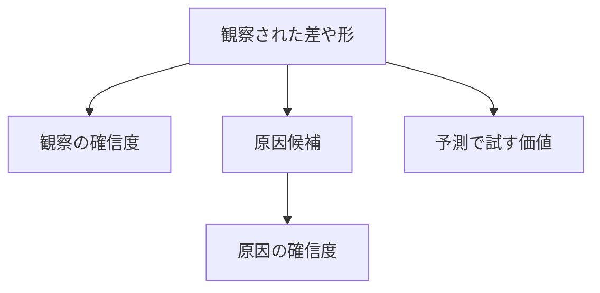

# Bike Sharingデータ可視化・仮説レビュー

レビュー日: 2026-07-25

対象:

- `src/app.py`
- `docs/observations/graph_observation_template.md`
- `data/raw/bike_sharing/hour.csv`
- `data/raw/bike_sharing/day.csv`
- `data/raw/bike_sharing/Readme.txt`

## 1. このレビューの目的と読み方

この文書は、現在のグラフと仮説について、次の内容を明確にするためのレビューです。

1. 現在の記述のどこが間違っている、または不十分なのか
2. なぜ修正が必要なのか
3. どのグラフ・仮説・処理を修正するのか
4. 修正後にどのような状態になっていればよいか

学習目的を優先し、具体的な修正コードは記載していません。一方、判断材料が曖昧にならないよう、再集計で確認できた事実や、修正すべき結論の方向は記載しています。

レビューは優先度順に並んでいます。まずP0を修正し、その後P1以降へ進んでください。

| 優先度 | 意味 | この段階で直す理由 |
|---|---|---|
| P0 | 誤った結論、定義違反、リーク | 後続の仮説やモデルを誤った方向へ進めるため |
| P1 | 不十分な集計、グラフ表現、交絡 | 観察結果を過大・過小評価するため |
| P2 | 仮説の重複、因果の飛躍、確信度 | 検証可能な仮説になっていないため |
| P3 | 見落としている視点 | 現在のグラフだけでは反証が不足するため |
| P4 | 特徴量と評価方法 | モデル評価を正しく比較するため |

## 2. 修正サマリ

| ID | 優先度 | 対象 | 現在の主な問題 | 修正の方向 |
|---|:---:|---|---|---|
| P0-01 | P0 | グラフ10、12、13、H014～H016 | 祝日・土日・平日・非稼働日の混同 | データ定義に合わせて分類名と集計条件を統一する |
| P0-02 | P0 | グラフ10、H014 | 祝日と非祝日の大小関係が逆 | 再集計結果に合わせて観察・仮説・解釈を修正する |
| P0-03 | P0 | グラフ11、H017 | 目的変数とその内訳を独立した相関として解釈 | 仮説から外し、データ整合性確認へ位置づけ直す |
| P0-04 | P0 | グラフ6、H009 | 正規化値を摂氏として解釈 | 単位換算と異常値の扱いを修正する |
| P0-05 | P0 | グラフ1～3 | 欠落時間を考慮せずゼロ需要がないと断定 | 欠落時間を確認し、平均と最小値の解釈を修正する |
| P0-06 | P0 | グラフ6～8、H009～H011 | 日単位の関係を時間単位の予測へ適用 | 予測粒度とEDAの集計粒度をそろえる |
| P1-01 | P1 | グラフ1、2 | タイトル、ビン、ばらつきの解釈が不正確 | 表示内容と観察文を一致させる |
| P1-02 | P1 | グラフ4、H003、H004 | 季節性と年次成長を混同 | 年別に月次推移を比較する |
| P1-03 | P1 | グラフ3、5 | 時刻単体・曜日単体の平均で用途を推測 | 稼働日と時間帯の相互作用を中心に見る |
| P1-04 | P1 | グラフ7、8、H010、H011 | 散布図の目視だけで関係を判断 | 集計粒度別・区間別の傾向を併記する |
| P1-05 | P1 | グラフ9、H012 | 天気カテゴリの件数差を無視 | 件数・中央値・分布・交絡を追加する |
| P1-06 | P1 | グラフ12～14 | 割合、絶対数、総需要を混同 | 構成比と一日あたり需要を分ける |
| P1-07 | P1 | `src/app.py` | 日付軸用の表示設定をカテゴリ軸にも適用 | 軸型・ラベル・単位をグラフ用途ごとに分ける |
| P2-01 | P2 | H001～H017 | 重複、欠番、観察と原因の混在 | 仮説の単位とIDを整理する |
| P2-02 | P2 | 確信度 | パターンの明確さと因果の確信を混同 | 観察と原因の確信度を分ける |
| P3-01 | P3 | 追加分析 | 長期トレンド・利用者区分・異常日が不足 | 追加グラフと反証用の問いを追加する |
| P4-01 | P4 | 特徴量・検証 | 時系列性、利用可能時点、共線性が不足 | 予測条件を明記して評価計画を作り直す |

## 3. P0: 先に直すべき重大な問題

### P0-01: 祝日・土日・平日・非稼働日の定義が混ざっている

#### どこが間違っているか

`holiday` は祝日かどうかを表すカラムです。`holiday=0` は「平日」ではなく「祝日ではない日」であり、土日も含みます。

また、`src/app.py` では `weekday` が月曜日から金曜日かどうかで「平日」を抽出しています。この抽出には月曜日から金曜日に当たる祝日も含まれるため、データセットの `workingday` と同じ定義ではありません。

その結果、現在の文書では次の異なる意味が「平日」「休日」として混在しています。

| 表現 | 実際に確認すべきカラム・条件 |
|---|---|
| 祝日 / 非祝日 | `holiday` |
| 土日 / 月～金 | `weekday` |
| 稼働日 / 非稼働日 | `workingday` |

#### 修正対象

- グラフ5の「平日」「休日」
- グラフ10の「休日と平日」
- グラフ12の「祝日と非祝日」
- グラフ13の「平日と休日」
- グラフ14の曜日解釈
- H008、H014、H015、H016
- `src/app.py` の曜日による抽出と画面上の名称

#### どのように修正するか

- グラフタイトルと観察文に、実際に使用したカラム名または分類定義を明記する
- `holiday` を使った比較は「祝日 / 非祝日」と記載する
- `weekday` で月～金と土日を分けた比較は、そのまま「月～金 / 土日」と記載する
- 「稼働日 / 非稼働日」を比較したい場合は、データセットの `workingday` の定義に合わせる
- グラフ間で定義が異なる場合は、直接比較できないことを注意点へ追記する

#### 完了条件

すべての「平日」「休日」という表現について、どのカラムと条件を指しているか一意に説明できる状態にしてください。

### P0-02: グラフ10とH014は大小関係が逆

#### どこが間違っているか

グラフ10とH014では「祝日の方が平均利用者数が約800多い」と記載されています。しかし `day.csv` を `holiday` で再集計すると、祝日の平均は非祝日より少なくなります。

再確認値:

| holiday | 日数 | `cnt` 平均 | `cnt` 中央値 |
|---:|---:|---:|---:|
| 0 | 710 | 4,527.1 | 4,558 |
| 1 | 21 | 3,735.0 | 3,351 |

差の符号だけでなく、祝日が21日しかない点も重要です。平均差だけから強い一般化はできません。

#### 修正対象

- グラフ10の観察、目立つパターン、解釈、注意点
- H014の観察、仮説、確信度、反証・注意点
- H015の「その分、利用者の総数が増えている」という部分
- グラフ12・13からグラフ10へ結びつけている説明

#### どのように修正するか

- 「祝日の方が多い」という記述を、再集計した大小関係に合わせて修正する
- 比較対象を「祝日 / 非祝日」と正しく表記する
- 平均だけでなく日数、中央値、ばらつきを併記する
- 祝日による総需要の変化と、`casual` / `registered` の構成比変化を別の観察にする
- 買い物やレジャーという利用目的は、データから直接確認できない解釈として残す
- 標本数が少ないため、確信度を平均差だけで「高」にしない

#### 完了条件

グラフ10、H014、H015の間で、祝日の総需要と利用者構成について矛盾がない状態にしてください。

### P0-03: `registered` と `cnt` の相関は独立した仮説ではない

#### どこが間違っているか

データ定義上、`cnt` は `casual + registered` です。したがって `registered` と `cnt` の強い正相関は、独立した二つの現象の関係ではなく、目的変数とその構成要素の関係です。

現在のH017では、この相関から「登録者は普段づかいで利用している」「登録したが利用しない場合が少ない」と解釈しています。しかし、このデータには次の情報がありません。

- 登録者の母数
- 登録したが利用しなかった人数
- 個人ごとの利用履歴
- 利用目的

そのため、H017の原因説明はデータから導けません。

#### 修正対象

- グラフ11
- H017
- 特徴量候補のリーク確認

#### どのように修正するか

- グラフ11を需要要因の発見用グラフから外す
- 残す場合は「`cnt` と内訳の整合性確認」または「需要構成の確認」として位置づける
- H017を削除するか、予測仮説ではなくデータ定義の確認事項へ移す
- `casual` と `registered` は事後分析には使用しても、`cnt` 予測の入力特徴量には使用しない
- 登録者の行動目的を説明する場合は、個人単位の追加データが必要であることを明記する

#### 完了条件

目的変数の内訳を入力特徴量や独立した原因として扱っていない状態にしてください。

### P0-04: 気温の単位換算と異常値の解釈が誤っている

#### どこが間違っているか

`temp` と `atemp` は摂氏そのものではなく正規化値です。しかも換算基準が異なります。

| カラム | データ定義 |
|---|---|
| `temp` | 摂氏温度を41で割った値 |
| `atemp` | 体感温度を50で割った値 |

したがって、グラフ6の「0.6は約20.2℃」という記述は換算方法と一致していません。また、`temp=0.6` と `atemp=0.6` は同じ温度を意味しません。

2012-08-17のレコードは `temp` と `atemp` の組み合わせが他の日から大きく外れています。現在は `cnt` が高い理由を探していますが、先に気象値の入力異常を疑うべきレコードです。

`hum=0` についても、通常の気象現象と決めつけず、観測異常または欠測値の代替表現でないか確認が必要です。

#### 修正対象

- グラフ6の軸、観察、外れ値、解釈、注意点
- グラフ7の `hum=0` に関する記述
- H009
- 気象値を表示するホバー情報

#### どのように修正するか

- 正規化値のまま表示するか、物理単位へ戻して表示するかを統一する
- 正規化値のまま表示する場合は、軸名と説明に「正規化値」と明記する
- `temp` と `atemp` をそれぞれの定義に従って換算する
- 「適温」の境界は1点の目視ではなく、温度帯ごとの需要分布で確認する
- 不自然な `temp` と `atemp` の組み合わせはデータ品質問題として分離する
- 異常候補を含む場合と除いた場合で、結論が変わるか確認する

#### 完了条件

軸の数値、観察メモの温度、仮説内の温度が同じ単位で記載され、異常候補が需要の外れ値と気象値の外れ値に分けられている状態にしてください。

### P0-05: 「ゼロ需要の時間はない」という結論は成立しない

#### どこが間違っているか

`hour.csv` の最小 `cnt` は1ですが、731日×24時間に対して165時間分の行がありません。欠落は特に深夜から早朝へ偏っています。

さらに、存在する時間行の `cnt` を日ごとに合計すると `day.csv` の日別 `cnt` と一致します。このため、行がない時間を単純に無視して「ゼロ需要はない」と結論づけることはできません。

現在の時間帯平均も、行が存在する時間だけを分母にしています。欠落時間をゼロ需要として扱うべき場合、特に深夜・早朝の平均が過大になります。

#### 修正対象

- グラフ1の解釈
- グラフ2の時間分布
- グラフ3の時間帯平均
- 時系列のラグ・移動平均を今後作る処理

#### どのように修正するか

- 日付と0～23時の組み合わせを基準に、存在しない時間を一覧化する
- 欠落が「観測なし」か「利用ゼロのため行がない」のかを確認する
- 判断できない場合は、前提を明記した複数パターンで集計する
- 時間帯平均には各時間帯の観測数を併記する
- 最小値の記述を「記録されている行の最小値」と限定する
- ラグ特徴量を作る前に、1時間間隔の連続した時系列へ整える

#### 完了条件

欠落時間の扱いが明記され、時間帯平均と最小値の解釈がその扱いと整合している状態にしてください。

### P0-06: `day.csv` の関係を `hour.csv` の予測へ直接移している

#### どこが間違っているか

課題の主対象は `hour.csv` ですが、気温・体感温度・湿度・風速の散布図には `day.csv` を使用しています。

集計粒度によって関係は変わります。例えば風速と `cnt` の単純相関は、日単位では負ですが、時間単位ではわずかに正です。これは時刻、季節、天気などの構成が集計によって変わるためです。

したがって、日単位の散布図から「時間需要予測にも同じ方向で効く」と結論づけることはできません。

#### 修正対象

- グラフ6～8
- H009～H011
- 特徴量候補
- 観察対象欄

#### どのように修正するか

- 今回の最終的な予測単位が時間か日かを観察対象欄に明記する
- 主対象が時間予測なら、気象変数と時間 `cnt` の関係を基本とする
- 日単位グラフを残す場合は「長期・日別傾向の補助」と位置づける
- 日単位と時間単位で結論が異なる場合は、両方を記載して理由を検討する
- 集計粒度をまたいで仮説を適用するときは、追加検証が必要と明記する

#### 完了条件

各仮説が時間需要と日需要のどちらを説明するものか明確で、モデル対象と同じ粒度で再確認されている状態にしてください。

## 4. P1: 誤解を招きやすいグラフと集計

### P1-01: 基本統計量とヒストグラムの読み方

#### どこが不十分か

グラフ1のタイトルは「気温統計量」ですが、表示しているのは `cnt` の基本統計量です。また、`hour.csv` について「1台も借りられていない日はない」と記載していますが、時間単位データを日単位の表現で説明しています。

グラフ2では「0～9台が圧倒的に多い」としていますが、`cnt < 10` は時間レコード全体の約10.5%です。ヒストグラムの自動ビン幅を、0～9という範囲として読んでいる可能性があります。

日別需要についても、最小値と最大値、四分位範囲が広いため、「日ごとの差は大きくない」という説明は不適切です。

#### どのように修正するか

- グラフ1のタイトルを表示内容に合わせる
- 時間データと日データの説明を分ける
- ヒストグラムのビン境界と件数を確認してから範囲を記載する
- 平均・中央値に加えて、標準偏差、四分位範囲、上位分位点を確認する
- 右に裾が長い分布であることを踏まえ、対数軸でも形を確認する
- 「差が大きい／小さい」は比較基準となる数値とセットで記載する

### P1-02: 月次グラフは季節性と年次成長を分ける

#### どこが不十分か

2011年1月から2012年12月を一本の時系列として見ると、季節変動とサービス全体の成長が混ざります。2012年の日平均需要は2011年より約64%高く、冬から夏への変化だけでは説明できません。

また、2011年と2012年では需要が最大になる月が同じではありません。「6～9月が多い」というまとめだけでは、年ごとの違いを捨てています。

#### 修正対象

- グラフ4
- H003
- H004
- 月・季節に関する特徴量候補

#### どのように修正するか

- 2011年と2012年を別系列として、同じ月を比較する
- 月別平均に加えて前年同月差または比率を確認する
- 季節による周期変動と、時間経過による需要水準の上昇を別の観察にする
- 「夏休み」「冬休み」「雪」を原因として断定せず、代替説明として扱う
- サービス普及、利用者増加、供給規模など、データ外の要因も候補にする

### P1-03: 時間帯単体より `workingday × hr` を中心に見る

#### どこが不十分か

全日をまとめた時間帯平均では、稼働日の朝夕ピークと非稼働日の昼ピークが混ざります。H001/H002とH005/H007が重複したのも、時間単体と条件付き時間帯を分けて整理できていないためです。

再集計では、稼働日と非稼働日で朝夕の形が大きく異なります。したがって「8時だから多い」よりも「稼働日の8時」という組み合わせが重要です。

#### どのように修正するか

- 時間帯平均を稼働日と非稼働日の系列に分ける
- 曜日×時間ヒートマップとは別に、`workingday × hr` を直接比較する
- `casual` と `registered` の時間帯パターンを診断用に分ける
- 通勤・通学という説明は、利用者区分のパターンで補強しても因果確定とはしない
- H001/H005、H002/H007を統合し、条件を仮説内へ明記する

### P1-04: 湿度と風速を「関係なし」としない

#### どこが間違っているか

グラフ7では湿度と需要に関係がないとしています。しかし、日単位の単純相関が弱くても、時間単位や年・月を考慮した残差では負の関係が見られます。高湿度帯だけで需要が下がる非線形な関係も、単純な散布図では見落とします。

グラフ8では「風速との相関は見られない」と観察しながら、H011では「風速が強い日は利用者数が少ない」としており、観察と仮説が矛盾しています。

最大風速の1点についても、「1点しかない」ことだけでは外れ値と断定できません。

#### どのように修正するか

- 「関係がない」を「単純な散布図では明瞭な直線関係を確認できない」に弱める
- 時間単位と日単位の結果を分ける
- 気象値を複数の区間に分け、各区間の件数、平均、中央値を確認する
- 年、月、時刻、稼働日をそろえた条件でも関係が残るか確認する
- 外れ値は統計的基準、データ定義、周辺日の値を確認してから判断する
- H010とH011を、追加検証で反証可能な形へ書き直す

### P1-05: 天気カテゴリは標本数と交絡を表示する

#### どこが不十分か

天気別平均は段階的に変化していますが、カテゴリごとの件数が大きく異なります。

| `weathersit` | 時間レコード数 |
|---:|---:|
| 1 | 11,413 |
| 2 | 4,544 |
| 3 | 1,419 |
| 4 | 3 |

特にカテゴリ4は3時間だけなので、平均値を一般的な需要水準として扱うことはできません。また、悪天候が特定の季節・時刻に偏る場合、単純平均にはその影響も混ざります。

#### どのように修正するか

- 天気番号を説明付きのカテゴリ名に変える
- 平均値と同じ画面に標本数を表示する
- 中央値、四分位範囲、実測点または信頼区間を追加する
- 標本数が極端に少ないカテゴリを別扱いにする
- 同じ年・月・時刻・稼働日条件でも差が残るか確認する
- H012の「天気と需要の関連」と「天気が需要を増減させる原因」を分ける

### P1-06: 割合の増加と総需要の増加を分ける

#### どこが間違っているか

グラフ12・13では、祝日や土日に `casual` の割合が高いことから、`casual` が増え、その分だけ総需要も増えたと解釈しています。

しかし、割合は他方の区分が減った場合にも上昇します。そのため、構成比だけから絶対数や総需要の増加は判断できません。

また、グループごとの総和を円グラフにすると、グループの日数が違う場合の絶対需要比較には使えません。

#### どのように修正するか

- `casual` / `registered` の構成比と、一日あたり絶対数を別のグラフにする
- 祝日、非祝日、稼働日、非稼働日ごとの日数を表示する
- 総和ではなく一日あたり平均または分布も確認する
- 「割合が高い」と「人数が多い」を別の観察文にする
- グラフ14の曜日別総需要だけから、用途の置き換わりを断定しない

### P1-07: `src/app.py` のグラフ表示を用途別にする

#### どこが不十分か

共通の棒グラフ関数とヒストグラム関数が、x軸の種類に関係なく日付用の表示形式を設定しています。そのため、時間、曜日、天気カテゴリのような数値カテゴリでも日付軸向けの設定が適用されます。

曜日と天気は数値コードのままで、画面だけでは意味が分かりません。ヒートマップも、すでに平均集計したデータを密度ヒートマップとして再集計しており、意図が読み取りにくくなっています。

月別天気グラフは時間レコードの件数を積み上げているため、月の日数と欠落時間の影響を受けます。

#### どのように修正するか

- 日付軸、連続数値軸、カテゴリ軸で表示要件を分ける
- 曜日番号に曜日名を付ける
- 天気番号にデータ定義上のカテゴリ名を付ける
- 各グラフへ元データ、集計単位、集計方法、フィルタ条件を表示する
- 平均済みの曜日×時間データは、各セルが一つの値として読める表示にする
- 月別天気は件数だけでなく月内構成比でも表示する
- 気象グラフには正規化値か物理単位かを明記する

## 5. P2: 仮説一覧の整理

### P2-01: 仮説ごとの修正方針

| 仮説 | 現在の問題 | 修正方針 |
|---|---|---|
| H001・H005 | 全日と平日限定で内容が重複 | 稼働日条件を含む一つの仮説へ統合する |
| H002・H007 | 帰宅時間の内容が重複 | 稼働日条件を含む一つの仮説へ統合する |
| H003 | 夏休み・天気を同時に原因としている | 夏季パターン、年次成長、天気、利用目的を分離する |
| H004 | 冬の低需要から雪を主原因としている | 冬季パターンと、低温・天気・日照・成長段階を分ける |
| H008 | 「休日」の定義が曖昧で、用途を断定 | 非稼働日または土日を明記し、用途は解釈に下げる |
| H009 | 正規化単位が誤りで、低温と悪天候を一体化 | 単位を直し、温度効果と天気効果を別に検証する |
| H010 | 目視だけで無関係と判断 | 高湿度帯・時間粒度・条件付き関係を検証する仮説へ変更する |
| H011 | 観察では無関係、仮説では減少として矛盾 | 粒度別の結果を示し、反証条件を明記する |
| H012 | 関連から因果へ飛躍し、少数カテゴリを無視 | 標本数と交絡を反映して確信度を見直す |
| H014 | 大小関係が逆 | 再集計結果に合わせて全面的に書き直す |
| H015 | 構成比から総需要増加を推測 | 構成比、絶対数、総需要を別の仮説にする |
| H016 | 土日と非稼働日、祝日が混在 | 比較条件を一つに固定し、用途は解釈にする |
| H017 | 目的変数と内訳の包含関係 | 削除またはデータ整合性確認へ移動する |

H006とH013が欠番になっています。意図的な欠番でなければ、仮説を整理した後にIDを振り直してください。

### P2-02: 観察と原因を別の欄にする

現在は「グラフで確認できたこと」と「その理由の推測」が同じ仮説文に入っています。これを次の構造へ分けてください。

| 欄 | 書く内容 | 書かない内容 |
|---|---|---|
| 観察 | 集計値、時間帯、大小関係、分布 | 通勤、買い物など未観測の目的 |
| 原因候補 | 観察を説明できる可能性 | 確認していない原因の断定 |
| 代替説明 | 同じパターンを生む別要因 | 最初の説明だけを正解とする記述 |
| 反証条件 | 仮説が誤りとなる集計結果 | 「モデルで確認する」だけの曖昧な表現 |
| 追加確認 | 必要なグラフ・比較条件 | 実装コード |

### P2-03: 確信度を二つに分ける

現在の「高・中・低」は、パターンが明瞭であることと、原因が正しいことを混同しています。

修正後は、少なくとも次を区別してください。

- 観察の確信度: 件数、ばらつき、年ごとの再現性
- 原因の確信度: 利用目的や因果を直接示すデータの有無
- 予測上の優先度: 特徴量としてモデル比較する価値

通勤・通学やレジャーの説明は、パターンが明瞭でも原因の確信度を高くしないでください。

## 6. P3: 追加するグラフと仮説

### P3-01: 追加グラフ

| 優先順 | 追加グラフ | 修正できる問題 | 確認する内容 |
|---:|---|---|---|
| 1 | 稼働日・非稼働日別の時間帯折れ線 | 時間帯平均の混在 | 朝夕と昼のパターンが条件で変わるか |
| 2 | 年別の月次推移 | 季節性と成長の混同 | 同じ月を年ごとに比較しても傾向が残るか |
| 3 | 利用者区分×稼働日×時間帯 | 利用目的の推測 | どの区分が各時間帯パターンを作るか |
| 4 | 気象値の区間別平均・中央値・件数 | 散布図の目視判断 | 非線形性と少数区間の影響 |
| 5 | 祝日・稼働日別の箱ひげ図と実測点 | 平均・割合だけの比較 | 分布、外れ値、標本数 |
| 6 | 日付×時間の欠落ヒートマップ | ゼロ需要と欠落の混同 | 欠落がどの時期・時間帯へ偏るか |
| 7 | `temp` と `atemp` の整合性散布図 | 気象値異常の見落とし | 二つの温度が不自然に離れた日 |
| 8 | 日次時系列と移動要約 | 長期トレンド・異常日の見落とし | 成長、季節、急増・急減 |
| 9 | 月ごとの天気構成比 | 月の日数による件数差 | 月内の天気割合と需要推移 |
| 10 | 条件別の予測誤差グラフ | 全体指標だけの評価 | 時間帯・季節・天気別の弱点 |

### P3-02: 追加仮説として検討する内容

次の項目を、完成した結論ではなく、追加検証する仮説候補として追加してください。

| 仮説候補 | 確認する問い | 主な反証方法 |
|---|---|---|
| 長期トレンド | 同じ月でも年が後になるほど需要水準が高いか | 年別・同月比較で差が再現しない |
| 稼働日×時間帯 | 時間帯単体より稼働日との組み合わせが重要か | 条件を分けても時間帯形状が同じ |
| 利用者区分の異質性 | 時間帯や天気の影響が区分ごとに違うか | 区分別の相対変化が同じ |
| 高湿度帯 | 高湿度域だけで需要が低下するか | 条件をそろえると差が消える |
| 強風条件 | 日単位と時間単位の違いは交絡で説明できるか | 層別後も一貫した関係がない |
| 気温の非線形性 | 快適な温度帯の前後で需要の傾きが変わるか | 年・月を分けると形が再現しない |
| 時系列依存 | 前日・前週同時刻の需要と関連するか | 時間順検証で改善しない |
| イベント・異常日 | 通常の時刻・季節・天気で説明できない日があるか | 残差が通常範囲に収まる |

## 7. P4: 特徴量候補と検証方法

### P4-01: 特徴量候補

#### 現在不足している点

- 予測対象が時間需要か日需要か明記されていない
- 相互作用の仮説と単独特徴量の仮説が対応していない
- `temp` と `atemp` の強い類似性を考慮していない
- 気象情報が予測時点で取得可能か整理されていない
- 欠落時間を処理する前にラグ特徴量を検討する可能性がある
- 時間経過を表す特徴量が、将来へ外挿できるか検討されていない

#### どのように修正するか

- 特徴量表の先頭に予測対象と予測時点を記載する
- 各特徴量候補へ対応する仮説IDを付ける
- 時間帯と稼働日の相互作用を独立した検証項目にする
- 周期特徴量は使用するモデルとの相性を説明する
- 強く似た気象変数を同時に入れる場合の影響を確認する
- 実測天気ではなく、予測時点で得られる天気情報かどうかを区別する
- ラグ特徴量は時刻の連続性と利用可能時点を確認してから候補にする
- `casual` と `registered` は `cnt` 予測の入力候補から除外する

### P4-02: 検証方法

#### 現在不足している点

ランダムな学習・テスト分割では、2011年と2012年の需要水準や近接時刻の情報が両方へ混ざり、未来予測より簡単な評価になる可能性があります。

また、全体のMAE・RMSE・R2だけでは、通勤時間帯や悪天候時だけ大きく外すモデルを見落とします。

#### どのように修正するか

- 実際の予測用途に合わせて、過去から未来を予測する順序で分割する
- 特徴量追加前後で同じ期間と評価指標を使用する
- 一度に追加する特徴量群を限定し、どの仮説が改善へ寄与したか追跡する
- 全体指標に加え、時間帯、稼働日、季節、天気別の誤差を確認する
- 需要規模が大きい時間ほど誤差が大きくなる点を考慮し、指標の役割を整理する
- 異常日を含む場合と除いた場合で、モデル比較の結論が変わらないか確認する

## 8. 修正チェックリスト

このチェックリストは、上の説明を読んだ後に実作業の進捗管理として使用してください。

### P0: データ定義と誤った結論

- [ ] `holiday`、`weekday`、`workingday` の定義を整理した
- [ ] すべての「平日」「休日」を実際の抽出条件に合う名称へ修正した
- [ ] グラフ10の祝日・非祝日平均を再集計した
- [ ] グラフ10の観察とH014を再集計結果に合わせて修正した
- [ ] H015から構成比と総需要を混同する記述を除いた
- [ ] グラフ11を需要要因の相関分析から外した
- [ ] H017を削除するかデータ整合性確認へ移した
- [ ] `casual` と `registered` を入力特徴量にしないことを明記した
- [ ] `temp` と `atemp` の単位換算を修正した
- [ ] 2012-08-17の気象値をデータ品質問題として確認した
- [ ] `hum=0` を通常値と断定せず確認対象にした
- [ ] `hour.csv` の欠落時間を日付×時間で確認した
- [ ] ゼロ需要に関する記述を欠落時間の扱いと整合させた
- [ ] 時間帯平均へ観測数を追加した
- [ ] 予測対象が時間需要か日需要か明記した
- [ ] 気象仮説を予測対象と同じ集計粒度で確認した

### P1: グラフと観察文

- [ ] グラフ1のタイトルを表示内容に合わせた
- [ ] グラフ1の時間・日の表現を修正した
- [ ] グラフ2のビン境界と件数を確認した
- [ ] 日別需要のばらつきを四分位範囲などで再確認した
- [ ] 月次推移を2011年と2012年に分けた
- [ ] 季節性と長期トレンドを別の観察にした
- [ ] 時間帯グラフを稼働日と非稼働日に分けた
- [ ] 曜日×時間と稼働日×時間の役割を分けた
- [ ] 湿度を「関係なし」と断定する記述を修正した
- [ ] 風速の観察文とH011の矛盾を解消した
- [ ] 気象値を区間別・粒度別に確認した
- [ ] 天気カテゴリ名と各カテゴリの件数を表示した
- [ ] 少数の天気カテゴリへ注意書きを追加した
- [ ] 利用者区分の割合と一日あたり絶対数を分けた
- [ ] グラフ14から利用目的を断定する記述を修正した
- [ ] 日付軸とカテゴリ軸の表示要件を分けた
- [ ] 曜日と天気の数値コードへ名称を付けた
- [ ] 月別天気を件数と構成比の両方で確認した
- [ ] 各グラフへ元データ・集計単位・集計方法を記載した

### P2: 仮説

- [ ] H001とH005を整理した
- [ ] H002とH007を整理した
- [ ] H003で季節性・成長・天気・利用目的を分離した
- [ ] H004で冬季パターンと原因候補を分離した
- [ ] H008の「休日」の定義を明記した
- [ ] H009の単位と原因説明を修正した
- [ ] H010を追加検証可能な仮説へ修正した
- [ ] H011へ集計粒度と反証条件を追加した
- [ ] H012へ標本数と交絡の注意を追加した
- [ ] H014を全面的に修正した
- [ ] H015・H016で割合・絶対数・総需要を分けた
- [ ] H017の位置づけを修正した
- [ ] H006・H013を含めて仮説IDを整理した
- [ ] 各仮説で観察・原因候補・代替説明・反証条件を分けた
- [ ] 観察の確信度と原因の確信度を分けた
- [ ] 各仮説に予測上の優先度を付けた

### P3: 追加グラフ・追加仮説

- [ ] 稼働日別の時間帯グラフを追加した
- [ ] 年別月次推移を追加した
- [ ] 利用者区分別の時間帯パターンを追加した
- [ ] 気象値の区間別分布を追加した
- [ ] 祝日・稼働日別の分布を追加した
- [ ] 欠落時間ヒートマップを追加した
- [ ] `temp` と `atemp` の整合性を確認するグラフを追加した
- [ ] 長期トレンドと異常日を確認する時系列を追加した
- [ ] 月別天気構成比を追加した
- [ ] 長期トレンドの仮説を追加した
- [ ] 稼働日×時間帯の仮説を追加した
- [ ] 利用者区分ごとの差に関する仮説を追加した
- [ ] 高湿度・強風・気温非線形性の仮説を追加した
- [ ] 時系列依存または異常日の仮説を追加した

### P4: 特徴量・検証

- [ ] 特徴量表へ予測対象と予測時点を記載した
- [ ] すべての特徴量候補へ仮説IDを付けた
- [ ] 時間帯×稼働日の相互作用を検証項目にした
- [ ] 周期特徴量と使用モデルの関係を整理した
- [ ] `temp` と `atemp` を同時利用する影響を確認した
- [ ] 気象情報が予測時点で利用可能か記載した
- [ ] 欠落時間を処理してからラグ特徴量を作成した
- [ ] 時間順の学習・評価分割を採用した
- [ ] 比較実験の期間と評価指標を固定した
- [ ] 特徴量を段階的に追加する計画にした
- [ ] 時間帯・稼働日・季節・天気別の誤差を確認した
- [ ] 異常日の扱いによる評価結果の変化を確認した

### 最終確認

- [ ] グラフだけで因果関係を断定していない
- [ ] 「関係がない」と「単純な関係が見えない」を区別している
- [ ] 平均には件数・中央値・ばらつきが添えられている
- [ ] 割合と絶対数を区別している
- [ ] 日単位と時間単位の結果を区別している
- [ ] すべての仮説が反証可能である
- [ ] 目的変数リークがない
- [ ] 仮説、特徴量、検証方法を相互に追跡できる
