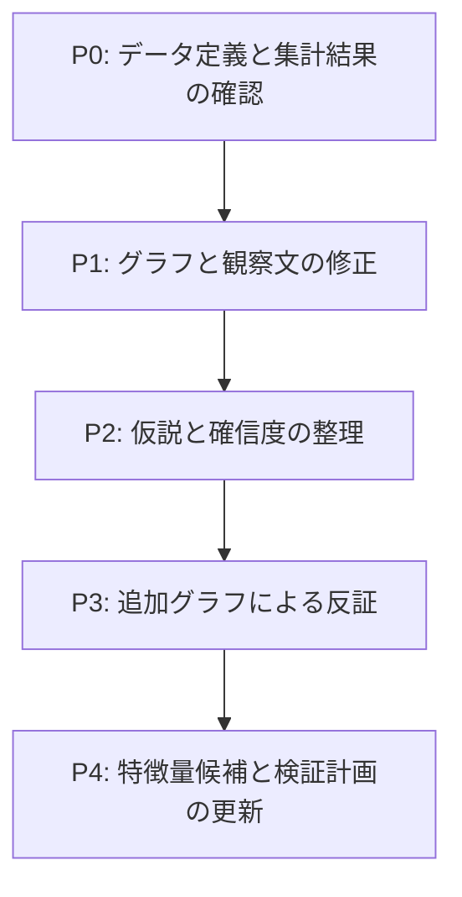
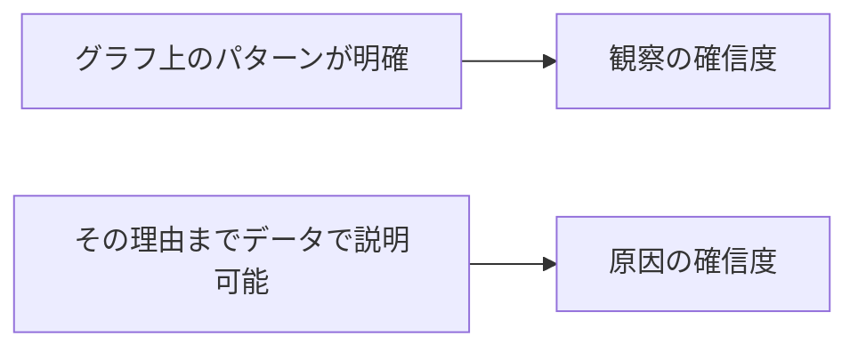

# Bike Sharingデータ可視化・仮説レビュー

対象:

- `src/app.py`
- `docs/observations/graph_observation_template.md`
- `data/raw/bike_sharing/hour.csv`
- `data/raw/bike_sharing/day.csv`
- `data/raw/bike_sharing/Readme.txt`

レビュー日: 2026-07-25

## このレビューの使い方

この文書は、修正すべき箇所と確認観点を示すためのものです。

学習目的を優先し、次の内容は記載していません。

- 修正後のコード
- 仮説の完成文
- 再集計後の正解となる数値
- 特徴量の具体的な実装方法
- グラフを作るためのライブラリAPI

各項目について、自分でデータを再集計し、観察と解釈を修正してください。

## 修正の優先順位



| 優先度 | 意味 | 対応方針 |
|---|---|---|
| P0 | 結論やモデルに直接影響する | 次の分析へ進む前に修正する |
| P1 | グラフの読み違いにつながる | 観察メモとグラフをセットで修正する |
| P2 | 仮説の重複・飛躍・確信度の問題 | 仮説一覧を整理するときに修正する |
| P3 | 現在のグラフだけでは判断できない | 追加グラフで確認する |
| P4 | モデル評価を歪める可能性がある | 特徴量作成前に修正する |

## 修正チェックリスト

### P0: 最優先

- [ ] `holiday`、`weekday`、`workingday` の定義を `Readme.txt` と照合する
- [ ] 「祝日」「非祝日」「土日」「平日」「非稼働日」を混同している記述を修正する
- [ ] グラフ10とH014の大小関係を元データから再集計する
- [ ] `cnt`、`casual`、`registered` の定義上の関係を確認する
- [ ] グラフ11とH017を、独立した相関仮説として扱ってよいか見直す
- [ ] `temp`、`atemp`、`hum`、`windspeed` の正規化方法と単位を確認する
- [ ] グラフ6に記載した温度換算と「適温」の解釈を再確認する
- [ ] `hour.csv` の全日付に24時間分の行が存在するか確認する
- [ ] `cnt` の最小値だけからゼロ需要の有無を判断している記述を修正する

### P1: グラフと観察文

- [ ] グラフ1のタイトルと、実際に表示している統計量を一致させる
- [ ] グラフ2のヒストグラムについて、ビン幅と各ビンの件数を確認する
- [ ] グラフ2の「差が大きい／小さい」を分散や四分位範囲でも確認する
- [ ] グラフ3の時間帯平均を、欠けている時間の扱いを決めたうえで再計算する
- [ ] グラフ4で季節性と年次トレンドを分離して観察する
- [ ] グラフ5で土日と祝日を同じ意味で記述していないか確認する
- [ ] グラフ6～8の集計粒度がモデル対象と一致しているか確認する
- [ ] グラフ6～8に、目視以外の要約値を追加する
- [ ] グラフ7の `hum=0` を通常の気象値として扱ってよいか確認する
- [ ] グラフ8の最大風速付近を、根拠なしに外れ値と断定していないか確認する
- [ ] グラフ9に各天気カテゴリの件数を併記する
- [ ] グラフ12・13で割合と絶対数を混同していないか確認する
- [ ] グラフ14の「差がない」という結論を統計量で確認する
- [ ] 月別天気グラフを、月ごとの総時間数の違いに影響されない形でも確認する

### P2: 仮説

- [ ] H001とH005の役割を整理する
- [ ] H002とH007の役割を整理する
- [ ] 欠番になっているH006とH013を意図的に残すか整理する
- [ ] 「観察されたパターン」と「利用目的の推測」を別々に記載する
- [ ] 観察の確信度と原因説明の確信度を分ける
- [ ] H003とH004から、季節・気温・天気・年次トレンドを分離する
- [ ] H008の「休日」が何を指しているか明記する
- [ ] H009で低温と悪天候を同じ原因として扱っていないか確認する
- [ ] H010を「散布図で傾きが見えない」だけで採択していないか確認する
- [ ] H011の観察文と仮説文が整合しているか確認する
- [ ] H012の確信度をカテゴリ件数と交絡を踏まえて見直す
- [ ] H014を再集計結果に基づいて全面的に見直す
- [ ] H015・H016で構成比と総需要を分離する
- [ ] H017を仮説一覧に残す目的を見直す
- [ ] 各仮説に、反証されたと判断する条件を追加する

### P3: 追加グラフ

- [ ] 年ごとの月次推移を比較するグラフを追加する
- [ ] `workingday` と時間帯を組み合わせたグラフを追加する
- [ ] 時間帯パターンを利用者区分別に確認する
- [ ] 気象変数を区間集計し、分布と不確実性を確認する
- [ ] 祝日・非祝日・稼働日・非稼働日の分布を比較する
- [ ] 日付×時間のデータ欠落状況を確認するグラフを追加する
- [ ] 気象値の不自然な組み合わせを確認するグラフまたは表を追加する
- [ ] 時系列上の急増・急減を確認するグラフを追加する

### P4: 特徴量と検証

- [ ] 予測対象を時間単位と日単位のどちらにするか明記する
- [ ] 予測時点で利用可能な情報だけを特徴量候補にする
- [ ] `casual` と `registered` を入力特徴量へ入れないことを再確認する
- [ ] 相互作用を検証する仮説と、単独特徴量の仮説を分ける
- [ ] 時刻・月の周期性がモデル種類によってどう扱われるか確認する
- [ ] 強く似た気象変数を同時投入する影響を確認する
- [ ] 欠落時間を処理してから時系列・ラグ特徴量を検討する
- [ ] ランダム分割と時系列分割の違いを確認する
- [ ] 特徴量追加前後で同一のデータ分割と評価指標を使う
- [ ] 全体指標だけでなく、時間帯・季節・天気別の誤差も確認する

## 修正箇所一覧

| No. | 優先度 | 対象 | 修正する観点 |
|---:|:---:|---|---|
| R01 | P0 | グラフ1 | タイトル、時間粒度、ゼロ需要の解釈 |
| R02 | P1 | グラフ2 | ビン幅、件数、ばらつきの解釈 |
| R03 | P0 | グラフ3 | 欠落時間を含む平均の分母 |
| R04 | P0 | グラフ4 | 季節性と年次トレンドの交絡 |
| R05 | P1 | グラフ5 | 曜日、土日、祝日、稼働日の区別 |
| R06 | P0 | グラフ6 | 単位換算、異常値、非線形性、交絡 |
| R07 | P1 | グラフ7 | 目視判断、異常値、高湿度帯 |
| R08 | P1 | グラフ8 | 集計粒度、外れ値判定、条件付き関係 |
| R09 | P1 | グラフ9 | カテゴリ件数、順序尺度、交絡 |
| R10 | P0 | グラフ10 | カテゴリ定義、大小関係、標本数 |
| R11 | P0 | グラフ11 | 目的変数との包含関係、リーク |
| R12 | P1 | グラフ12 | 構成比と絶対需要の分離 |
| R13 | P0 | グラフ13 | 平日判定方法、構成比の解釈 |
| R14 | P1 | グラフ14 | 「差がない」という結論の根拠 |
| R15 | P1 | 月別天気 | 件数と割合、月の長さ、欠落時間 |
| R16 | P2 | H001～H017 | 重複、因果表現、確信度、反証条件 |
| R17 | P4 | 特徴量候補 | 時系列分割、予測時点、リーク |
| R18 | P1 | グラフ共通処理 | 軸型、カテゴリ名、件数、単位 |

## 1. データ定義に関する修正

### 1.1 カレンダー変数

対象:

- `docs/observations/graph_observation_template.md` のグラフ5、10、12、13、14
- H008、H014、H015、H016
- `src/app.py` のカレンダー変数による抽出処理

確認する問い:

- `holiday=0` を平日と呼んでいないか
- 土日と祝日を合わせたい場合、どのカラムがその定義に対応するか
- 月曜日から金曜日に含まれる祝日を、平日側へ入れてよいか
- 「休日」という語が、祝日、土日、非稼働日のどれを意味するか

完了条件:

- [ ] 各グラフに使用したカラム名が記載されている
- [ ] 表示名とデータ定義が一致している
- [ ] 「休日」の意味がグラフごとに一意である
- [ ] 異なる定義のグラフを直接比較する場合、注意書きがある

### 1.2 目的変数と内訳

対象:

- グラフ11
- H017
- 特徴量候補とリーク確認

確認する問い:

- 相関を調べる2変数の一方が、もう一方の計算要素になっていないか
- このグラフから、登録後の利用頻度や利用目的まで説明できるか
- 分析用の内訳と、予測時に利用できる特徴量を区別できているか

完了条件:

- [ ] 目的変数の定義式を確認済みである
- [ ] 包含関係を通常の相関仮説として解釈していない
- [ ] 内訳カラムを予測入力へ入れないことが明記されている

### 1.3 正規化された気象値

対象:

- グラフ6～8
- H009～H011
- グラフ軸名とホバー表示

確認する問い:

- 正規化値と物理単位を混同していないか
- `temp` と `atemp` で換算基準が異なることを反映しているか
- `hum` と `windspeed` にも換算が必要ではないか
- 軸ラベルを見ただけで値の意味が分かるか

完了条件:

- [ ] 軸と観察メモで同じ単位を使っている
- [ ] 温度の記述を元データ定義と照合している
- [ ] 正規化値のまま表示する場合、その旨が明記されている

### 1.4 時間行の欠落

対象:

- グラフ1～3
- 時間帯別集計
- 将来追加するラグ・移動平均

確認する問い:

- 全日付に0時から23時までの行があるか
- 行がない時間を「観測なし」と「需要ゼロ」のどちらとして扱うか
- 時間帯によって欠落件数に偏りがないか
- 欠落した時間を無視した平均が、時間帯比較へ影響しないか

完了条件:

- [ ] 期待される時間数と実レコード数を比較している
- [ ] 欠落時間の扱いを観察メモに記載している
- [ ] 時間帯別の標本数を確認している
- [ ] 時系列特徴量を作る前に時刻の連続性を確認している

## 2. グラフごとの修正

### 2.1 グラフ1・2: 基本統計量と分布

修正する箇所:

- グラフ1の名称
- 時間データと日データの表現
- 最小値から導いた解釈
- ヒストグラムのビンに関する説明
- 日別需要のばらつきに関する説明

追加で確認する指標:

- 件数
- 標準偏差
- 四分位点
- 歪度
- 各ビンの範囲と件数
- 対数軸または対数変換後の形

完了条件:

- [ ] タイトルと表示対象が一致している
- [ ] 「時間」と「日」の表記が正しい
- [ ] ビン幅に依存する印象を断定していない
- [ ] 「差が大きい／小さい」に数値上の根拠がある

### 2.2 グラフ3～5: 時刻・月・曜日

修正する箇所:

- 時間帯平均の欠落時間への対応
- 月次推移に混ざる年次差
- 全日平均から利用目的を推測している箇所
- 曜日番号だけで土日・祝日・稼働日を説明している箇所

確認する問い:

- 年ごとに月次パターンは同じか
- 同じ月を年ごとに比べた場合も同じ結論になるか
- 時刻パターンは稼働日と非稼働日で同じか
- 時刻パターンは利用者区分で同じか

完了条件:

- [ ] 季節性と長期トレンドを分けて観察している
- [ ] 時刻単体ではなくカレンダー条件との組み合わせを確認している
- [ ] 利用目的は観察事実ではなく解釈として記載している

### 2.3 グラフ6～8: 気温・湿度・風速

修正する箇所:

- 単位の記載
- 外れ値の判断根拠
- 点群の目視だけで判断している箇所
- 日単位の関係を時間単位へ適用している箇所
- 季節・年・時刻との交絡

確認する問い:

- 日単位と時間単位で関係の向きは同じか
- 年や月を固定しても関係が残るか
- 線形関係だけを想定してよいか
- 高温・高湿度・強風など特定区間だけで変化していないか
- 気象変数同士が強く関連していないか

完了条件:

- [ ] 集計粒度ごとに関係を確認している
- [ ] 相関係数だけでなく区間別の分布を確認している
- [ ] 異常値を除外する前に原因と影響を確認している
- [ ] 「関係がない」と「単純な直線関係が見えない」を区別している

### 2.4 グラフ9: 天気カテゴリ

修正する箇所:

- カテゴリ番号だけの軸
- 各カテゴリの標本数
- 平均だけによる確信度判断
- 季節・時刻・稼働日との交絡

確認する問い:

- 極端な天気カテゴリにも十分な観測数があるか
- 天気カテゴリを連続数値として扱ってよいか
- 同じ時刻・季節・稼働日条件でも差が残るか
- 平均差が一部の異常日だけで生じていないか

完了条件:

- [ ] カテゴリ名と件数が表示されている
- [ ] 標本数が少ないカテゴリの注意書きがある
- [ ] 因果説明と予測上の関連を区別している

### 2.5 グラフ10～14: 休日と利用者区分

修正する箇所:

- グラフ10のカテゴリ名と大小関係
- グラフ12・13の割合から総需要を推測している箇所
- グラフ13の平日抽出条件
- グラフ14の「差がない」という断定
- 円グラフだけで比較している構成

確認する問い:

- 割合が増えたのか、絶対数が増えたのか
- グループごとの日数が大きく異ならないか
- 平均と中央値で結論が変わらないか
- 利用者区分ごとの変化が総需要と同じ方向か
- 曜日差は分散に対して十分大きいか

完了条件:

- [ ] カテゴリごとの件数が示されている
- [ ] 割合と日平均の両方を確認している
- [ ] 総需要と内訳を別の問いとして扱っている
- [ ] 利用目的をデータから直接観察した事実として書いていない

### 2.6 月別天気グラフ

修正する箇所:

- 時間数の積み上げだけによる月比較
- 月の日数の違い
- 欠落時間の影響
- 天気と季節の因果解釈

確認する問い:

- 件数ではなく月内割合にすると見え方が変わらないか
- 年ごとに同じ月の天気構成は似ているか
- 需要の月次変化と天気構成の変化が同時に起きているだけではないか

完了条件:

- [ ] 月ごとの分母を確認している
- [ ] 件数と割合を使い分けている
- [ ] 天気構成だけで季節需要の原因を断定していない

## 3. 仮説一覧の修正

### 3.1 重複整理

対象:

- H001とH005
- H002とH007

確認する問い:

- 全日平均の観察と、平日に限定した観察を別仮説にする必要があるか
- 一つの仮説の中で条件を明確にした方が検証しやすくないか
- 各仮説が別々の特徴量または検証に対応しているか

完了条件:

- [ ] 各仮説に固有の検証目的がある
- [ ] 同じ内容を別IDで重複させていない
- [ ] 仮説IDの欠番を整理している

### 3.2 観察と原因の分離

対象:

- 通勤・通学
- 帰宅
- 買い物
- レジャー
- 冬休み
- 悪天候で利用できないという説明

整理する枠:

| 区分 | 記載する内容 |
|---|---|
| 観察 | データ上で直接確認できるパターン |
| 解釈 | パターンを説明する候補 |
| 代替説明 | 同じパターンを生む別の理由 |
| 反証条件 | 仮説が誤りと判断できる結果 |
| 追加確認 | 判断に必要なグラフや集計 |

完了条件:

- [ ] 利用目的を観察欄へ書いていない
- [ ] 各原因仮説に代替説明がある
- [ ] 「高」の確信度が原因まで証明した意味になっていない

### 3.3 確信度

現在の確信度では、次の二つが混ざっていないか確認してください。



完了条件:

- [ ] 観察の確信度を記載している
- [ ] 原因の確信度を別に記載している
- [ ] モデルで試す価値と因果的な確信を区別している
- [ ] 標本数とばらつきを確信度へ反映している

## 4. 追加で検討する問い

ここでは答えを仮定せず、追加分析で確認する問いだけを示します。

### 時間・カレンダー

- 同じ時間でも稼働日と非稼働日で需要パターンは変わるか
- 朝と夕方のパターンを作っている利用者区分は同じか
- 曜日単体より、曜日と時間帯の組み合わせの方が説明力を持つか
- 祝日の前日・翌日に通常日と異なる動きがあるか

### 長期トレンド

- 2011年と2012年で全体の需要水準は同じか
- 同じ月を年ごとに比較しても季節仮説は維持されるか
- サービスの普及や供給規模の変化を示す情報が必要ではないか
- 時間経過を特徴量にした結果は未来期間でも再現するか

### 気象

- 悪天候の影響は稼働日と非稼働日で同じか
- 気象の影響は利用者区分によって異なるか
- 気温の効果は季節によって変わるか
- 湿度と風速は単独ではなく、天気カテゴリや気温との組み合わせで効くか
- 極端な気象値は実測値か、観測・入力上の異常か

### 時系列・異常日

- 前日または前週同時刻の需要と関連があるか
- 急増・急減日は通常の季節・時刻・天気で説明できるか
- イベント日を調査する場合、その情報は予測時点で利用可能か
- 欠落時間が時系列関係の計算を壊していないか

## 5. `src/app.py` の表示上の修正

この節はコードの修正方法ではなく、画面上で満たすべき条件だけを示します。

### 軸

- [ ] 日付軸とカテゴリ軸で表示形式を分ける
- [ ] 曜日番号に曜日名を付ける
- [ ] 天気番号にカテゴリ名を付ける
- [ ] 正規化値か物理単位かを軸名へ含める
- [ ] `cnt` が時間需要か日需要かを軸名へ含める

### 比較

- [ ] 比較する棒や線に標本数を表示する
- [ ] 平均だけでなく中央値や分布も確認できるようにする
- [ ] 割合を比較するグラフは同じ基準で並べる
- [ ] 年、稼働日、利用者区分を必要に応じて分ける

### データ品質

- [ ] 欠落時間の件数を確認できるようにする
- [ ] 不自然な気象値を確認できるようにする
- [ ] グラフに使用したフィルタ条件と集計方法を表示する
- [ ] 各グラフが `hour.csv` と `day.csv` のどちらを使ったか表示する

## 6. 特徴量候補・検証方法の修正

### 特徴量候補

確認する問い:

- 仮説と特徴量が一対一または一対多で追跡できるか
- 単独の時刻特徴量だけで、稼働日による違いを表現できるか
- 周期特徴量が使用予定モデルに必要か
- 気象特徴量は予測時点で取得可能か
- 年次トレンドを表す特徴量は将来へ外挿できるか
- 利用者区分は予測時点では目的変数の内訳ではないか

完了条件:

- [ ] 各特徴量候補に対応する仮説IDがある
- [ ] 予測時点で利用できない情報に印がある
- [ ] 目的変数またはその内訳を入力に含めていない
- [ ] 欠落時間を含む特徴量の作成条件が明記されている
- [ ] 強く関連する特徴量を同時利用する際の確認項目がある

### 検証方法

確認する問い:

- ランダム分割によって未来の需要水準が訓練側へ混ざらないか
- 2011年と2012年の水準差が評価へどう影響するか
- 一度に複数の特徴量を追加して、効果の出所が分からなくならないか
- 全体の評価値が良くても、重要な時間帯で悪化していないか

完了条件:

- [ ] 予測用途に合った時間順の検証方法を選んでいる
- [ ] 比較実験でデータ分割を固定している
- [ ] 特徴量を段階的に追加している
- [ ] 複数の誤差指標の役割を説明できる
- [ ] 時間帯・季節・天気別の誤差を確認している

## 7. 最終確認チェックリスト

### データ理解

- [ ] 全カラムの定義と単位を説明できる
- [ ] `hour.csv` と `day.csv` の粒度の違いを説明できる
- [ ] 欠落行と異常値の扱いを説明できる
- [ ] カレンダー変数3種類の違いを説明できる
- [ ] 目的変数と利用者区分の関係を説明できる

### グラフ

- [ ] タイトル、軸、単位、集計方法、フィルタ条件がそろっている
- [ ] 平均と同時に件数または分布を確認している
- [ ] 日単位の結果を時間単位へ無条件に適用していない
- [ ] 散布図の目視だけで「関係なし」としていない
- [ ] 割合の変化を絶対数の変化として説明していない

### 仮説

- [ ] 観察と原因推測を分けている
- [ ] 重複仮説を整理している
- [ ] 反証条件がある
- [ ] 代替説明がある
- [ ] 確信度に標本数・交絡・不確実性を反映している
- [ ] 仮説から特徴量候補と検証方法を追跡できる

### モデル検証

- [ ] 予測時点で利用可能な情報だけを入力にしている
- [ ] 目的変数リークがない
- [ ] 時系列の順序を守った評価をしている
- [ ] 特徴量追加前後を同じ条件で比較している
- [ ] 全体指標以外の誤差も確認している

## 完了ライン

次の状態になったら、観察メモの修正完了と判断できます。

```text
データ定義が明確
↓
集計粒度と標本数が明確
↓
グラフから直接分かる観察が明確
↓
原因の推測と代替説明が分離されている
↓
反証可能な仮説になっている
↓
リークのない特徴量候補へつながっている
↓
時間順の検証計画へつながっている
```
